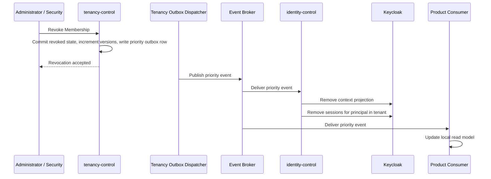

---
doc_meta:
  id: TDD-003
  title: Membership Projection and Revocation Propagation
  owner: Core Platform Team
  version: 0.2.0
  status: draft
  classification: restricted
  review_cycle_days: 90
  created_date: 2026-08-10
  last_reviewed: 2026-08-10
  parent_sad:
    - SAD-004
    - SAD-001
---

# Membership Projection and Revocation Propagation

## Purpose

Specify how authoritative Membership state reaches token issuance and protected
resources without a synchronous call on every request, and how a revocation reaches
enforcement within a bounded and measured interval.

The preceding custom identity implementation held a revocation marker in a cache with
a 24-hour lifetime and no invalidation on write. Suspending an account, resetting a
credential, and revoking all sessions each left issued tokens valid for up to a day.
Containment actions that do not contain are worse than absent ones, because incident
response is planned around them. This design makes the enforcement interval an
explicit, measured, alertable property.

## Scope

**In scope**

- Projection of Tenant and Membership state from the authoritative store into
  Keycloak and into product consumers.
- Snapshot bootstrap, incremental delivery, cursor management, and reconciliation.
- Version semantics that let a consumer detect that its projection is stale.
- Revocation propagation across the four mechanisms that together bound enforcement.
- The one-active-context token rule and the staleness policy per risk class.

**Out of scope**

- The Principal identifier — owned by
  [TDD-001](TDD-001-principal-identifier-and-creation.md).
- Module boundaries and the outbox dispatcher — owned by
  [TDD-002](TDD-002-control-plane-module-boundaries.md).
- The normative token claim set and verifier rules — owned by the Token &
  Verification Profile standard.
- Product business authorization, which remains with the owning Product domain.

## Technical Context

Membership is authoritative in the Tenancy Database of the Organization & Tenancy
Control application. Two
classes of consumer read it, and neither calls it per request:

| Consumer | Reads projection for | Delivery |
| :-- | :-- | :-- |
| Keycloak Identity Kernel | Deciding which Tenant context a token may assert | Applied by the Identity Control Service through the supported Admin API |
| Product APIs | Enforcing context on requests carrying an already-issued token | Consumed from the event stream into a local read model |

A token asserts exactly one active Tenant context and at most one Workspace context.
An operator holding Membership in thirty client Tenants receives a token naming one
of them. The full set is retrieved through the context API and never placed in the
token, which bounds token size and prevents a single stolen token from carrying
authority across every client relationship.

The enforcement interval is not a single number. It is the sum of a propagation term
the platform controls and a token-lifetime term the token profile controls:

```text
max_enforcement_delay
    = projection_propagation_time
    + remaining_access_token_lifetime
```

Access token lifetime is therefore a security parameter of this design, not a
performance tuning knob. A revocation target of five minutes with a one-minute
propagation budget constrains access token lifetime to four minutes.

The token-lifetime term does not bound a connection that was authenticated once and
held open. A WebSocket or server-sent-event stream established before a revocation
survives expiry of the token that authorized it, because the consumer receives no
further request to reject. For those surfaces the second term is replaced by the
maximum connection lifetime, which is capped at the access token lifetime of the
connection's profile.

## Component Design

### Components

| Component | Module | Responsibility |
| :-- | :-- | :-- |
| `MembershipService` | `tenancy/membership` | Authoritative mutation, version increment, outbox write |
| `ProjectionPublisher` | `tenancy/context` | Snapshot generation and high-water mark |
| `KeycloakProjector` | `identity/projection` | Applies context projection through the Admin API |
| `SessionContainer` | `identity/projection` | Removes Keycloak sessions on revocation |
| `ProjectionReconciler` | `identity/reconcile` | Compares authority against projection, repairs drift |
| Consumer read model | Product systems | Local Tenant and Membership context with declared freshness |
| Connection registry | Product systems | Records open long-lived connections against the context that authorized them |

### Revocation Propagation

Revocation is enforced by four mechanisms with four different latencies. The design
uses all four because none is sufficient alone.



| Mechanism | Blocks | Latency |
| :-- | :-- | :-- |
| Keycloak context projection removed | Issuance of any new token asserting that context | Propagation time |
| Keycloak session removal | Refresh, which would otherwise mint a fresh token | Propagation time |
| Consumer read model updated | Requests carrying an already-issued access token | Propagation time |
| Long-lived connection terminated | Streams opened before the revocation, which issue no further request to reject | Propagation time, bounded by maximum connection lifetime |

Without session removal, a revoked Principal refreshes and receives a new token.
Without consumer projection update, an already-issued token remains accepted until it
expires. Without projection removal, a subsequent authentication reasserts the
revoked context. Without connection termination, a stream opened before the
revocation continues delivering tenant-scoped data indefinitely, because the first
three mechanisms act on new requests and an open connection makes none.

A consumer holding long-lived connections registers each one against the Principal
and Tenant context that authorized it. A priority revocation event closes every
matching connection. A connection that cannot be matched to a registered context is
closed rather than retained, because an unattributable stream cannot be revoked.

## Data Model

### Authoritative State

```sql
CREATE TABLE membership.membership (
    membership_id       UUID        PRIMARY KEY,
    principal_id        UUID        NOT NULL,
    tenant_id           UUID        NOT NULL REFERENCES tenant.tenant(tenant_id),
    workspace_id        UUID,
    subject_type        TEXT        NOT NULL,
    status              TEXT        NOT NULL,
    membership_version  BIGINT      NOT NULL DEFAULT 1,
    valid_from          TIMESTAMPTZ NOT NULL,
    valid_until         TIMESTAMPTZ,
    provenance          TEXT        NOT NULL,
    created_at          TIMESTAMPTZ NOT NULL DEFAULT now(),
    updated_at          TIMESTAMPTZ NOT NULL DEFAULT now(),
    CONSTRAINT membership_status_check
        CHECK (status IN ('active', 'suspended', 'revoked')),
    CONSTRAINT membership_subject_check
        CHECK (subject_type IN ('human', 'workload')),
    -- A referenced Workspace must belong to this Membership's Tenant.
    CONSTRAINT membership_workspace_in_tenant
        FOREIGN KEY (tenant_id, workspace_id)
        REFERENCES workspace.workspace (tenant_id, workspace_id)
);

-- Required as the target of the composite foreign key above. Without it the
-- constraint cannot be created and the same-Tenant invariant is unenforced.
ALTER TABLE workspace.workspace
    ADD CONSTRAINT workspace_tenant_scope_unique UNIQUE (tenant_id, workspace_id);

-- One active Membership per subject, context, and type.
CREATE UNIQUE INDEX membership_active_unique
    ON membership.membership (principal_id, tenant_id, COALESCE(workspace_id, tenant_id), subject_type)
    WHERE status = 'active';

-- Monotonic per-tenant counter incremented by any security-relevant change.
ALTER TABLE tenant.tenant
    ADD COLUMN tenant_security_version BIGINT NOT NULL DEFAULT 1;
```

`membership_version` increments on every status transition. `tenant_security_version`
increments on Tenant suspension, offboarding, and any change that invalidates every
context within the Tenant at once. The two versions give a consumer a cheap staleness
test without a remote call.

The composite foreign key is what enforces that a Membership cannot reference a
Workspace belonging to a different Tenant. It relies on the default `MATCH SIMPLE`
semantics deliberately: when `workspace_id` is `NULL` the constraint is satisfied
without a lookup, which is the tenant-scoped Membership case. `MATCH FULL` would
reject that row and is therefore incorrect here. `tenant_id` retains its own foreign
key so it remains validated when no Workspace is referenced.

### Projection Consumer Registry and Cursors

Two different facts were previously carried by one table. They belong to different
systems and therefore to different databases.

**Registry — owned by the publisher, in the Tenancy Database.** It records which
consumers exist and the freshness contract each one declared. `tenancy-control` writes
and reads it when deciding whether to serve a projection.

```sql
CREATE TABLE projection.consumer (
    consumer_id        TEXT        PRIMARY KEY,
    projection_version TEXT        NOT NULL,
    max_accepted_age   INTERVAL    NOT NULL,
    stale_behavior     TEXT        NOT NULL,
    registered_at      TIMESTAMPTZ NOT NULL DEFAULT now(),
    last_reported_at   TIMESTAMPTZ,
    last_reported_mark BIGINT,
    CONSTRAINT stale_behavior_check
        CHECK (stale_behavior IN ('use_with_marker', 'revalidate', 'fail_closed'))
);
```

A consumer that has not registered receives no projection. `last_reported_*` holds
what the consumer most recently reported about its own progress; it is a report, not
an authority, and the publisher never infers a consumer's position from it.

**Cursor — owned by each consumer, in that consumer's own database.** Every consumer
tracks its own position. `identity-control` is one such consumer, and SAD-001 §5.1
already allocates reconciliation cursors to the Control Database:

```sql
CREATE TABLE identity.projection_cursor (
    stream             TEXT        PRIMARY KEY,
    projection_version TEXT        NOT NULL,
    last_event_id      BIGINT      NOT NULL DEFAULT 0,
    last_snapshot_mark BIGINT,
    last_reconciled_at TIMESTAMPTZ
);
```

Neither system reads the other's table. `tenancy-control` holds no privilege in the
Control Database, and `identity-control` holds none in the Tenancy Database. A
consumer communicates its position by reporting it through the published contract,
never by a cross-database read.

### Token Context Claims

```json
{
  "principal_id": "019235f1-8c4a-7c1e-9d0b-3f4a2b6e5d71",
  "tenant_id": "019235f2-4d11-7a03-b8c7-1e9f7a2c4b60",
  "workspace_id": "019235f3-9b72-7f45-8e21-6d3c8a1f0e52",
  "membership_version": 14,
  "tenant_security_version": 3
}
```

A consumer comparing these versions against its local read model detects staleness
without contacting the control plane. A token whose `membership_version` is lower
than the locally known version is rejected, because the local model is newer than the
token and has already recorded a change.

## API / Interface

### Control Plane

```text
GET    /v1/principals/{principal_id}/contexts
GET    /v1/context/{tenant_id}/{principal_id}:verify
POST   /v1/memberships/{membership_id}:suspend
POST   /v1/memberships/{membership_id}:revoke
POST   /v1/memberships/{membership_id}:restore
GET    /v1/projections/tenancy/snapshot
POST   /v1/projections/tenancy:reconcile
GET    /v1/projections/tenancy/consumers/{consumer_id}
```

`:verify` is the authoritative fresh check. It is reserved for high-risk operations
and is never placed on an ordinary request path. Its use is measured; a consumer
whose `:verify` rate approaches its request rate has misclassified its operations and
is treated as a defect.

### Published Events

```text
membership.lifecycle.granted
membership.lifecycle.restored
membership.security.suspended      (priority)
membership.security.revoked        (priority)
tenant.security.suspended          (priority)
tenant.lifecycle.activated
tenancy.projection.reconciled
```

Priority events occupy a dedicated dispatch lane. All events carry the enterprise
envelope with `event_id`, `occurred_at`, `aggregate_id`, `version`, and
`correlation_id`. Delivery is at-least-once and consumers are idempotent.

### Bootstrap Contract

A new consumer follows a fixed sequence:

1. Request a versioned snapshot and record its high-water mark.
2. Load the snapshot into the local read model.
3. Subscribe from the high-water mark.
4. Register a cursor with `max_accepted_age` and `stale_behavior`.
5. Report reconciliation status on the declared cadence.

Reading the stream without a snapshot yields an incomplete model, and the registry
rejects a cursor whose `last_snapshot_mark` is absent.

## Algorithms / Logic

### Revocation

```text
BEGIN
    load membership FOR UPDATE
    reject if the transition is not permitted by the state machine
    set status = 'revoked'
    increment membership_version
    if the revocation is tenant-wide:
        increment tenant_security_version
    insert outbox row (priority = 0, event = membership.security.revoked)
    record the acting subject, reason, and correlation identifier
COMMIT
```

The outbox row is written inside the same transaction as the status change. A
revocation that commits without its event is unreachable by any consumer, which is
the failure the transactional outbox exists to prevent.

Acknowledgement to the caller means the revocation is durable and queued, not that it
is enforced. The response carries the accepted timestamp so that enforcement delay is
measurable from a recorded origin.

### Dispatch Priority

```text
claim rows:
    SELECT ... FROM platform.outbox
    WHERE published_at IS NULL
    ORDER BY priority ASC, id ASC
    LIMIT :batch
    FOR UPDATE SKIP LOCKED
```

Priority `0` carries security events; priority `100` carries lifecycle events. A
lifecycle backlog does not delay a revocation.

### Staleness Handling

A consumer evaluates its projection age on every request against its declared policy:

| Condition | Action |
| :-- | :-- |
| Age within `max_accepted_age` | Serve from the local model |
| Age exceeded, `stale_behavior = use_with_marker` | Serve and expose a staleness indicator to the caller |
| Age exceeded, `stale_behavior = revalidate` | Call `:verify` for this decision |
| Age exceeded, `stale_behavior = fail_closed` | Deny |
| Any irreversible or high-risk operation | Call `:verify` regardless of age |

Token issuance uses `fail_closed`. Issuing a token from a projection of unknown age
mints authority that outlives the uncertainty, which no downstream control can undo.

### Reconciliation Sweep

The reconciler runs inside `identity-control`, which cannot query the Tenancy
Database. It obtains the authoritative set through the publisher's contract
`GET /v1/projections/tenancy/snapshot`, which TDD-002 permits as a published HTTP
contract available to any consumer. There is no privileged path and no direct read.

On a fixed cadence the reconciler compares that authoritative set against its own
projection target:

```text
authoritative := active memberships from the publisher snapshot at the watermark
projected     := current projection state

missing   := authoritative − projected    → apply, emit repair event
extra     := projected − authoritative    → remove, emit repair event, raise alert
mismatch  := version divergence           → apply authoritative value
```

An `extra` finding means a context is projected that authority does not grant. It is
treated as a security finding rather than a data-quality finding, because it is the
shape a privilege-escalation defect takes.

Reconciliation repairs toward authority in one direction. A projection is never
promoted into authority, and no repair path writes to the Keycloak database.

### Context Switching

The token rule is fixed: one active Tenant context, at most one Workspace context.
The mechanism that issues the replacement token is determined by proof-of-concept.
Three candidates are evaluated:

| Option | Mechanism | Note |
| :-- | :-- | :-- |
| A | New authorization request riding the existing Keycloak SSO session | Standard protocol path; a redirect round-trip, not a credential prompt |
| B | Standard Token Exchange, internal-to-internal within one realm | Requires proving how the requested context is authorized and how claims are produced |
| C | Refresh carrying a context parameter | Evaluated only if achievable through supported mechanisms without altering refresh-grant semantics |

Acceptance criteria applied to each candidate:

1. The full Membership set is never placed in a token.
2. A Principal cannot obtain a context for which no active Membership exists.
3. Membership is checked against the projection at switch time.
4. The previously issued token is unchanged and remains valid until it expires.
5. The new token carries exactly one context.
6. The switch is recorded with actor, source context, and target context.
7. Revocation behavior after a switch is defined and tested.
8. No preview or deprecated feature is required.
9. Upgrade burden is bounded, and a custom server extension counts against the
   candidate.

Option A is the current baseline because it uses the standard protocol path and
requires no extension. The proof-of-concept determines whether the browser round-trip
is acceptable for operators switching context frequently, and whether Option B
removes that cost without introducing an extension.

## Configuration

| Variable | Default | Purpose |
| :-- | :-- | :-- |
| `TENANCY_SNAPSHOT_INTERVAL` | `1h` | Snapshot generation cadence |
| `TENANCY_RECONCILE_INTERVAL` | `15m` | Authority-versus-projection comparison cadence |
| `TENANCY_PRIORITY_LANE_WORKERS` | `2` | Workers reserved for security events |
| `IDENTITY_PROJECTION_TIMEOUT` | `5s` | Upper bound on one Admin API projection call |
| `IDENTITY_SESSION_REMOVAL_ENABLED` | `true` | Removes Keycloak sessions on revocation |

Consumer-side values are declared per consumer in the cursor registry rather than
configured globally, because a work queue and a financial approval path do not share
a freshness requirement.

### Enforcement Budget

| Term | Initial budget |
| :-- | :-- |
| Accept to outbox commit | 100 ms |
| Outbox commit to dispatch claim | 1 s |
| Dispatch to Keycloak projection and session removal | 2 s |
| Dispatch to consumer read model applied | 5 s |
| Dispatch to long-lived connection closed | 5 s |
| Propagation subtotal | under 10 s |
| Remaining access token lifetime | bounded by the token profile |
| Maximum long-lived connection lifetime | capped at the access token lifetime of its profile |

The propagation subtotal is owned by this design. The token-lifetime term is owned by
the Token & Verification Profile standard. Neither alone states the enforcement
interval, and the operational dashboard presents their sum.

## Testing Strategy

### Correctness

- A revocation and its outbox row commit atomically; a failure after the status change
  and before the outbox write rolls back both.
- `membership_version` increments on every status transition and never decreases.
- The partial unique index rejects a second active Membership for the same subject,
  context, and type.
- A Membership referencing a Workspace of another Tenant is rejected by the composite
  foreign key, and a Membership with a `NULL` Workspace is accepted.
- `workspace.workspace` carries the `UNIQUE (tenant_id, workspace_id)` constraint the
  composite foreign key depends on; dropping it fails the migration test.

### Propagation

- Measured accept-to-enforcement delay stays within the propagation budget for each
  of the four mechanisms.
- A WebSocket or server-sent-event stream open at the moment of revocation is closed
  within its budget, and a reconnection attempt for the revoked context is refused.
- A long-lived connection reaching its maximum lifetime is closed and cannot continue
  without re-authentication.
- After revocation and projection removal, a new authentication cannot assert the
  revoked context.
- After session removal, a refresh attempt for the revoked context fails.
- After the consumer read model updates, a previously issued token naming the revoked
  context is rejected.
- A lifecycle backlog of ten thousand rows does not delay a priority event beyond its
  budget.

### Reconciliation

- A context injected directly into Keycloak that authority does not grant is detected
  as `extra`, removed, and alerted as a security finding.
- A dropped event produces a `missing` finding that the next sweep repairs.
- Reconciliation is idempotent across repeated runs against an already-consistent
  state.

### Staleness

- A consumer past `max_accepted_age` under `fail_closed` denies.
- A consumer past `max_accepted_age` under `revalidate` calls `:verify` and proceeds
  on an affirmative result.
- Token issuance from a projection past its maximum age fails closed.
- A token whose `membership_version` is lower than the locally known version is
  rejected.

### Negative

- A context switch to a Tenant without active Membership is refused.
- A projection consumer cannot write to any Tenancy Database schema, and
  `identity-control` cannot connect to the Tenancy Database at all.
- The reconciler obtains authority only through the published snapshot contract; no
  code path in `identity-control` constructs a Tenancy Database connection.
- No repair path writes to the Keycloak database.

## Security Notes

Projection carries context, not authorization. It contains Tenant identity, Workspace
identity, Membership status, and versions. It contains no Product permission, no
Entitlement, and no business role. A projection that grows to carry permissions has
recreated the token-as-permission-snapshot pattern the enterprise security
architecture rejects.

Revocation acknowledgement is a durability statement, not an enforcement statement.
Operational procedures and the security dashboard present the accepted timestamp and
the enforced timestamp separately so that incident response works from the enforced
value.

An `extra` reconciliation finding is escalated as a potential privilege escalation.
Reaching a state where a context is projected without authority requires either a
defect in the projection path or a write outside it, and both warrant investigation
before the finding is repaired away.

## Performance Notes

Snapshot generation reads the active Membership set for one consumer and is bounded
by admission control so that it cannot contend with priority dispatch. Snapshot size
grows with active Membership count and is paged.

The `:verify` path is a synchronous authoritative read with a p95 target of 200 ms.
It is reserved for high-risk decisions; its call rate is a monitored signal, and a
sustained rise indicates consumers are misusing it as an ordinary read.

Placing one context in a token rather than the full Membership set keeps token size
independent of how many client relationships an operator holds, which is the property
that makes the model workable for cross-client operators.

## Operational Notes

| Signal | Warning | Critical |
| :-- | :-- | :-- |
| Oldest unpublished priority outbox row | 30 s | 2 min |
| Accept-to-enforcement delay, security events | above budget | twice budget |
| Projection reconciliation age per consumer | one interval | consumer stale policy exceeded |
| `extra` reconciliation findings | any occurrence | any occurrence |
| Consumers with an unregistered cursor | any occurrence | — |

Runbooks required before production: revocation not enforced within budget, priority
lane backlog, projection drift repair, consumer read model rebuild, and reconciliation
reporting an `extra` finding.

## Traceability

| Relationship | Target |
| :-- | :-- |
| Parent system | SAD-004 — Scnehaux Organization & Tenancy Control (authority, publisher, revocation) |
| Parent system | SAD-001 — Scnehaux Identity Runtime (projector, session containment, reconciler) |
| Realizes capability | PAD-PLT-002 — Organization & Tenancy Platform |
| Governed by | ADR-TEN-001 — Separate Tenancy Authority and Keycloak Projection |
| Governed by | ADR-GLB-003 — Transactional Outbox |
| Governed by | ADR-GLB-006 — Event Versioning |
| Enterprise constraint | EAD-003 — projection contract with freshness, stale behavior, and reconciliation |
| Enterprise constraint | EAD-006 — Membership, Entitlement, and Permission are distinct |
| Enterprise constraint | EAD-002 — no universal synchronous control-plane fan-in |
| Depends on | Token & Verification Profile standard, which owns access token lifetime |
| Related design | TDD-001 — principal identifier and creation path |
| Related design | TDD-002 — module boundaries and dispatcher |

### Open Proof-of-Concept Questions

1. Context switch mechanism, decided against the nine acceptance criteria above.
2. Representation of projected context inside Keycloak: Organizations, Groups, or
   user attributes. Canonical authority stays in the control plane in every case; the
   choice affects projection cost, mapper configuration, and reconciliation shape.
3. Session removal granularity: whether sessions can be removed per Principal and
   Tenant context, or only per Principal, which determines whether revoking one
   Membership disturbs unrelated contexts.
