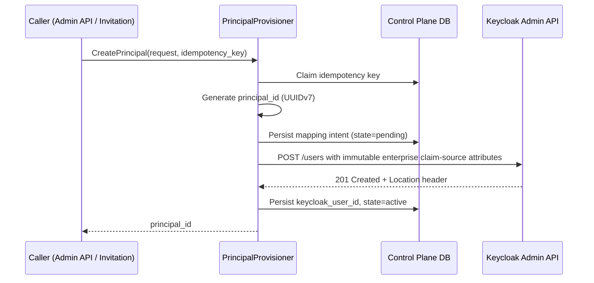

---
doc_meta:
  id: TDD-identity-control-001
  title: Canonical Principal Identifier and Creation Path
  owner: Core Platform Team
  version: 0.4.0
  status: approved
  classification: restricted
  review_cycle_days: 90
  created_date: 2026-08-10
  last_reviewed: 2026-08-14
  parent_sad: SAD-001
---

# Canonical Principal Identifier and Creation Path

## Purpose

Specify how the Scnehaux canonical Principal identifier is generated, stored,
propagated into tokens, and verified, so that no enterprise domain ever persists a
Keycloak-internal identifier as a foreign key.

This design implements the accepted Principal Identifier decision: Scnehaux mints a
canonical `principal_id`; Keycloak retains its own protocol subject. The two are
distinct claims with distinct lifetimes and distinct portability guarantees.

The identifier contract is irreversible in practice. Once tokens carrying a subject
identifier have been issued and downstream domains have persisted it, changing the
identifier is an enterprise-wide referential migration rather than a configuration
change. This design therefore fixes the contract before the first Principal exists.

## Scope

**In scope**

- Generation, format, and uniqueness invariant of `principal_id`.
- Storage of `principal_id` inside the Keycloak user representation.
- The single authorized Principal creation path through the Identity Control Service.
- Idempotency and crash-recovery behavior of that path.
- Detection and quarantine of Principals created outside the authorized path.
- The `principal_id` token claim and the verifier invariant that depends on it.

**Out of scope**

- Protocol subject (`sub`) semantics, pairwise subject derivation, and external
  token profiles — owned by the STD-IAM-002 Token and Verification Profile.
- Realm and issuer topology — owned by the Realm & Issuer decision.
- Credential material, authenticator enrollment, and authentication ceremonies —
  owned by the Keycloak Identity Kernel.
- Membership, Tenant, and Workspace authority - owned by `organization-control`;
  projection into Keycloak is owned by `TDD-identity-control-002`.
- Migration of identifiers from any prior identity implementation.

## Technical Context

Two runtimes participate:

| Runtime | Role in this design |
| :-- | :-- |
| Keycloak Identity Kernel (SAD-001) | Physical storage of the Principal record and its immutable `scnehaux_principal_id` attribute; issues tokens carrying the claim |
| Identity Control Service (SAD-001) | Mints `principal_id`, performs the only authorized creation call, owns the mapping table, runs reconciliation |

The authority split is deliberate. Keycloak is the physical system of record for the
Principal row. Scnehaux is the authority for the identifier that the rest of the
enterprise references. Exiting Keycloak therefore requires migrating credential
material and protocol configuration, and does not require rewriting foreign keys in
Membership, HCM, audit, evidence, or analytical stores.

Three constraints shape the component design:

1. Keycloak does not enforce uniqueness on user attributes. The uniqueness invariant
   for `principal_id` is held by the Control Database, not by Keycloak.
2. Creating a Keycloak user and setting an attribute in two separate calls produces a
   window in which a Principal exists without a canonical identifier. The design
   removes that window rather than compensating for it.
3. Keycloak can create users without the Control Plane in the request path through
   self-registration and federated first-login. Both are disabled in this phase.

## Component Design

### Components

| Component | Module | Responsibility |
| :-- | :-- | :-- |
| `PrincipalProvisioner` | `internal/identity/provisioning` | Mints the identifier, performs the create call, owns idempotency |
| `KeycloakAdminClient` | `internal/identity/keycloak` | Typed wrapper over the supported Admin REST API |
| `PrincipalMappingRepository` | `internal/identity/provisioning` | Persists and enforces uniqueness of the mapping |
| `PrincipalReconciler` | `internal/identity/reconcile` | Periodic sweep for unmapped, duplicate, and orphaned Principals |
| Realm protocol mapper | Keycloak configuration | Projects the user attribute into the `principal_id` token claim |

### Creation Path



The identifier and subject classification are fixed before the remote call and carried
inside the creation payload. The Keycloak representation accepts attributes at creation
time, so the Principal never exists without the complete claim source required by its
audience profile.

### Authorized and Prohibited Creation Paths

```text
Authorized
    Identity Control Service → Keycloak Admin API

Prohibited in this phase
    Self-registration
    Federated first-login auto-create
    Direct Admin Console user creation
    Any write to the Keycloak database
```

Prohibited paths are closed by realm configuration rather than by policy alone. The
reconciler treats any Principal that appears without a mapping as evidence that a
prohibited path is open, and quarantines it.

## Data Model

### Control Database

```sql
CREATE TABLE identity.principal_mapping (
    principal_id       UUID        PRIMARY KEY,
    keycloak_user_id   TEXT        UNIQUE,
    realm              TEXT        NOT NULL,
    subject_type       TEXT        NOT NULL,
    workload_owner     UUID,
    state              TEXT        NOT NULL,
    created_at         TIMESTAMPTZ NOT NULL DEFAULT now(),
    activated_at       TIMESTAMPTZ,
    quarantined_at     TIMESTAMPTZ,
    quarantine_reason  TEXT,
    version            INTEGER     NOT NULL DEFAULT 1,
    CONSTRAINT principal_mapping_state_check
        CHECK (state IN ('pending', 'active', 'quarantined', 'retired')),
    CONSTRAINT principal_mapping_subject_check
        CHECK (subject_type IN ('human', 'workload')),
    CONSTRAINT principal_mapping_owner_check
        CHECK ((subject_type = 'human' AND workload_owner IS NULL)
            OR (subject_type = 'workload' AND workload_owner IS NOT NULL))
);

CREATE UNIQUE INDEX principal_mapping_realm_user
    ON identity.principal_mapping (realm, keycloak_user_id)
    WHERE keycloak_user_id IS NOT NULL;
```

`principal_id` is the primary key and the enterprise-wide reference. `keycloak_user_id`
is nullable while the mapping is `pending`, and is never exposed outside this module.

State transitions:

```text
pending ──→ active ──→ retired
   │           │
   └───────────┴────→ quarantined
```

### Keycloak

The canonical identifier is stored as a user attribute:

```json
{
  "username": "operator@example.com",
  "enabled": true,
  "attributes": {
    "scnehaux_principal_id": ["019235f1-8c4a-7c1e-9d0b-3f4a2b6e5d71"],
    "scnehaux_subject_type": ["human"]
  }
}
```

The attribute is treated as immutable. Realm configuration removes it from the
user-editable attribute set so that account self-service and administrator edits
cannot alter it.

### Token Claim

```json
{
  "iss": "https://identity.scnehaux.com/realms/<realm>",
  "sub": "<protocol subject>",
  "principal_id": "019235f1-8c4a-7c1e-9d0b-3f4a2b6e5d71",
  "subject_type": "human",
  "aud": ["hcm-api"],
  "iat": 1786000000,
  "exp": 1786000900
}
```

`sub` remains the issuer-scoped protocol subject and may be pairwise for external
relying parties. `principal_id` is the enterprise reference. Internal domains persist
`principal_id`. Audit and evidence records retain `principal_id` together with
`iss` and `sub` so that protocol-level and enterprise-level identity remain
reconcilable after any future issuer change.

## API / Interface

### Identity Control Service

```text
POST   /v1/principals
GET    /v1/principals/{principal_id}
POST   /v1/principals/{principal_id}:quarantine
POST   /v1/principals/{principal_id}:retire
GET    /v1/principals:unmapped
POST   /v1/principals:reconcile
```

`POST /v1/principals` requires an `Idempotency-Key` header. The response carries
`principal_id`. The request must declare `subject_type`; a workload also requires an
active human `workload_owner`. `keycloak_user_id` is never present in any response body.

### Keycloak Admin API

| Operation | Endpoint | Use |
| :-- | :-- | :-- |
| Create user with attribute | `POST /admin/realms/{realm}/users` | Sole creation call |
| Search by attribute | `GET /admin/realms/{realm}/users?q=scnehaux_principal_id:{id}` | Idempotent recovery |
| Enumerate users | `GET /admin/realms/{realm}/users` (paged) | Reconciliation sweep |
| Disable user | `PUT /admin/realms/{realm}/users/{id}` | Quarantine |

Attribute search behavior differs across Keycloak releases. The proof-of-concept
verifies that attribute search is exact-match and returns the created user against
the pinned release before implementation begins.

## Algorithms / Logic

### Identifier Generation

`principal_id` is a UUIDv7 generated inside the Control Plane process. UUIDv7 is
selected for time-ordered index locality on the mapping table and on every
downstream table that references it. The value is opaque to consumers; no consumer
parses the embedded timestamp.

Uniqueness is enforced by the primary key on `identity.principal_mapping`. A
generation collision fails the insert and the request is retried with a new value.

### Idempotency and Crash Recovery

The creation path has one durable checkpoint before the remote call and one after.
Recovery is driven by the `pending` state:

```text
For each mapping in state=pending older than the recovery threshold:
    search Keycloak by attribute scnehaux_principal_id = principal_id
    if exactly one user found:
        record keycloak_user_id, transition to active
    if zero users found:
        retry the create call with the same principal_id
    if more than one user found:
        quarantine every matching user, transition to quarantined, raise alert
```

Retrying with the same `principal_id` is what makes the operation idempotent across
a crash between the remote call and the local commit. The attribute search is the
recovery index; it is the reason the identifier is written into Keycloak rather than
held only in the Control Plane.

A repeated request carrying the same `Idempotency-Key` returns the original
`principal_id` and performs no remote call.

### Reconciliation Sweep

The reconciler runs on a schedule and enumerates Keycloak users per realm:

```text
For each Keycloak user:
    attribute := scnehaux_principal_id

    if attribute is absent:
        disable the user
        record an unmapped-principal finding
        emit identity.principal.unmapped_detected

    else if no mapping row exists for attribute:
        disable the user
        record an orphan finding
        emit identity.principal.orphan_detected

    else if the mapping row points at a different keycloak_user_id:
        disable both users
        transition the mapping to quarantined
        emit identity.principal.duplicate_detected
```

Disabling rather than deleting is deliberate: a false positive caused by a
reconciler defect is recoverable, while deletion of a Principal is not.

The sweep is the compensating control for the two invariants Keycloak cannot
enforce — attribute presence and attribute uniqueness. It is defense in depth, not
the primary mechanism. The primary mechanism is closing every unauthorized creation
path.

### Verifier Invariant

A protected resource accepting an internal Scnehaux token rejects the token when
`principal_id` is absent. This invariant prevents a partially migrated estate in
which some domains key on `sub` and others key on `principal_id`, which is a worse
outcome than either choice applied consistently.

External token profiles that intentionally omit `principal_id` are identified by
audience and are validated against the external profile rules in STD-IAM-002 §3.6.

## Configuration

### Realm Configuration Required by This Design

Realm configuration is authored and versioned in `identity-kernel`, not here. This
design does not configure Keycloak; it depends on four settings and fails without
them, so they are stated as requirements rather than as instructions.

| Requirement | Consequence if absent |
| :-- | :-- |
| User registration disabled | A Principal can appear without a canonical identifier |
| Identity provider first-login creates no user | Same, through the federated path |
| `scnehaux_principal_id` admin-managed and not user-editable | The identifier stops being immutable and the mapping stops being trustworthy |
| Protocol mappers project the required claim-source attributes into the selected audience profile | The verifier invariant and workload accountability contract cannot hold |

The reconciler treats a violation of the first two as evidence that a prohibited
creation path is open, and quarantines what it finds. That is a compensating control,
not a substitute: the primary mechanism is the realm configuration owned by
`identity-kernel`.

Mapper surface coverage is settled by proof-of-concept in `identity-kernel`, and the
outcome is pre-decided so a partial result requires no unplanned amendment:

- All four surfaces covered — adopt the target configuration.
- Access token covered, one or more of ID token, UserInfo, or introspection not
  covered — adopt access-token-only, record the uncovered surfaces here, and prohibit
  consumers from resolving enterprise identity through them. No standard amendment and
  no custom extension is required, because STD-IAM-001 §3.3 mandates only the access
  token.
- Access token not covered by any supported mapper — escalate. This is the single
  outcome that forces either a restricted Keycloak extension or a standard amendment,
  and it is why this question runs first.

### Identity Control Service Settings

| Variable | Default | Purpose |
| :-- | :-- | :-- |
| `IDENTITY_KEYCLOAK_BASE_URL` | none, required | Admin API base URL |
| `IDENTITY_KEYCLOAK_REALM` | none, required | Target realm |
| `IDENTITY_KEYCLOAK_CLIENT_ID` | none, required | Service account client used for administration |
| `IDENTITY_PROVISION_TIMEOUT` | `10s` | Upper bound on a single Admin API call |
| `IDENTITY_PENDING_RECOVERY_AFTER` | `60s` | Age at which a pending mapping enters recovery |
| `IDENTITY_RECONCILE_INTERVAL` | `15m` | Sweep cadence |
| `IDENTITY_RECONCILE_PAGE_SIZE` | `200` | Admin API pagination size |

The administration client credential is sourced from the approved secret manager and
is never present in application configuration or source control.

## Testing Strategy

### Unit

- UUIDv7 values are monotonically ordered within a process and unique across
  concurrent generation.
- The mapping state machine rejects every transition not present in the state
  diagram.
- A repeated `Idempotency-Key` returns the original identifier without a remote call.

### Integration

Executed against a Keycloak instance pinned to the release under evaluation:

- A created Principal carries `scnehaux_principal_id` in its Keycloak representation.
- Attribute search returns exactly the created user and performs exact matching.
- The issued access token, ID token, UserInfo response, and introspection response
  each carry the claims supported for their audience profile, and values are identical
  across every covered surface.
- Human tokens carry `subject_type=human`; workload tokens carry
  `subject_type=workload` and `workload_owner`.
- `sub` and `principal_id` hold different values, confirming the claims are distinct.

### Failure Injection

- Process termination between the Admin API call and the local commit leaves a
  `pending` mapping; recovery adopts the existing Keycloak user without creating a
  second one.
- Admin API timeout followed by retry produces exactly one Keycloak user.
- A user created directly through the Admin Console is disabled by the next sweep and
  produces an `unmapped` finding.
- Two Keycloak users carrying the same attribute value are both disabled and the
  mapping is quarantined.

### Negative

- An internal-audience token lacking `principal_id` is rejected by the reference
  verifier.
- Self-registration and federated first-login are unreachable in the configured realm.
- The `scnehaux_principal_id` attribute cannot be modified through account
  self-service or through a non-administrative account.

## Security Notes

`principal_id` is a pseudonymous identifier. It carries no name, address, or
credential material, and disclosure of the value alone does not authenticate the
subject.

The identifier is deliberately stable and enterprise-wide, which makes it a
correlation key across domains. It is therefore restricted to internal audiences.
External relying parties receive `iss` and `sub`, and receive pairwise subjects where
cross-relying-party correlation is not justified.

The Admin API service account holds the narrowest realm role set that permits user
creation, attribute write, user search, and user disable. It does not hold realm
administration, client management, or credential read authority.

## Performance Notes

Principal creation is an administrative operation. The design targets a p95 of 500 ms
for `POST /v1/principals` excluding Keycloak latency, and does not appear on any
authentication or token-validation hot path.

The reconciliation sweep enumerates users through paged Admin API calls. Sweep
duration grows linearly with Principal count; at the initial internal population the
sweep completes well inside its interval. The sweep is rate-limited so that
reconciliation cannot consume capacity reserved for authentication.

## Operational Notes

Alerts:

| Condition | Severity |
| :-- | :-- |
| Duplicate `scnehaux_principal_id` detected | critical |
| Unmapped Principal detected | critical |
| Pending mappings exceeding the recovery threshold | warning |
| Reconciliation sweep age exceeding two intervals | warning |

Runbooks required before production: unmapped-Principal triage, duplicate-identifier
containment, pending-mapping recovery, and administration credential rotation.

Telemetry excludes credential fields and unrestricted personal data. `principal_id`
appears in structured logs; `keycloak_user_id` does not.

## Traceability

| Relationship | Target |
| :-- | :-- |
| Parent system | SAD-001 — Scnehaux Identity Runtime (Identity Control Service container) |
| Realizes capability | PAD-PLT-001 — Identity & Access Platform |
| Governed by | ADR-IAM-001 — Adopt Keycloak Identity Kernel |
| Governed by | Principal Identifier decision (Gate B) |
| Enterprise constraint | EAD-003 — canonical identifiers are opaque, stable, and authority-scoped |
| Enterprise constraint | EAD-006 — identity correlation is limited to justified realm and purpose |
| Consumed by | STD-IAM-002 Token and Verification Profile, which fixes the verifier invariant |
| Related design | `TDD-identity-control-002` - Membership projection and session removal |

### Open Proof-of-Concept Questions

This design leaves `draft` when the following are answered against the pinned
Keycloak release:

1. Attribute search exact-match behavior and pagination semantics.
2. Protocol mapper coverage across access token, ID token, UserInfo, and
   introspection.
3. Declarative user profile enforcement of attribute immutability.
4. Whether the issuer path form permits a vendor-neutral value, which determines the
   `iss` component of the identity pair retained in evidence.
