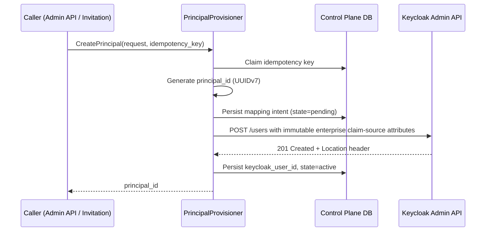

---
doc_meta:
  id: TDD-identity-control-001
  title: Canonical Principal Identifier and Creation Path
  owner: Core Platform Team
  version: 1.13.0
  status: approved
  classification: restricted
  review_cycle_days: 90
  created_date: 2026-08-10
  last_reviewed: 2026-10-07
  parent_sad: SAD-001
---

# Canonical Principal Identifier and Creation Path

## Purpose

Specify how the Scnehaux canonical Principal identifier is generated, stored,
propagated into tokens, and verified, so that no enterprise domain ever persists a
Keycloak-internal identifier as a foreign key.

This design implements the accepted Principal Identifier decision: Scnehaux mints a
canonical `principal_id`; Keycloak retains its own protocol subject. The two are
distinct claims with distinct lifetimes and distinct portability guarantees.

The identifier contract is irreversible in practice. Once tokens carrying a subject
identifier have been issued and downstream domains have persisted it, changing the
identifier is an enterprise-wide referential migration rather than a configuration
change. This design therefore fixes the contract before the first Principal exists.

## Scope

**In scope**

- Generation, format, and uniqueness invariant of `principal_id`.
- Storage of `principal_id` inside the Keycloak user representation.
- The single authorized Principal creation path through the Identity Control Service.
- Idempotency and crash-recovery behavior of that path.
- Detection and quarantine of Principals created outside the authorized path.
- The `principal_id` token claim and the verifier invariant that depends on it.

**Out of scope**

- Protocol subject (`sub`) semantics, pairwise subject derivation, and external
  token profiles — owned by the STD-IAM-002 Token and Verification Profile.
- Realm and issuer topology — owned by the Realm & Issuer decision.
- Credential material, authenticator enrollment, and authentication ceremonies —
  owned by the Keycloak Identity Kernel.
- Membership, Tenant, and Workspace authority - owned by `organization-control`;
  projection into Keycloak is owned by `TDD-identity-control-002`.
- Migration of identifiers from any prior identity implementation.

## Technical Context

Two runtimes participate:

| Runtime | Role in this design |
| :-- | :-- |
| Keycloak Identity Kernel (SAD-001) | Physical storage of the Principal record and its immutable `scnehaux_principal_id` attribute; issues tokens carrying the claim |
| Identity Control Service (SAD-001) | Mints `principal_id`, performs the only authorized creation call, owns the mapping table, runs reconciliation |

The authority split is deliberate. Keycloak is the physical system of record for the
Principal row. Scnehaux is the authority for the identifier that the rest of the
enterprise references. Exiting Keycloak therefore requires migrating credential
material and protocol configuration, and does not require rewriting foreign keys in
Membership, HCM, audit, evidence, or analytical stores.

Three constraints shape the component design:

1. Keycloak does not enforce uniqueness on user attributes. The uniqueness invariant
   for `principal_id` is held by the Control Database, not by Keycloak.
2. Creating a Keycloak user and setting an attribute in two separate calls produces a
   window in which a Principal exists without a canonical identifier. The design
   removes that window rather than compensating for it.
3. Keycloak can create users without the Control Plane in the request path through
   self-registration and federated first-login. Both are disabled in this phase.

## Component Design

### Components

| Component | Module | Responsibility |
| :-- | :-- | :-- |
| `PrincipalProvisioner` | `internal/identity/provisioning` | Mints the identifier, performs the create call, owns idempotency |
| `KeycloakAdminClient` | `internal/identity/keycloak` | Typed wrapper over the supported Admin REST API |
| `PrincipalMappingRepository` | `internal/identity/provisioning` | Persists and enforces uniqueness of the mapping |
| `PrincipalReconciler` | `internal/identity/provisioning` (`sweep.go`) | Periodic sweep for unmapped, orphan, duplicate and dangling Principals (1.13.0) |
| Realm protocol mapper | Keycloak configuration | Projects the user attribute into the `principal_id` token claim |

### Creation Path


```mermaid
sequenceDiagram
    participant C as Caller (Admin API / Invitation)
    participant P as PrincipalProvisioner
    participant D as Control Plane DB
    participant K as Keycloak Admin API

    C->>P: CreatePrincipal(request, idempotency_key)
    P->>D: Claim idempotency key
    P->>P: Generate principal_id (UUIDv7)
    P->>D: Persist mapping intent (state=pending)
    P->>K: POST /users with immutable enterprise claim-source attributes
    K-->>P: 201 Created + Location header
    P->>D: Persist keycloak_user_id, state=active
    P-->>C: principal_id
```

The identifier and subject classification are fixed before the remote call and carried
inside the creation payload. The Keycloak representation accepts attributes at creation
time, so the Principal never exists without the complete claim source required by its
audience profile.

### Authorized and Prohibited Creation Paths

```text
Authorized
    Identity Control Service → Keycloak Admin API
        via POST /v1/principals              ordinary path, authenticated caller
        via the bootstrap ceremony           single use per Control Database

Prohibited in this phase
    Self-registration
    Federated first-login auto-create
    Direct Admin Console user creation
    Any write to the Keycloak database
    Any direct write to identity.principal_mapping
```

Prohibited paths are closed by realm configuration rather than by policy alone. The
reconciler treats any Principal that appears without a mapping as evidence that a
prohibited path is open, and quarantines it.

#### The Bootstrap Ceremony

`POST /v1/principals` requires a caller holding a `principal_id`, and it is the only path that
issues one. A fresh realm therefore has no entry point, and the ceremony is it. `ADR-IAM-001 §5.11`
records the decision and why a standing break-glass identity was rejected.

It is a command on the deployable rather than an endpoint, because an endpoint that creates a
Principal without an authenticated caller is a permanent hole in the API whether or not a guard
currently closes it.

**Structural guarantees, in the order the code relies on them.**

```sql
CREATE TABLE identity.bootstrap_ceremony (
    id              INTEGER     PRIMARY KEY,
    operator        TEXT        NOT NULL,
    reason          TEXT        NOT NULL,
    idempotency_key TEXT        NOT NULL,
    requested_at    TIMESTAMPTZ NOT NULL DEFAULT now(),
    CONSTRAINT bootstrap_ceremony_single_row CHECK (id = 1)
);
```

1. `id = 1` under a primary key makes the table hold at most one row. A second ceremony is
   refused by a constraint, not by a `SELECT count(*)` the next refactor could drop, and two
   concurrent ceremonies produce one Principal rather than two.
2. The claiming transaction asserts `identity.principal_mapping` is empty. Together with (1)
   this means the ceremony can only ever run on a virgin registry.
3. The row is **insert-only**. `grants.sql` revokes `UPDATE` and `DELETE` from the runtime role
   on this table specifically, so the operator and reason on record cannot be rewritten — by the
   application, by a retry, or by whoever runs the ceremony a second time.
4. `idempotency_key` is claimed in the same row rather than generated per invocation. A ceremony
   that crashes after the kernel call resumes against the same key, so the recovery path that
   already exists for the API applies unchanged and a retry cannot mint a second Principal.

**The ceremony holds no credential.** The kernel user is created with a required
credential-setting action, so the first human interaction establishes the credential. A ceremony
that set a password would be a process holding a credential for an identity it also authorized,
which is the concentration `ADR-IAM-001 §5.10` exists to prevent.

**The ceremony registers this service's resource** (`ADR-IAM-001 §5.11` rule 5). A caller's token
is admitted only when its `aud` names a registered protected resource (STD-IAM-002 §3.1), and the
first call after the ceremony is to this API, so the resource must exist before any token can name
it. Registering it through the API would need such a token first. The ceremony registers it through
the registration path's own Admin API client, as `POST /v1/registrations` would:

| Field | Value |
| :-- | :-- |
| `client_key` | `IDENTITY_TOKEN_AUDIENCE`, `identity-control-api`: one setting, so the resource the ceremony registers and the audience the service verifies cannot disagree |
| `profile`, `audience_class`, `lifetime_class` | `resource`, `privileged`, `L0` |
| `registered_by` | the Principal the ceremony created |
| idempotency | scope `ceremony:bootstrap`, key `bootstrap-resource:<realm>` |

A ceremony interrupted after the Principal exists names the failed registration and is resumed
with `-resume`, which replays the Principal and completes the registration once. An estate whose
ceremony ran before this rule registers the resource the same way, by resuming with the recorded
operator, username and email, and then moves its callers' audience to it by an audience change
(`TDD-identity-control-003` §Registration Changes).

**The ceremony's Principal is the first provider.** It records that Principal in its own row as a
local emergency grant, honored until Organization's first emergency `provider:identity-control`
grant is projected, and retired then by an insert-only record (`ADR-ORG-002 §5.4`,
`TDD-identity-control-006` §The Ceremony's Grant). It no longer writes the kernel attribute
`scnehaux_provider_scope`.

**Why not simply relax the API for the first call.** A route that accepts an unauthenticated
request when a table is empty is a route whose authorization depends on data. The table is empty
in every fresh environment, including a restored-from-backup one and a mistakenly-pointed-at one,
and the failure is silent: the request succeeds.

## Data Model

### Control Database

```sql
CREATE TABLE identity.principal_mapping (
    principal_id       UUID        PRIMARY KEY,
    keycloak_user_id   TEXT        UNIQUE,
    realm              TEXT        NOT NULL,
    subject_type       TEXT        NOT NULL,
    workload_owner     UUID,
    state              TEXT        NOT NULL,
    created_at         TIMESTAMPTZ NOT NULL DEFAULT now(),
    activated_at       TIMESTAMPTZ,
    quarantined_at     TIMESTAMPTZ,
    quarantine_reason  TEXT,
    version            INTEGER     NOT NULL DEFAULT 1,
    CONSTRAINT principal_mapping_state_check
        CHECK (state IN ('pending', 'active', 'suspended', 'quarantined', 'retired')),
    CONSTRAINT principal_mapping_subject_check
        CHECK (subject_type IN ('human', 'workload')),
    CONSTRAINT principal_mapping_owner_check
        CHECK ((subject_type = 'human' AND workload_owner IS NULL)
            OR (subject_type = 'workload' AND workload_owner IS NOT NULL)),
    CONSTRAINT principal_mapping_active_linked_check
        CHECK (state <> 'active' OR keycloak_user_id IS NOT NULL)
);

CREATE UNIQUE INDEX principal_mapping_realm_user
    ON identity.principal_mapping (realm, keycloak_user_id)
    WHERE keycloak_user_id IS NOT NULL;
```

**Departure recorded: the row carries the creation payload.** Two columns were added during
implementation, `username TEXT NOT NULL` and `email TEXT`, because the recovery algorithm
below cannot be written without them.

Recovery retries the create when the kernel holds no matching user. Retrying requires the
payload of the original call, and the columns above name an identifier, a realm, a subject
type, and an owner — none of which is a username. A pending row was therefore
unrecoverable: the branch could not run, and the caller's idempotency key would stay
in-progress permanently with no path out, because a repeated request against an unfinished
claim returns `ErrInProgress` rather than retrying.

Passing the payload into the recovery sweep instead was considered and rejected. A sweep
resolves many mappings, each from a different request, so one payload supplied by the caller
would have been applied to every mapping the sweep touched.

The payload is Tier-2 identifiable PII under STD-GLB-007 and is encrypted at rest with the
rest of the Control Database. It is the argument of a call this service makes and not a
second authority for identity attributes: Keycloak owns the live values, and a change made
there is not reflected here. `username` is refused as empty before the insert rather than at
the database, so the failure names the reason instead of a column.

**Departure recorded: the global unique constraint on `keycloak_user_id` makes the partial
index redundant.** `keycloak_user_id TEXT UNIQUE` already enforces global uniqueness of
non-null values, and PostgreSQL treats nulls as distinct, so it permits many pending rows.
The partial unique index on `(realm, keycloak_user_id)` therefore adds nothing. Both are
implemented as specified above; the redundancy is recorded rather than resolved, because
removing a constraint named as a deliverable belongs in a review rather than in an
implementation commit.

`principal_id` is the primary key and the enterprise-wide reference. `keycloak_user_id`
is nullable while the mapping is `pending`, and is never exposed outside this module.
`principal_mapping_active_linked_check` makes that the only state where it can be
absent: an active mapping with no Keycloak user would be served by nothing, and
recovered by nothing, because recovery reads only `pending` rows.

State transitions:

```text
      relink
   ┌──────────┐
   ↓          │
pending ──→ active ──→ retired
   │         ↑  │        ↑
   │ restore │  │ suspend│
   │         │  ↓        │
   │        suspended ───┘
   │          │
   └──────────┴────→ quarantined
```

**`suspended` is containment, and it is reversible.** An administrator suspends a Principal to
stop it signing in while an incident is investigated, and restores it afterwards
(`TDD-identity-control-005` §Containment Is Reversible). The kernel user is disabled and its
sessions ended, and nothing else changes: its Memberships, ownerships and grants are kept, as
Okta keeps a suspended user's assignments and reinstates them on unsuspend. **`quarantined` is
different.** It is the reconciler's hold on a mapping whose invariants are broken: a Principal made
outside the authorized path, or a duplicate. No administrator sets it, and only a relink or a
retirement leaves it. A suspended Principal may be retired.

**`relink` is the one way back from `active`.** A Principal outlives its Keycloak user.
The user can be deleted in the console, or lost with a realm rebuilt from nothing, and
the `principal_id` that every domain keys on, with every Membership held under it, must
survive that. `relink` clears `keycloak_user_id` and returns the mapping to `pending`.
The recovery below then does what it does for any pending mapping: it adopts a user
carrying the identifier, or creates one with the same `principal_id`. Nothing outside
this table changes, since `organization-control` holds Memberships by `principal_id`.

**A workload's retirement retires its Principal.** A workload's Keycloak user is its client's
service account, and deleting the client deletes it. The workload lifecycle therefore moves the
mapping to `retired` in the transaction that deletes the client (`TDD-identity-control-004`
§Suspension, Restoration, and Retirement). A human Principal's `:retire` is a separate route and is
not built.

```sql
CREATE TABLE identity.principal_relink (
    relink_id                 UUID        PRIMARY KEY,
    principal_id              UUID        NOT NULL REFERENCES identity.principal_mapping(principal_id),
    previous_keycloak_user_id TEXT        NOT NULL,
    relinked_by               UUID        NOT NULL,
    reason                    TEXT        NOT NULL CHECK (btrim(reason) <> ''),
    relinked_at               TIMESTAMPTZ NOT NULL DEFAULT now()
);

CREATE TABLE identity.principal_finding (
    finding_id           UUID        PRIMARY KEY,
    principal_id         UUID        REFERENCES identity.principal_mapping(principal_id),
    finding_class        TEXT        NOT NULL
        CHECK (finding_class IN ('dangling', 'unmapped', 'orphan', 'duplicate')),
    keycloak_user_id     TEXT        NOT NULL,
    claimed_principal_id TEXT,                    -- orphan: the identifier the user carries
    username             TEXT,                    -- the kernel user's username, for triage
    user_disabled        BOOLEAN     NOT NULL DEFAULT false,
    detected_at          TIMESTAMPTZ NOT NULL DEFAULT now(),
    resolved_at          TIMESTAMPTZ,
    resolution           TEXT,
    CHECK ((resolved_at IS NULL) = (resolution IS NULL)
        AND (resolution IS NULL OR resolution IN ('relinked', 'user_present', 'user_absent'))),
    CONSTRAINT principal_finding_subject_check CHECK (
        (finding_class IN ('dangling', 'duplicate') AND principal_id IS NOT NULL AND claimed_principal_id IS NULL)
     OR (finding_class = 'unmapped' AND principal_id IS NULL AND claimed_principal_id IS NULL)
     OR (finding_class = 'orphan' AND principal_id IS NULL AND claimed_principal_id IS NOT NULL))
);

CREATE UNIQUE INDEX principal_finding_open_user
    ON identity.principal_finding (finding_class, keycloak_user_id) WHERE resolved_at IS NULL;
```

**1.13.0 widens the finding to the sweep's other three branches.** An `unmapped` or `orphan`
finding names a kernel user no mapping accounts for, so it has no `principal_id`; an orphan
records the identifier the user carries, which no mapping holds and which may not even parse.
`username` is recorded so whoever triages the finding can find the user: `keycloak_user_id` never
leaves this module. `user_disabled` says whether the sweep disabled the user, which it does only
under `IDENTITY_UNMAPPED_USERS=disable` (§Reconciliation Sweep). One open finding per class and
kernel user replaces one per Principal, because a duplicate is one finding per extra user.

`principal_relink` is insert-only for the runtime role: a Principal's move to a new
Keycloak user is exactly the change whose record must not be rewritable by the process
that made it. A finding is kept after it resolves, and the runtime deletes none.

### Keycloak

The canonical identifier is stored as a user attribute:

```json
{
  "username": "operator@example.com",
  "enabled": true,
  "attributes": {
    "scnehaux_principal_id": ["019235f1-8c4a-7c1e-9d0b-3f4a2b6e5d71"],
    "scnehaux_subject_type": ["human"]
  }
}
```

The attribute is treated as immutable. Keycloak enforces this against the user, but
not against an administrator.

- **Self-service is closed.** Realm configuration removes the attribute from the
  user-editable set, and the account API refuses a change.
- **An administrator's edit is applied.** No declarative profile can make the attribute
  write-once. `identity-kernel` proof-of-concept question 3 answered this against the
  pinned release: an attribute nobody may edit is silently dropped at creation.

Immutability against administrators therefore rests on two things:

- **Who holds `manage-users`.** This service's Admin API client is the only holder
  outside break-glass. That role can already reset any user's credentials, so rewriting
  an identifier gives it nothing new.
- **Reconciler detection.** A rewritten identifier reads as an orphan, or as a duplicate
  when it names another Principal. Either way the user is disabled on the next sweep, and
  until then the rewritten value is carried into tokens.

The identifier is always written as the canonical lowercase form `id.UUID.String`
produces. The kernel's attribute search is case-insensitive, so two values differing only
in case are one identifier to it.

### Token Claim

```json
{
  "iss": "https://identity.scnehaux.com/realms/<realm>",
  "sub": "<protocol subject>",
  "principal_id": "019235f1-8c4a-7c1e-9d0b-3f4a2b6e5d71",
  "subject_type": "human",
  "aud": ["hcm-api"],
  "iat": 1786000000,
  "exp": 1786000900
}
```

`sub` remains the issuer-scoped protocol subject and may be pairwise for external
relying parties. `principal_id` is the enterprise reference. Internal domains persist
`principal_id`. Audit and evidence records retain `principal_id` together with
`iss` and `sub` so that protocol-level and enterprise-level identity remain
reconcilable after any future issuer change.

### Caller Token

The token above is what a Principal carries to an internal API. A caller of this service carries
the same shape, and its authority is read from records rather than claims. Minting a Principal is
irreversible and belongs to no Tenant, which makes it `privileged` (STD-IAM-002 §3.1.1):

```json
{
  "principal_id": "019235f1-8c4a-7c1e-9d0b-3f4a2b6e5d71",
  "subject_type": "human",
  "acr": "1",
  "auth_time": 1786000000,
  "aud": ["identity-control-api"],
  "exp": 1786000240
}
```

**`aud` names this service's resource registration, `identity-control-api`**, and never its Admin
API client `identity-control`, which holds a key and `manage-users`. A client named in `aud` is one
the kernel lets exchange the token, so the resource is a keyless `resource` registration
(STD-IAM-002 §3.1). A caller's audience moves to it by an audience change
(`TDD-identity-control-003` §Registration Changes), and `IDENTITY_TOKEN_AUDIENCE` names it.

**A provider is a Principal this service's records say is one, for this request**
(`ADR-ORG-002 §5.3`, `TDD-identity-control-006`): one holding an emergency
`provider:identity-control` grant, or an activation of an eligible one that is in force while the
projection is fresh, or, until Organization's first emergency grant is projected, the ceremony's
Principal. The token carries no `provider_scope`. A token that carries one, or carries `tenant_id`,
is refused. The access token lifetime is class `L0`, 240 seconds, set on the calling client's
registration.

**A caller that is not a provider is a registration owner** (`ADR-IAM-003`), the
`resource-scoped` form of STD-IAM-002 §3.1.1: `principal_id`, `subject_type` `human`, `acr` and
`auth_time`, and no `tenant_id`. It carries no authority of its own. Its authority is the ownership
this service records for the registration a request names, read for each request
(`TDD-identity-control-003` §Registration Ownership), and only the routes listed there serve it.
Every other route answers it 403 before reading anything, so a Principal route, a workload route or
an adoption is a provider's alone. A workload's token is never an owner's.

**The caller's token is an access token, typed `at+jwt`** (STD-IAM-002 §3.5 step 5, RFC 9068 §4).
An ID token carries the same issuer and signature, so the header type is what keeps one from
passing as an access token. `IDENTITY_TOKEN_TYPE` sets how the check runs:

- `report`, the default, accepts a token typed `JWT` or untyped and logs it with its `azp`, so an
  operator sees which callers' clients still need the token profile (TDD-identity-control-003
  §Profiles). The log carries no claim value but the client identifier.
- `enforce` refuses such a token with 401, as every other verification failure is refused.

A server moves to `enforce` once its callers' clients carry the at+jwt attribute: a registered
client does from its registration, and a client registered or adopted before the profile does once
an operator applies the registered state. Production runs `enforce`.

## API / Interface

### Identity Control Service

```text
POST   /v1/principals
GET    /v1/principals/{principal_id}
POST   /v1/principals/{principal_id}:quarantine
POST   /v1/principals/{principal_id}:relink
POST   /v1/principals/{principal_id}:retire
GET    /v1/principals:unmapped
GET    /v1/principals:dangling
POST   /v1/principals:reconcile
```

`GET /v1/principals:unmapped` (1.13.0) lists the open `unmapped`, `orphan` and `duplicate`
findings, oldest first: `{"unmapped": [{"finding_id", "finding_class", "principal_id",
"claimed_principal_id", "username", "user_disabled", "detected_at"}]}`, the identifiers present only
for the classes that have them. `GET /v1/principals:dangling` keeps its shape and lists `dangling`
findings only. `POST /v1/principals:reconcile` answers what the sweep it ran found:
`{"recovered", "dangling", "unmapped", "orphan", "duplicate"}`. All three are a provider's.
`:quarantine` and `:retire` for a human are not built: quarantine is the reconciler's hold, which
no administrator sets (§Data Model).

`:relink` requires `X-Administrative-Reason`. It refuses a mapping that is not
`active`, and it refuses with `409` while the mapped Keycloak user still exists:
relinking a live user would only find that same user again, and it would hide
whatever made someone think it was gone. If Keycloak cannot be reached it answers
`503` and changes nothing, because an unknown answer is not an absent user. The
caller, the reason and the previous `keycloak_user_id` are recorded with the
transition.

`POST /v1/principals` requires an `Idempotency-Key` header. The response carries
`principal_id`. The request must declare `subject_type`. `keycloak_user_id` is never present in any
response body.

**A workload is refused here, and by `:relink`.** A workload authenticates as its own client with
the client credentials grant, and that grant issues its token for the client's service-account
user and no other (`TDD-identity-kernel-001` §Claim Projection). A user this path created would
carry the workload's `principal_id` into no token. Workloads are created through
`POST /v1/workloads`, which mints the `principal_id` the same way and binds the mapping to the
service-account user (`TDD-identity-control-004` §Creation). The mapping's `subject_type` and
`workload_owner` columns and their constraint are unchanged, and a workload's mapping is written by
that path.

### Keycloak Admin API

| Operation | Endpoint | Use |
| :-- | :-- | :-- |
| Create user with attribute | `POST /admin/realms/{realm}/users` | Sole creation call |
| Search by attribute | `GET /admin/realms/{realm}/users?q=scnehaux_principal_id:{id}` | Idempotent recovery |
| Enumerate users | `GET /admin/realms/{realm}/users` (paged) | Reconciliation sweep |
| Disable user | `PUT /admin/realms/{realm}/users/{id}` | Quarantine |

Attribute search behavior differs across Keycloak releases. `identity-kernel`
proof-of-concept question 2 answered it against the pinned release (26.7.4):

- **Exact.** No prefix, substring, or extension matches.
- **Case-insensitive.**
- **Disabled users.** They are found.
- **Paging.** `first` and `max` page without loss.
- **Uniqueness.** It is not enforced.

`compat/` fails a release that loosens the match. `FindByPrincipalID` still filters to
exact equality, and it reads every page, because the many-match branch quarantines every
match. A disable sent as `{"enabled": false}` keeps the identifier, and `compat/` asserts
that too.

## Algorithms / Logic

### Identifier Generation

`principal_id` is a UUIDv7 generated inside the Control Plane process. UUIDv7 is
selected for time-ordered index locality on the mapping table and on every
downstream table that references it. The value is opaque to consumers; no consumer
parses the embedded timestamp.

Uniqueness is enforced by the primary key on `identity.principal_mapping`. A
generation collision fails the insert and the request is retried with a new value.

### Idempotency and Crash Recovery

The creation path has one durable checkpoint before the remote call and one after.
Recovery is driven by the `pending` state:

```text
For each mapping in state=pending older than the recovery threshold:
    search Keycloak by attribute scnehaux_principal_id = principal_id
    if exactly one user found:
        record keycloak_user_id, transition to active
    if zero users found:
        retry the create call with the same principal_id
    if more than one user found:
        quarantine every matching user, transition to quarantined, raise alert
```

Retrying with the same `principal_id` is what makes the operation idempotent across
a crash between the remote call and the local commit. The attribute search is the
recovery index; it is the reason the identifier is written into Keycloak rather than
held only in the Control Plane.

A repeated request carrying the same `Idempotency-Key` returns the original
`principal_id` and performs no remote call.

### Reconciliation Sweep

The reconciler runs on a schedule and enumerates Keycloak users per realm:

```text
enumerate the realm's users, page by page          -- a failure part way records nothing
read the mappings, and the principal_id every pending workload holds, after the enumeration

For each user the enumeration returned:
    attribute := scnehaux_principal_id

    if attribute is absent:
        if the user is a client's service-account user: skip     -- (1.13.0) its client's, below
        record an unmapped finding, raise an alert
        disable the user when IDENTITY_UNMAPPED_USERS is disable

    else if no mapping row and no pending workload holds attribute:
        record an orphan finding, raise an alert
        disable the user when IDENTITY_UNMAPPED_USERS is disable

    else if the mapping is pending: skip                          -- (1.13.0) recovery's, below

    else if the mapping row points at a different keycloak_user_id:
        read the mapping's own user; if the kernel no longer holds it: skip   -- (1.13.0) below
        disable both users
        transition the mapping to quarantined when it is active or suspended
        record a duplicate finding, raise an alert

For each active mapping whose keycloak_user_id the enumeration did not return:
    read the user; if the kernel holds it, it is present         -- (1.13.0) below
    otherwise record a dangling-mapping finding, raise an alert
```

A dangling mapping is reported, never relinked by the sweep. A Keycloak user can be
deleted on purpose, by an administrator removing someone's access. A sweep that
recreated every missing user would restore that access within one interval, with
nobody having decided it. Relinking is an operator's decision, made through `:relink`
with a reason.

The users are enumerated before the active mappings are read, and a mapping activated
during the enumeration is left for the next sweep, since its user may sit on a page
already read. An enumeration that fails part way records nothing, because an unread page
is not a missing user. When a later sweep finds the user present again, the open finding
is resolved as `user_present`.

**Built.** Pending recovery and every branch above run on the registration reconcile schedule
(TDD-identity-control-003), and on `POST /v1/principals:reconcile`. Before that schedule existed,
nothing ran pending recovery: a creation interrupted after its checkpoint stayed pending until
someone noticed. The unmapped, orphan and duplicate branches were built in 1.13.0, which settles
what the pseudocode above left open:

- **A service-account user is its client's, not a stray Principal.** Keycloak creates a user for
  every client with service accounts enabled, and marks it with the client it belongs to
  (`serviceAccountClientLink` in the Admin API's user representation, `ADR-IAM-001` [R23]). A
  workload's carries its `principal_id` and is checked like any user. One without the attribute is
  this service's own Admin API client's, or a registered confidential client's, or an unmanaged
  client's, and the registration sweep already accounts for every client
  (`TDD-identity-control-003` §Drift Reconciliation). Disabling it here would cut this service off
  from the kernel the first time it ran, so it is never an unmapped finding.
- **The enumeration may not return a service-account user,** so an active mapping whose user it did
  not return is read directly before it is reported dangling. A workload's user is a
  service-account user, and reporting every workload dangling would be the sweep's whole output.
- **An identifier a pending workload holds is not an orphan.** A workload's identity is written on
  its service-account user before its mapping, because the mapping is written only once that user
  exists (`TDD-identity-control-004` §Creation). Between the two, the user carries an identifier no
  mapping holds yet, and workload recovery is what finishes it.
- **A pending mapping is recovery's.** A user carrying a pending mapping's identifier is the one
  recovery adopts, and recovery's own many-match branch already quarantines a duplicate.
- **A duplicate needs two users that exist.** A mapping whose own user is gone, while another user
  carries its identifier, is a dangling mapping or a rebind in flight: `:relink`'s recovery, or a
  workload's client rebuilt with a new service-account user (`TDD-identity-control-004` 1.5.0).
  Quarantining it would turn an operator's repair into an incident. Both users of a real duplicate
  are disabled whatever `IDENTITY_UNMAPPED_USERS` says: either one's token asserts the same
  `principal_id`. A quarantined or retired mapping keeps its state; only the users are disabled.
- **Disabling is a setting, for the rollout.** `IDENTITY_UNMAPPED_USERS` is `report` or `disable`,
  as `IDENTITY_UNMANAGED_CLIENTS` is for clients and for the same reason: an estate whose users
  predate this service would lose all of them to the first sweep, and the first sweep runs at
  startup. It is the observe-first rollout Crossplane's `Observe` management policy gives an import
  (`ADR-IAM-001` [R5]). Unlike clients, the default follows `IDENTITY_ENVIRONMENT`: `disable` in
  production, `report` elsewhere, so the control a production estate depends on is not one it has
  to remember to switch on.
- **A finding resolves only by what the sweep sees.** A dangling finding resolves as `user_present`
  when its user is read again, or as `relinked` by `:relink`. An unmapped, orphan or duplicate
  finding resolves as `user_absent` once a complete enumeration no longer returns its user: deleting
  a user that came from outside the authorized path is the triage decision, and a user disabled and
  left in place is still evidence.
- **No event is emitted yet.** `identity.principal.*_detected` belongs to the canonical
  `identity.*` events, which follow when Audit & Evidence consumes them
  (`TDD-identity-control-007` §Scope). Until then the finding is the record and an `ERROR` log line
  is the alert §Operational Notes classes as critical.

Disabling rather than deleting is deliberate: a false positive caused by a
reconciler defect is recoverable, while deletion of a Principal is not.

The sweep is the compensating control for the two invariants Keycloak cannot
enforce — attribute presence and attribute uniqueness. It is defense in depth, not
the primary mechanism. The primary mechanism is closing every unauthorized creation
path.

### Verifier Invariant

A protected resource accepting an internal Scnehaux token rejects the token when
`principal_id` is absent. This invariant prevents a partially migrated estate in
which some domains key on `sub` and others key on `principal_id`, which is a worse
outcome than either choice applied consistently.

External token profiles that intentionally omit `principal_id` are identified by
audience and are validated against the external profile rules in STD-IAM-002 §3.6.

## Configuration

### Realm Configuration Required by This Design

Realm configuration is authored and versioned in `identity-kernel`, not here. This
design does not configure Keycloak; it depends on four settings and fails without
them, so they are stated as requirements rather than as instructions.

| Requirement | Consequence if absent |
| :-- | :-- |
| User registration disabled | A Principal can appear without a canonical identifier |
| Identity provider first-login creates no user | Same, through the federated path |
| `scnehaux_principal_id` admin-managed and not user-editable | The identifier stops being immutable and the mapping stops being trustworthy |
| Protocol mappers project the required claim-source attributes into the selected audience profile | The verifier invariant and workload accountability contract cannot hold |

The reconciler treats a violation of the first two as evidence that a prohibited
creation path is open, and quarantines what it finds. That is a compensating control,
not a substitute: the primary mechanism is the realm configuration owned by
`identity-kernel`.

Mapper surface coverage is settled by proof-of-concept in `identity-kernel`, and the
outcome is pre-decided so a partial result requires no unplanned amendment:

- All four surfaces covered — adopt the target configuration.
- Access token covered, one or more of ID token, UserInfo, or introspection not
  covered — adopt access-token-only, record the uncovered surfaces here, and prohibit
  consumers from resolving enterprise identity through them. No standard amendment and
  no custom extension is required, because STD-IAM-001 §3.3 mandates only the access
  token.
- Access token not covered by any supported mapper — escalate. This is the single
  outcome that forces either a restricted Keycloak extension or a standard amendment,
  and it is why this question runs first.

### Identity Control Service Settings

| Variable | Default | Purpose |
| :-- | :-- | :-- |
| `IDENTITY_KEYCLOAK_BASE_URL` | none, required | Admin API base URL |
| `IDENTITY_KEYCLOAK_REALM` | none, required | Target realm |
| `IDENTITY_KEYCLOAK_CLIENT_ID` | none, required | Service account client used for administration |
| `IDENTITY_KEYCLOAK_CLIENT_KEY_FILE` | none, required | That client's PEM private key. It authenticates by signed JWT and has no secret |
| `IDENTITY_PROVISION_TIMEOUT` | `10s` | Upper bound on a single Admin API call |
| `IDENTITY_PENDING_RECOVERY_AFTER` | `60s` | Age at which a pending mapping enters recovery |
| `IDENTITY_RECONCILE_INTERVAL` | `15m` | Sweep cadence |
| `IDENTITY_RECONCILE_PAGE_SIZE` | `200` | Admin API pagination size |
| `IDENTITY_UNMAPPED_USERS` | `disable` in production, `report` elsewhere | Whether the sweep disables an unmapped or orphan user, or only records it (1.13.0) |

The Principal sweep runs on `IDENTITY_REGISTRATION_RECONCILE_INTERVAL` with the registration sweep;
`IDENTITY_RECONCILE_INTERVAL` is not read.

The administration client credential is a private key (`ADR-IAM-001 §5.12`). It is sourced from
the approved secret manager as a file, and is never present in application configuration or
source control. The kernel holds only its public half, so neither the kernel's database nor its
administrators can read anything that authenticates as this service. The assertion's audience is
read from the realm's discovery, because this service reaches the kernel on an internal address
while the issuer is the public one.

## Testing Strategy

### Unit

- UUIDv7 values are monotonically ordered within a process and unique across
  concurrent generation.
- The mapping state machine rejects every transition not present in the state
  diagram.
- A repeated `Idempotency-Key` returns the original identifier without a remote call.

### Integration

Executed against a Keycloak instance pinned to the release under evaluation:

- A created Principal carries `scnehaux_principal_id` in its Keycloak representation.
- Attribute search returns exactly the created user and performs exact matching.
- The issued access token, ID token, UserInfo response, and introspection response
  each carry the claims supported for their audience profile, and values are identical
  across every covered surface.
- Human tokens carry `subject_type=human`; workload tokens carry
  `subject_type=workload` and `workload_owner`.
- `sub` and `principal_id` hold different values, confirming the claims are distinct.

### Failure Injection

- Process termination between the Admin API call and the local commit leaves a
  `pending` mapping; recovery adopts the existing Keycloak user without creating a
  second one.
- Admin API timeout followed by retry produces exactly one Keycloak user.
- A user created directly through the Admin Console is disabled by the next sweep and
  produces an `unmapped` finding; under `report` it produces the finding and stays enabled.
- A user carrying an identifier no mapping holds produces an `orphan` finding naming it.
- Two Keycloak users carrying the same attribute value are both disabled and the
  mapping is quarantined.
- A client's service-account user is never an `unmapped` finding, a workload is never reported
  dangling, a pending workload's identifier is never an orphan, and a mapping whose own user is gone
  is never quarantined as a duplicate.
- An enumeration that fails part way changes nothing.

### Portability

- An active mapping cannot be stored without a `keycloak_user_id`: the database
  refuses it.
- Deleting a Principal's Keycloak user produces a dangling-mapping finding on the next
  sweep, and the sweep changes nothing else.
- `:relink` on that mapping returns it to `pending`, and recovery creates a Keycloak
  user carrying the same `principal_id`. The mapping is `active` again under the new
  user, and the Principal's Memberships in `organization-control` are unchanged.
- `:relink` is refused while the mapped user exists, without a reason, and on a
  mapping that is not `active`.

### Negative

- An internal-audience token lacking `principal_id` is rejected by the reference
  verifier.
- Self-registration and federated first-login are unreachable in the configured realm.
- The `scnehaux_principal_id` attribute cannot be modified through account
  self-service or through a non-administrative account.

## Security Notes

`principal_id` is a pseudonymous identifier. It carries no name, address, or
credential material, and disclosure of the value alone does not authenticate the
subject.

The identifier is deliberately stable and enterprise-wide, which makes it a
correlation key across domains. It is therefore restricted to internal audiences.
External relying parties receive `iss` and `sub`, and receive pairwise subjects where
cross-relying-party correlation is not justified.

The Admin API service account holds the narrowest realm role set that permits user
creation, attribute write, user search, and user disable. It does not hold realm
administration, client management, or credential read authority.

## Performance Notes

Principal creation is an administrative operation. The design targets a p95 of 500 ms
for `POST /v1/principals` excluding Keycloak latency, and does not appear on any
authentication or token-validation hot path.

The reconciliation sweep enumerates users through paged Admin API calls. Sweep
duration grows linearly with Principal count; at the initial internal population the
sweep completes well inside its interval. The sweep is rate-limited so that
reconciliation cannot consume capacity reserved for authentication.

## Operational Notes

Alerts:

| Condition | Severity |
| :-- | :-- |
| Duplicate `scnehaux_principal_id` detected | critical |
| Unmapped Principal detected | critical |
| Pending mappings exceeding the recovery threshold | warning |
| Reconciliation sweep age exceeding two intervals | warning |

Runbooks required before production: unmapped-Principal triage, duplicate-identifier
containment, pending-mapping recovery, and administration credential rotation.

Telemetry excludes credential fields and unrestricted personal data. `principal_id`
appears in structured logs; `keycloak_user_id` does not.

## Traceability

| Relationship | Target |
| :-- | :-- |
| Parent system | SAD-001 — Scnehaux Identity Runtime (Identity Control Service container) |
| Realizes capability | PAD-PLT-001 — Identity & Access Platform |
| Governed by | ADR-IAM-001 — Adopt Keycloak Identity Kernel |
| Governed by | Principal Identifier decision (Gate B) |
| Enterprise constraint | EAD-003 — canonical identifiers are opaque, stable, and authority-scoped |
| Enterprise constraint | EAD-006 — identity correlation is limited to justified realm and purpose |
| Consumed by | STD-IAM-002 Token and Verification Profile, which fixes the verifier invariant |
| Related design | `TDD-identity-control-002` - Membership projection and session removal |

### Open Proof-of-Concept Questions

This design leaves `draft` when the following are answered against the pinned
Keycloak release:

1. Attribute search exact-match behavior and pagination semantics. **Answered
   2026-09-25: exact, case-insensitive, pages without loss.** See §Keycloak Admin API.
2. Protocol mapper coverage across access token, ID token, UserInfo, and
   introspection. **Answered 2026-09-25: all four covered**, so the target configuration
   is adopted.
3. Declarative user profile enforcement of attribute immutability. **Answered
   2026-09-25: enforced against the user, detected rather than enforced against an
   administrator.** See §Data Model.
4. Whether the issuer path form permits a vendor-neutral value, which determines the
   `iss` component of the identity pair retained in evidence. **Answered 2026-09-25:
   no.** `iss` is `{frontend URL}/realms/{realm name}`, and a realm rename moves it
   (`identity-kernel` question 4). The `iss` retained in evidence therefore names the
   realm. This design is unaffected, because it already retains `iss` and `sub` beside
   `principal_id` precisely so that a future issuer change stays reconcilable.
