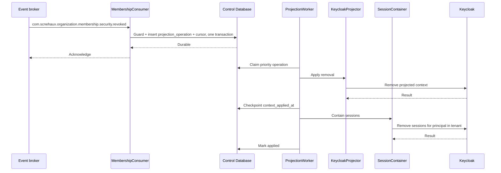

---
doc_meta:
  id: TDD-identity-control-002
  title: Keycloak Context Projection, Session Removal, and Drift Reconciliation
  owner: Core Platform Team
  version: 1.0.0
  status: approved
  classification: restricted
  review_cycle_days: 90
  created_date: 2026-08-11
  last_reviewed: 2026-08-14
  parent_sad: SAD-001
---

# Keycloak Context Projection, Session Removal, and Drift Reconciliation

## Purpose

Specify how authoritative Membership state reaches Keycloak, how a revocation removes
both the projected context and the sessions that could refresh past it, and how drift
between authority and the Keycloak projection is detected and repaired.

This service owns two of the four mechanisms that together bound revocation
enforcement. Removing the projected context stops the next authentication from
asserting a revoked context. Removing the session stops a refresh from minting a fresh
token before the old one expires. Either one alone leaves a usable path, which is why
both are specified here rather than treated as variants of the same action.

## Scope

**In scope**

- Consuming Membership and Tenant security events from the broker.
- Applying and removing context projection through the supported Keycloak Admin API.
- Removing Keycloak sessions on revocation.
- The consumer cursor this service holds, and how it obtains authority for
  reconciliation without a cross-database read.
- Drift detection between authority and the Keycloak projection, and repair direction.

**Out of scope**

- Membership authority, versions, and the revocation transaction — owned by
  `TDD-organization-control-002`. This service is a consumer, never an authority.
- Realm configuration and the protocol mappers that turn projected context into token
  claims — owned by `identity-kernel`.
- The Principal identifier and creation path — owned by
  `TDD-identity-control-001`.
- Outbox, dispatcher, envelope, and deduplication — owned by
  `TDD-foundation-platform-001`.

## Technical Context

Authority lives in the Organization Database, which this service cannot reach. It
holds no credential for it, and `TDD-organization-control-001` grants its runtime role
no privilege there. State arrives one way only:

```text
organization-control commits Membership change
    → outbox append in the same transaction
    → dispatcher publishes to the broker
    → identity-control consumes idempotently
    → Keycloak Admin API applies the projection
```

That path is fixed by ADR-ORG-001 §5.4, which prohibits Organization from writing to
Keycloak at all. The projection adapter therefore lives here, in the only process
holding the Keycloak Admin credential.

Keycloak-local structures carrying projected context are non-authoritative. ADR-IAM-001
§5.3 permits Organizations, Groups, attributes, and roles as bounded local projections
and prohibits them from becoming canonical enterprise authority. A reconciliation
finding is repaired toward the Organization authority in one direction, and no repair
path writes to the Keycloak database.

This service owns a 2 s share of the propagation budget: dispatch to context removal
and session removal applied.

## Component Design

| Component | Package | Responsibility |
| :-- | :-- | :-- |
| `MembershipConsumer` | `internal/projection` | Validates and durably accepts Organization events; it never calls Keycloak |
| `ProjectionWorker` | `internal/projection` | Claims durable operations, applies bounded retries, and owns the consumer DLQ state |
| `KeycloakProjector` | `internal/projection` | Applies and removes context projection idempotently through the Admin API |
| `SessionContainer` | `internal/projection` | Removes Keycloak sessions on revocation |
| `ProjectionReconciler` | `internal/reconcile` | Compares authority against the Keycloak projection and repairs drift |
| `KeycloakAdminClient` | `internal/keycloak` | Typed client over the supported Admin REST API |

### Revocation Path



Context removal runs before session removal. Reversing them leaves a window in which a
session still exists and the context is still projected, so a refresh arriving inside
that window mints a token asserting the revoked context. Ordering them the other way
narrows the window to a refresh that finds no context to assert.

The broker acknowledgement is sent after the event, deduplication mark, cursor update,
and executable operation commit locally. Keycloak is deliberately outside that
transaction. A crash before commit causes broker redelivery; a crash after commit leaves
a durable operation for the worker. This is the consumer durability point required by
STD-GLB-004 and is independent of the producer outbox dispatcher.

## Data Model

### Consumer Cursor

This service is one consumer among several. It tracks its own position; the publisher
registry lives in the Organization Database and is never read from here.

```sql
CREATE TABLE identity.projection_cursor (
    stream             TEXT        PRIMARY KEY,
    projection_version TEXT        NOT NULL,
    max_applied_stream_position BIGINT NOT NULL DEFAULT 0,
    last_snapshot_mark BIGINT,
    last_reconciled_at TIMESTAMPTZ
);
```

SAD-001 §5.1 already allocates reconciliation cursors to the Control Database, so this
table is where the system architecture expects it.

`max_applied_stream_position` stores the greatest Organization `streamposition` this
consumer has applied. It is an observability watermark, not a delivery checkpoint:
the priority lane may deliver a later position before an earlier lifecycle event. The
durable broker consumer owns delivery progress, and `event_id` remains the UUID
deduplication identity in `platform.processed_event`.

### Durable Projection Operation

The consumer cannot atomically commit a database row and a Keycloak Admin API call.
It therefore turns each accepted event into an idempotent local operation in the same
transaction as `inbox.Guard`:

```sql
CREATE TABLE identity.projection_operation (
    operation_id        UUID        PRIMARY KEY,
    event_id            UUID        NOT NULL UNIQUE,
    stream_position     BIGINT      NOT NULL,
    event_type          TEXT        NOT NULL,
    aggregate_type      TEXT        NOT NULL,
    aggregate_id        UUID        NOT NULL,
    principal_id        UUID,
    tenant_id           UUID        NOT NULL,
    workspace_id        UUID,
    membership_version  BIGINT,
    tenant_security_version BIGINT  NOT NULL,
    desired_status      TEXT        NOT NULL,
    desired_action      TEXT        NOT NULL,
    priority            SMALLINT    NOT NULL,
    status              TEXT        NOT NULL DEFAULT 'pending',
    attempts            INTEGER     NOT NULL DEFAULT 0,
    next_attempt_at     TIMESTAMPTZ,
    failure_class       TEXT,
    last_error          TEXT,
    context_applied_at  TIMESTAMPTZ,
    sessions_removed_at TIMESTAMPTZ,
    created_at          TIMESTAMPTZ NOT NULL DEFAULT now(),
    applied_at          TIMESTAMPTZ,
    CONSTRAINT projection_operation_aggregate_check
        CHECK (aggregate_type IN ('membership', 'tenant')),
    CONSTRAINT projection_operation_action_check
        CHECK (desired_action IN ('apply_context', 'remove_context', 'remove_tenant_context', 'restore_tenant_context')),
    CONSTRAINT projection_operation_status_check
        CHECK (status IN ('pending', 'applying', 'retrying', 'unresolved', 'superseded', 'applied')),
    CONSTRAINT projection_operation_version_check
        CHECK ((aggregate_type = 'membership' AND membership_version IS NOT NULL)
            OR (aggregate_type = 'tenant' AND membership_version IS NULL))
);

CREATE INDEX projection_operation_claim
    ON identity.projection_operation (priority, next_attempt_at, stream_position)
    WHERE status IN ('pending', 'retrying');
```

An `unresolved` row is this consumer's durable DLQ. It retains the event identity,
failure metadata, attempt count, replay state, and desired action until replay succeeds
or reconciliation proves and records that the desired state already exists. Priority
rows are never discarded because their retry count was exhausted.

### Accepted Authority Heads

```sql
CREATE TABLE identity.projection_tenant_head (
    tenant_id               UUID        PRIMARY KEY,
    tenant_security_version BIGINT      NOT NULL,
    desired_status          TEXT        NOT NULL,
    source_event_id         UUID        NOT NULL,
    accepted_at             TIMESTAMPTZ NOT NULL DEFAULT now()
);

CREATE TABLE identity.projection_membership_head (
    membership_id           UUID        PRIMARY KEY,
    principal_id            UUID        NOT NULL,
    tenant_id               UUID        NOT NULL,
    workspace_id            UUID,
    membership_version      BIGINT      NOT NULL,
    tenant_security_version BIGINT      NOT NULL,
    desired_status          TEXT        NOT NULL,
    source_event_id         UUID        NOT NULL,
    accepted_at             TIMESTAMPTZ NOT NULL DEFAULT now()
);

CREATE TABLE identity.projection_tenant_lease (
    tenant_id       UUID        PRIMARY KEY,
    operation_id   UUID        NOT NULL UNIQUE,
    holder_id      TEXT        NOT NULL,
    generation     BIGINT      NOT NULL,
    lease_until    TIMESTAMPTZ NOT NULL
);
```

The head tables hold the newest accepted desired state, not merely the last state whose
Keycloak call completed. Upserts advance only when the incoming authority version is
greater. The Tenant lease serializes membership and tenant-wide side effects for one
Tenant across healthy worker replicas. A worker renews only its generation. An expired
`applying` operation is not blindly replaced: it becomes `unresolved` with failure class
`ambiguous`, and recovery reconciles the current heads against Keycloak before another
side effect for that Tenant begins.

### Drift Findings

```sql
CREATE TABLE identity.drift_finding (
    finding_id     UUID        PRIMARY KEY,
    finding_class  TEXT        NOT NULL,
    principal_id   UUID,
    tenant_id      UUID,
    detail         JSONB       NOT NULL,
    detected_at    TIMESTAMPTZ NOT NULL DEFAULT now(),
    repaired_at    TIMESTAMPTZ,
    CONSTRAINT drift_finding_class_check
        CHECK (finding_class IN ('missing', 'extra', 'mismatch'))
);
```

`extra` findings are retained after repair. A context projected without authority is
the shape a privilege-escalation defect takes, and discarding the record on repair
removes the only evidence that it happened.

### Projected Context Representation

The Keycloak-side representation is settled by proof-of-concept. Three candidates are
evaluated, and canonical authority stays in the Organization Database in every case:

| Option | Mechanism | Consequence |
| :-- | :-- | :-- |
| A | Keycloak Organizations | Closest native fit; ties the projection to a feature whose upgrade surface is still moving |
| B | Groups | Stable and long-supported; requires a naming scheme that encodes Tenant and Workspace |
| C | User attributes | Simplest to write and reconcile; least expressive for mapper configuration |

The choice affects projection cost, mapper configuration in `identity-kernel`, and the
shape of reconciliation. It does not affect the authority model, which is why the
projector is written against an internal interface and the representation sits behind
it.

## API / Interface

### Consumed Events

```text
com.scnehaux.organization.membership.lifecycle.granted
com.scnehaux.organization.membership.lifecycle.restored
com.scnehaux.organization.membership.security.suspended      (priority)
com.scnehaux.organization.membership.security.revoked        (priority)
com.scnehaux.organization.tenant.security.suspended          (priority)
com.scnehaux.organization.tenant.lifecycle.activated
```

`tenant.security.suspended` also represents entry into Tenant offboarding. The
offboarding lifecycle events are not enforcement inputs; Organization emits this
security event with the incremented `tenant_security_version` whenever offboarding
begins.

Every consumption validates the published envelope, passes the deduplication guard from
`foundation-platform`, conditionally advances the applicable authority head, inserts
its projection operation, and advances the observed cursor in one transaction. An
operation below the accepted Membership or Tenant authority version is inserted as
`superseded`; it remains attributable but has no Keycloak side effect. Duplicate
delivery is acknowledged without creating a second operation. During bootstrap,
buffered events at or below `last_snapshot_mark` are acknowledged as represented by
the snapshot; normal consumption never discards an event merely because its position
is lower than the maximum already observed.

### Keycloak Admin API

| Operation | Use |
| :-- | :-- |
| Apply projected context | Grant or restore a Membership context |
| Remove projected context | Suspend or revoke a Membership context |
| Enumerate projected context | Reconciliation sweep |
| Remove sessions for a Principal | Containment on revocation |

Exact endpoints depend on the representation chosen by proof-of-concept and are fixed
in `KeycloakAdminClient` once that answer exists.

### Authority Read for Reconciliation

The reconciler obtains the authoritative set through the publisher's contract
`GET /v1/projections/organization/snapshot`, which `TDD-organization-control-002`
publishes to every consumer. There is no privileged path, no direct read, and no
database connection to the Organization Database anywhere in this service.

## Algorithms / Logic

### Session Removal Granularity

The mechanism depends on an unanswered question: whether Keycloak sessions can be
removed for one Principal within one Tenant context, or only for a Principal entirely.

```text
if per-context removal is available:
    remove sessions matching principal and revoked tenant context
else:
    remove all sessions for the principal
    record a collateral-containment finding naming the unrelated contexts affected
```

The fallback is correct and blunt: it contains the revoked context and signs every
other context of that Principal out. That is acceptable for a security action and
unacceptable as a silent behavior, so the collateral is recorded and surfaced rather
than absorbed. The proof-of-concept determines which branch is live.

### Reconciliation

```text
authoritative := active memberships from the publisher snapshot at the watermark
projected     := context enumerated from Keycloak

missing   := authoritative − projected    → apply, record finding, emit repair event
extra     := projected − authoritative    → remove, record finding, raise alert
mismatch  := version divergence           → apply the authoritative value
```

Repair runs in one direction. A projection is never promoted into authority, and no
repair path writes to the Keycloak database.

An `extra` finding is escalated as a potential privilege escalation. Reaching a state
where Keycloak projects a context the Organization authority does not grant requires
either a defect in this path or a write outside it, and both warrant investigation
before the finding is repaired away.

### Failure Handling

The `ProjectionWorker`, not the Foundation outbox dispatcher, owns consumer execution.
It claims priority first with `FOR UPDATE SKIP LOCKED` and executes each idempotent
Keycloak step up to three immediate attempts within the operation budget. A transient
failure schedules exponential backoff. Exhaustion changes the operation to
`unresolved`, raises the containment alert for a priority action, and leaves the row
available to explicit replay and reconciliation.

A timeout after a request left the process is an ambiguous outcome. The worker first
reads the Keycloak representation: if desired state is present it checkpoints the step;
if not, it retries idempotently; if the read is also unavailable it records
`failure_class = 'ambiguous'` and moves the operation to `unresolved`. It never assumes
that a failed response means a failed side effect.

Context and session steps checkpoint independently. A crash after context removal but
before session removal resumes at session removal. Repeating either removal against an
already-removed resource succeeds, so a crash between an Admin API call and its local
checkpoint causes extra work but never restores access or duplicates authority.

### Reordered Security Events

Before an Admin API call, the worker acquires the Tenant lease and re-reads both heads:

```text
tenant operation:
    supersede unless tenant_security_version equals the Tenant head
    if desired status is active, restore contexts from current active Membership heads

membership operation:
    supersede unless membership_version equals the Membership head
    supersede apply_context unless the Tenant head is active
    supersede apply_context when its tenant_security_version is below the Tenant head

remove operation:
    execute when it is the current Membership or Tenant desired state
```

This comparison occurs again after every retry lease acquisition. Thus a priority
revocation at Membership version 14 can be accepted and applied before version 13;
when version 13 arrives later, it is recorded as superseded and cannot re-add context.
Likewise, Tenant suspension advances the Tenant head before any batched Membership
delivery, so an older grant cannot race tenant-wide removal. Reconciliation replaces
both heads from one versioned snapshot before repairing Keycloak toward that desired
state. A Tenant activation uses `restore_tenant_context` to rebuild only Membership
heads whose desired status is active; this is why an older Membership operation can be
superseded after the Tenant version advances without losing the final active state.

## Configuration

| Variable | Default | Purpose |
| :-- | :-- | :-- |
| `IDENTITY_PROJECTION_OPERATION_BUDGET` | `2s` | Successful-path dispatch-to-applied budget |
| `IDENTITY_PROJECTION_ATTEMPT_TIMEOUT` | `500ms` | Upper bound on one Admin API attempt |
| `IDENTITY_PROJECTION_MAX_ATTEMPTS` | `3` | Immediate attempts before unresolved/DLQ state |
| `IDENTITY_PROJECTION_BACKOFF_BASE` | `100ms` | Exponential retry base |
| `IDENTITY_SESSION_REMOVAL_ENABLED` | `true` | Removes Keycloak sessions on revocation |
| `IDENTITY_PROJECTION_RECONCILE_INTERVAL` | `15m` | Sweep cadence |
| `IDENTITY_PROJECTION_SNAPSHOT_TIMEOUT` | `30s` | Upper bound on one snapshot page request |

`IDENTITY_SESSION_REMOVAL_ENABLED` exists for rehearsal, not for production tuning.
Disabling it removes one of the four enforcement mechanisms, so the startup log records
the reduced guarantee and the security dashboard shows the enforcement interval
without that term.

## Testing Strategy

### Propagation

- Measured dispatch-to-applied delay stays within the 2 s share of the budget for both
  context removal and session removal.
- After context removal, a new authentication cannot assert the revoked context.
- After session removal, a refresh attempt for the revoked context fails.
- Context removal is applied before session removal, asserted by ordering test.

### Idempotency

- Duplicate broker delivery produces one durable operation.
- A crash after local commit but before broker acknowledgement redelivers and creates no
  second operation.
- A crash between a Keycloak call and its checkpoint repeats an idempotent call and
  produces the same projected state.
- Applying a removal against an already-removed context succeeds without error.
- Priority delivery out of sequence is applied even when its `streamposition` is below
  the maximum previously observed position.
- A grant at Membership version 13 delivered after revoke version 14 is retained as
  superseded and performs no Keycloak call.
- A Membership grant carrying an older `tenant_security_version` cannot re-add context
  after Tenant suspension, including under concurrent workers.
- Two workers cannot hold the same unexpired Tenant lease. Expired-lease recovery marks
  the prior operation ambiguous and reconciles the current heads before issuing another
  side effect.

### Reconciliation

- A context injected directly into Keycloak that authority does not grant is detected
  as `extra`, removed, alerted, and retained as a finding after repair.
- A dropped event produces a `missing` finding the next sweep repairs.
- Reconciliation is idempotent across repeated runs against a consistent state.
- The reconciler reads authority only through the published snapshot contract.

### Negative

- No code path in this service constructs an Organization Database connection.
- No repair path writes to the Keycloak database.
- An unresolved priority operation raises the containment alert, not a producer
  delivery alert.

## Security Notes

This service holds the Keycloak Admin credential. Its Admin API service account holds
the narrowest role set permitting context projection, context removal, session
enumeration, and session removal. It holds no realm administration, no client
management, and no credential read authority.

The projection carries context, not authorization: Tenant identity, Workspace
identity, Membership status, and versions. It carries no Product permission, no
Entitlement, and no business role.

Collateral session removal, when the per-context branch is unavailable, signs a
Principal out of contexts unrelated to the revocation. That is recorded as a finding
and surfaced to the operator who requested the revocation, because a containment
action with wider effect than requested must be visible to the person who requested
it.

## Performance Notes

Projection and session removal sit on the revocation path and nowhere else. Neither
appears on an authentication or token-validation path, so neither contributes to login
latency.

The reconciliation sweep enumerates projected context through paged Admin API calls.
Sweep duration grows linearly with projected context count, and the sweep is
rate-limited so reconciliation cannot consume capacity reserved for authentication.

## Operational Notes

| Signal | Warning | Critical |
| :-- | :-- | :-- |
| Dispatch-to-applied delay | above budget | twice budget |
| Unresolved priority operation | — | any occurrence |
| `extra` drift findings | any occurrence | any occurrence |
| Reconciliation sweep age | one interval | two intervals |
| Collateral session removals | any occurrence | — |
| `IDENTITY_SESSION_REMOVAL_ENABLED` false in production | — | any occurrence |

Runbooks required before production: revocation not enforced within budget, projection
drift repair, unresolved operation replay, and collateral containment review.

## Traceability

| Relationship | Target |
| :-- | :-- |
| Parent system | SAD-001 — Scnehaux Identity Runtime |
| Realizes capability | PAD-PLT-001 — Identity & Access Platform |
| Governed by | ADR-IAM-001 — Adopt Keycloak Identity Kernel |
| Governed by | ADR-ORG-001 — Organization never writes to Keycloak; projection is mediated here |
| Conforms to | STD-IAM-001 §3.4 — every revocation class declares the mechanisms that enforce it |
| Enterprise constraint | EAD-003 — a projection is never promoted into authority |
| Enterprise constraint | EAD-006 — Membership, Entitlement, and Permission are distinct |
| Depends on | `TDD-foundation-platform-001` — deduplication, dispatcher, envelope |
| Depends on | `TDD-organization-control-002` — authority, events, and the snapshot contract |
| Related design | `TDD-identity-control-001` — Principal identifier and creation path |

### Open Proof-of-Concept Questions

1. Projected context representation: Keycloak Organizations, Groups, or user
   attributes. Determines projection cost, mapper configuration in `identity-kernel`,
   and reconciliation shape. Canonical authority is unaffected in every case.
2. Session removal granularity: per Principal and Tenant context, or per Principal
   only. Determines whether revoking one Membership disturbs unrelated contexts, and
   therefore whether the collateral-containment finding is an exceptional record or a
   routine one.
