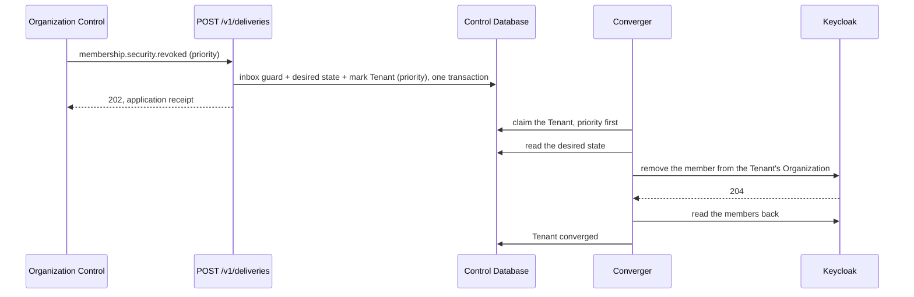

---
doc_meta:
  id: TDD-identity-control-002
  title: Tenant Context Projection into the Kernel, and Its Reconciliation
  owner: Core Platform Team
  version: 2.4.0
  status: approved
  classification: restricted
  review_cycle_days: 90
  created_date: 2026-08-11
  last_reviewed: 2026-10-07
  parent_sad: SAD-001
---

# Tenant Context Projection into the Kernel, and Its Reconciliation

## Purpose

Specify how authoritative Tenant and Membership state reaches the identity kernel, how a revocation
stops the kernel issuing a token for the revoked context, and how drift between the authority and
the kernel is found and repaired.

2.0.0 rewrites 1.0.0 after `ADR-IAM-006` settled its three open questions:
- **The representation.** A Keycloak Organization per Tenant. Its alias is the `tenant_id`, and its
  members are the Principals holding an active Membership.
- **The context switch.** The client asks for one Tenant per sign-in with `organization:<tenant_id>`.
- **Session removal on revocation.** It is no longer needed. The kernel refuses a refresh for a
  Tenant the person no longer belongs to, or one that is disabled, and leaves the person's other
  Tenants alone.

2.0.0 also takes delivery the way `TDD-identity-control-006` built it for provider authority:
Organization Control posts each event to this service, rather than this service reading a broker.

2.4.0 drops `identity.projection_cursor`, the broker consumer's watermark that 2.0.0 left behind
(§Data Model), and measures the revocation's accept-to-enforcement delay on every `deploy-dev` run
(§Testing Strategy).

## Scope

**In scope**

- Accepting Membership and Tenant events at `POST /v1/deliveries`, and keeping the newest desired
  state for each.
- Converging the kernel's Organizations and their members to that desired state through the Admin
  API.
- Bootstrap and reconciliation against Organization Control's published snapshot and the kernel's
  own listing, with findings for every difference repaired.

**Out of scope**

- **Membership authority, versions and the revocation transaction.** They belong to
  `TDD-organization-control-002`, and this service never becomes an authority.
- **The realm's `organization` scope and its `tenant_id` mapper.** They belong to identity-kernel
  (`TDD-identity-kernel-001` §Tenant Context).
- **Attaching that scope to a client.** That is the registration authority's job
  (`TDD-identity-control-003`), on the profiles `ADR-IAM-006 §5.3` names.
- **The resource's current-state check.** It is `STD-IAM-002 §3.5` step 8, done at each resource.
- **Containment of a Principal.** It belongs to `TDD-identity-control-005`, and still ends every
  session.

## Technical Context

The authority lives in Organization's database, which this service cannot reach. State arrives one
way:

```text
organization-control commits a Membership or Tenant change
    → its outbox, in the same transaction
    → its dispatcher for this consumer posts the event to POST /v1/deliveries
    → this service applies it to its desired state, idempotently, in one transaction
    → a convergence loop applies the desired state to the kernel through the Admin API
```

`ADR-ORG-001 §5.4` forbids Organization to write to Keycloak, so the projection lives here, in the
only process holding a Keycloak Admin credential. The kernel's Organizations are a bounded,
non-authoritative projection (`ADR-IAM-001 §5.3`). A difference is repaired toward Organization's
authority, never the other way.

**Why each mechanism, and where it comes from.**

- **Delivery, duplicates and order.** These follow `TDD-identity-control-006`. Every event carries
  the aggregate's whole state and its version, so an older event is discarded by comparing versions,
  not by arrival order. Its event id passes `inbox.Guard`.
- **Desired state, then convergence.** The kernel is changed by a controller, not by replaying
  events. Kubernetes' controller guidance states the rule: "Level driven, not edge driven. Just like
  having a shell script that isn't running all the time, your controller may be off for an
  indeterminate amount of time before running again" [R1].
  - An accepted event updates the desired state and marks its Tenant to converge.
  - Convergence reads the current desired state, not the event, and makes the kernel match it.
  - A missed, duplicated or reordered event therefore changes nothing a later convergence does not
    correct.
- **One Tenant at a time.** The same guidance: "Operate on one item at a time … with a guarantee that
  no two goroutines will work on the same item at the same time" [R1]. The work item is the Tenant,
  because an Organization and its members change together.
- **Failures requeue with a backoff:** "Percolate errors to the top level for consistent re-queuing
  … with reasonable backoffs" [R1].

This service owns a 2-second share of the propagation budget, from delivery to the kernel applied
(SAD-001).

## Component Design

| Component | Package | Responsibility |
| :-- | :-- | :-- |
| `POST /v1/deliveries` | `internal/httpapi` | Admits Organization Control's workload. Routes provider events to `providerauthority`, and Membership and Tenant events to `tenantcontext` |
| `tenantcontext.Desired` | `internal/tenantcontext` | Applies an event to the desired state under its version, with its inbox guard, and marks the Tenant to converge, in one transaction |
| `tenantcontext.Converger` | `internal/tenantcontext` | Claims a Tenant, reads its desired state, and makes the kernel's Organization and members match |
| `tenantcontext.Reconciler` | `internal/tenantcontext` | Bootstrap and the periodic sweep: replaces the desired state from the snapshot, lists the kernel's Organizations, and marks every Tenant to converge |
| `KeycloakAdminClient` | `internal/keycloak` | The Organizations Admin API: find, create, update, list members, add and remove a member |

### Revocation Path


```mermaid
sequenceDiagram
    participant O as Organization Control
    participant D as POST /v1/deliveries
    participant DB as Control Database
    participant C as Converger
    participant K as Keycloak

    O->>D: membership.security.revoked (priority)
    D->>DB: inbox guard + desired state + mark Tenant (priority), one transaction
    D-->>O: 202, application receipt
    C->>DB: claim the Tenant, priority first
    C->>DB: read the desired state
    C->>K: remove the member from the Tenant's Organization
    K-->>C: 204
    C->>K: read the members back
    C->>DB: Tenant converged
```

**What the removal achieves (`ADR-IAM-006 §5.5`).**
- **In the kernel:** the next refresh for that Tenant is refused with `invalid_grant`, and a new token
  for it carries no `tenant_id`.
- **At the resource:** an access token already issued is refused by step 8 once the resource applies
  the same event.
- **No session is removed.** The person's sessions in other Tenants are untouched.

## Data Model

### Desired State

```sql
CREATE TABLE identity.tenant_desired (
    tenant_id               UUID        PRIMARY KEY,
    tenant_status           TEXT        NOT NULL,
    tenant_version          BIGINT      NOT NULL,
    tenant_security_version BIGINT      NOT NULL,
    source_event_id         UUID,
    accepted_at             TIMESTAMPTZ NOT NULL DEFAULT now()
);

CREATE TABLE identity.membership_desired (
    membership_id      UUID        PRIMARY KEY,
    principal_id       UUID        NOT NULL,
    tenant_id          UUID        NOT NULL,
    membership_status  TEXT        NOT NULL,
    membership_version BIGINT      NOT NULL,
    source_event_id    UUID,
    accepted_at        TIMESTAMPTZ NOT NULL DEFAULT now()
);
CREATE INDEX membership_desired_tenant ON identity.membership_desired (tenant_id);
```

- **Each row is the newest state accepted.** A Tenant row is replaced only by a greater
  `tenant_version`, and a Membership row only by a greater `membership_version`. Organization's
  Tenant payload says why both Tenant versions are carried: "`TenantVersion` orders two events about
  this row; `TenantSecurityVersion` decides whether a held token is stale".
- **`source_event_id` is null for a row a snapshot wrote.**
- **What it holds.** Only identifiers, states and versions. There is no name, and no personal data.

### Convergence Work

```sql
CREATE TABLE identity.tenant_convergence (
    tenant_id          UUID        PRIMARY KEY,
    priority           BOOLEAN     NOT NULL DEFAULT false,
    marked_at          TIMESTAMPTZ NOT NULL DEFAULT now(),
    next_attempt_at    TIMESTAMPTZ NOT NULL DEFAULT now(),
    lease_until        TIMESTAMPTZ,
    attempts           INTEGER     NOT NULL DEFAULT 0,
    state              TEXT        NOT NULL DEFAULT 'pending',
    last_error_class   TEXT,
    kernel_org_id      TEXT,
    converged_at       TIMESTAMPTZ,
    CONSTRAINT tenant_convergence_state_check
        CHECK (state IN ('pending', 'converged', 'unresolved'))
);
CREATE INDEX tenant_convergence_claim ON identity.tenant_convergence (priority DESC, next_attempt_at)
    WHERE state = 'pending';
```

- **Marking a Tenant.** Each mark sets `state = 'pending'` and `marked_at = now()`. A priority event
  also sets `priority` and `next_attempt_at = now()`. A mark that arrives during a convergence is
  not lost: the converger finishes as `converged` only if `marked_at` is unchanged since it claimed
  the row, and otherwise leaves it `pending`.
- **Claiming.** A converger claims a row with `FOR UPDATE SKIP LOCKED`, priority first, and holds
  it through `lease_until`. That is the one-item-at-a-time rule [R1], across replicas.
- **`kernel_org_id`.** The kernel's identifier for the Tenant's Organization, kept once known. When
  it is unknown, the converger finds the Organization by its name, which is the `tenant_id`, with
  an exact search, before it creates one. So a crash between the create and the record does not
  make a second Organization.
- **Failure.** It is retried with full-jitter backoff. After `IDENTITY_PROJECTION_MAX_ATTEMPTS` the
  row is `unresolved`: logged, counted and alerted. The next mark, a re-drive, or the next sweep sets
  it `pending` again. A level-driven loop loses nothing by waiting, so a parked Tenant blocks no
  other.

### Findings

A sweep's mark is `tenant_convergence.sweep`, set when a sweep marks the Tenant and cleared when it
converges. A convergence that follows an event leaves it false and records nothing.

```sql
CREATE TABLE identity.projection_finding (
    finding_id    UUID        PRIMARY KEY,
    finding_class TEXT        NOT NULL,
    tenant_id     UUID,
    principal_id  UUID,
    detail        JSONB       NOT NULL,
    detected_at   TIMESTAMPTZ NOT NULL DEFAULT now(),
    CONSTRAINT projection_finding_class_check
        CHECK (finding_class IN ('missing_member', 'extra_member', 'organization_state', 'unknown_organization'))
-- and on identity.tenant_convergence:
--     sweep BOOLEAN NOT NULL DEFAULT false
);
```

A finding is written when a sweep's convergence had to change the kernel. A convergence that only
follows an event does not write one, because that change was expected. An `extra_member` or
`unknown_organization` finding is kept after repair, and it is alerted:
- An extra member is a context the authority never granted.
- An unknown Organization is one the authority never created.

Either is the shape a privilege-escalation defect takes, and the record is the evidence.

### What 1.0.0 Left Behind (2.4.0)

`identity.projection_cursor` was 1.0.0's per-stream watermark for a broker consumer: a stream, a
`projection_version`, the highest stream position applied, the last snapshot mark and
`last_reconciled_at`. 2.0.0 has no stream to follow:
- delivery is a post to `POST /v1/deliveries`, deduplicated by `inbox.Guard`;
- order is decided by the versions, "not delivery order or `streamposition`" [R3];
- convergence is observed through `tenant_convergence` and the metrics in §Operational Notes, and a
  sweep through its log line and `identity.tenant_projection.findings`.

No version of this service ever read or wrote the table, so migration
`20261007210158_drop_projection_cursor` drops it. It is the contract step of `STD-GLB-002`'s
"expand/migrate/contract" with nothing left to migrate: no running version reads it, so the drop
cannot break a deployment in progress or a rollback [R4].

## API / Interface

### Consumed Events

```text
com.scnehaux.organization.membership.lifecycle.granted     standard
com.scnehaux.organization.membership.lifecycle.restored    standard
com.scnehaux.organization.membership.security.suspended    priority
com.scnehaux.organization.membership.security.revoked      priority
com.scnehaux.organization.tenant.lifecycle.activated       standard
com.scnehaux.organization.tenant.lifecycle.retired         standard
com.scnehaux.organization.tenant.security.suspended        priority
com.scnehaux.organization.tenant.security.restored         priority
com.scnehaux.organization.projection.repair.reconciled     standard   (2.2.0)
```

- **Registration.** These are the Membership and Tenant types Organization Control offers a
  consumer. They are added to this consumer's registration beside the provider types of
  `TDD-identity-control-006`. An event of any other type is refused as poison, as there.
- **Priority.** A type is priority exactly when its class, the fifth segment, is `security`.
  Organization Control routes its lanes by the same rule, so the name and the lane cannot disagree.
- **Offboarding.** Entering offboarding is published as `tenant.security.suspended`, so a Tenant
  being offboarded is disabled here like a suspended one. Retirement comes only after offboarding, so
  it withdraws nothing more.

### What the Kernel Is Made to Hold

| Desired state | The kernel |
| :-- | :-- |
| A Tenant, `active` | An Organization named and aliased by the `tenant_id`, enabled, with no domain |
| A Tenant in any other state | The same Organization, disabled |
| A Membership, `active`, of a Principal with a kernel user | That user a member |
| A Membership in any other state, or a Principal with no kernel user | That user not a member |

- **A member of a disabled Organization.** The member stays, because the kernel already refuses the
  disabled Organization's tokens (`ADR-IAM-006 §5.5`). A restore re-enables it with its members
  intact.
- **No domain is set.** In Keycloak a domain routes sign-ins by email address and decides whether a
  member is managed. Neither is part of a Tenant.
- **A Membership row for a Tenant with no Tenant row** waits. Nothing is projected until the Tenant
  is known.
- **The member is the Principal's kernel user**, from `identity.principal_mapping`. For a workload
  that is its client's service-account user (`TDD-identity-control-004`).

### Keycloak Admin API

| Use | Endpoint |
| :-- | :-- |
| Find the Tenant's Organization | `GET /admin/realms/{realm}/organizations?search={tenant_id}&exact=true` |
| Create it | `POST /admin/realms/{realm}/organizations` |
| Enable or disable it | `PUT /admin/realms/{realm}/organizations/{id}` |
| List its members | `GET /admin/realms/{realm}/organizations/{id}/members` (paged) |
| Add a member | `POST /admin/realms/{realm}/organizations/{id}/members`, the user id as the body |
| Remove a member | `DELETE /admin/realms/{realm}/organizations/{id}/members/{user-id}` |
| List Organizations (sweep) | `GET /admin/realms/{realm}/organizations` (paged) |

**Roles.** The Principal credential gains the realm-management roles `manage-organizations` and
`view-organizations`. Adding or removing a member also needs `manage-users` on that user, which the
Principal credential already holds. The registration credential gains nothing. In Keycloak 26.7.5
these two roles, or `manage-realm`, are what organization management checks [R2]. The narrower
roles are the ones held.

### The Report an Operator Posts (2.2.0)

```text
GET /v1/projections/tenant-context/report      provider route, aal2
→ {"consumer_id": "identity-control", "mark": <applied position>,
   "rows": [{"membership_id": "...", "membership_version": 7}, ...]}
```

- **What it holds.** The active Memberships of the desired state, in the shape Organization
  Control's reconcile route takes, at the position this consumer has applied.
- **Why the position is needed.** That route refuses a report with no position, because comparing an
  unpositioned report with authority read now "would classify every change made since the report as
  a divergence" [R3].
- **What it does not hold.** No principal, no Tenant, no name: an identifier and a version per
  Membership.
- **Its route class.** It is a provider route, as every operational read here is.

### Applying a Repair (2.2.0)

`projection.repair.reconciled` carries `consumer_id`, `mark`, and findings. Each finding carries a
classification, a `membership_id`, and a `state`.
- **A sweep for another consumer** is acknowledged and applies nothing. Its findings describe that
  consumer's report.
- **A finding with a state** is applied by the rule every Membership event is applied by: a greater
  `membership_version` replaces the held state. It then marks the Tenant.
- **A finding with no state** means the authority never granted that Membership, which only an
  `extra` finding can say. The desired Membership becomes `absent`, and its Tenant is marked.
  - A `missing` or `mismatch` finding with no state comes from a producer that sent versions alone.
    Reading its null as a removal would withdraw a Membership the authority holds. So the whole sweep
    is refused as poison, as foundation-reference refuses it.
- **One sweep, one transaction,** with its inbox guard, as an event.

### Authority Read for Reconciliation

The reconciler reads the authoritative set only through Organization Control's published contract,
`POST /v1/projections/snapshot`, as this service's workload, page by page under the first page's
mark. Its rows carry the same fields as the events. Until 2.3.1 the client called
`/v1/projections/organization/snapshot`, the path the design documents named, which Organization
Control never served. Organization's deploy-dev, which wires the three stacks, found it the first
time `provider-bootstrap` ran against the real service.

## Algorithms / Logic

### Applying an Event

```text
in one transaction:
    inbox.Guard(event_id)                      → a duplicate is acknowledged, nothing more
    upsert the desired row where the incoming version is greater
        → otherwise the event is superseded: acknowledged, no application receipt
    mark the Tenant (priority for a priority-lane type)
```

### Converging a Tenant

```text
claim the Tenant
tenant  := tenant_desired[tenant]                     (none → release; nothing to project)
want    := kernel users of active Memberships in the Tenant
org     := kernel_org_id, or the exact search, or create it (enabled = tenant active)
if org.enabled ≠ (tenant active): update it          (disable before any member change)
have    := the Organization's members
remove  have − want                                   (removals before additions)
add     want − have
read back: enabled and members equal the desired state, or the attempt fails
converged, unless marked again since the claim
```

- **Order.** Disabling comes first, then removals, then additions. A failure part way through
  therefore leaves the kernel holding no more than the authority grants.
- **Idempotence.** Adding a member who already belongs answers `409`, which counts as done. Removing
  one who does not answers `404` or `400`, which also counts as done.
- **A timeout is not a failure of the side effect.** The read-back decides.

### Reconciliation (2.1.0)

Reconciliation has two halves, because they repair two different things.
- **The desired state against the authority.** The snapshot adds what this service missed. The
  authority's own reconciliation removes what it no longer grants.
- **The kernel against the desired state.** A sweep makes every Tenant converge, and records what it
  had to change.

```text
every IDENTITY_PROJECTION_RECONCILE_INTERVAL, and at bootstrap:
    rows := Organization's snapshot, all pages, under the first page's mark
    for each row:
        upsert the Membership's desired state where membership_version is greater
        upsert its Tenant's desired state where tenant_version is greater
    list the kernel's Organizations
        one whose name is no known tenant_id → disable it, empty it, record unknown_organization
    mark every known Tenant, as a sweep

on com.scnehaux.organization.projection.repair.reconciled for this consumer:
    for each finding:
        a state                → upsert it where membership_version is greater
        no state (never granted) → the Membership is 'absent'
    mark each Tenant a finding names
```

**Why the snapshot only adds (2.1.0).** 2.0.0 also set a desired Membership the snapshot does not
list to `absent`. That is unsound, for two reasons.
- **The snapshot holds active Memberships only.** It cannot say at what version a Membership stopped
  being active.
- **Its mark is not a boundary.** Organization's contract states the reason: "`platform.outbox.sequence`
  is allocated by `nextval` at `INSERT`, not at `COMMIT`". So a Membership granted while the snapshot
  was read can be missing from it and still be newer than it [R3]. Setting that Membership `absent`
  would remove a member the authority had just granted.

**Withdrawals come from Organization.** Organization Control's reconciliation compares a consumer's
report of its active Memberships, `membership_id` and `membership_version`, against the authority. It
publishes `projection.repair.reconciled`, each finding carrying the authoritative state with its
version, including a suspended or revoked one [R3].
- **Applying it.** This service applies that state by the rule it applies every event: a higher
  version replaces a lower one.
- **Who sends the report.** Organization's reconcile route admits a provider, because it reports
  across consumers. So an operator posts this service's report, as foundation-reference's system
  proof does.
- **Where the report comes from.** `GET /v1/projections/tenant-context/report`, a provider route,
  serves it.

**Ordering a Tenant from a snapshot.** A snapshot row carries its Tenant's `tenant_version` since
`TDD-organization-control-002` 1.8.0. A row therefore orders against a Tenant event exactly as two
events order. Without it, a snapshot could not safely say whether a Tenant was suspended.

- **Findings.** A sweep's convergence records a finding for each change it had to make (§Findings).
- **Bootstrap.** Bootstrap is the first sweep.
  - It runs before deliveries are applied.
  - It records the snapshot's mark with Organization Control, as `cmd/identity-provider-bootstrap`
    does for provider authority.
  - A consumer re-registered with more event types loses its recorded mark [R3]. So the bootstrap
    takes both snapshots, and records the lower mark (2.3.0).
  - **The command.** `cmd/identity-provider-bootstrap` does both. A registration that does not
    subscribe to the Membership and Tenant types is refused the Organization snapshot (`403`). The
    command then bootstraps provider authority alone and says so. A server can therefore deploy this
    service before its registration changes.

## Configuration

| Variable | Default | Purpose |
| :-- | :-- | :-- |
| `IDENTITY_PROJECTION_CONVERGER_INTERVAL` | `1s` | How often an idle converger looks for a marked Tenant |
| `IDENTITY_PROJECTION_ATTEMPT_TIMEOUT` | `2s` | Upper bound on one Admin API call |
| `IDENTITY_PROJECTION_LEASE` | `30s` | How long a claim holds a Tenant |
| `IDENTITY_PROJECTION_MAX_ATTEMPTS` | `8` | Attempts before a Tenant is `unresolved` |
| `IDENTITY_PROJECTION_RECONCILE_INTERVAL` | `15m` | Sweep cadence |

## Testing Strategy

- **Desired state.**
  - A duplicate event writes nothing twice.
  - A lower version is superseded.
  - A revoke at version 14 delivered before a grant at 13 leaves the Membership revoked.
  - Each priority type marks its Tenant as priority.
- **Convergence**, against the fake kernel:
  - a granted Membership adds the member, and a revoked one removes it;
  - a suspended Tenant disables the Organization, and a restore re-enables it with its members;
  - a crash after the create finds the Organization by its exact name and makes no second one;
  - `409` and `404` count as done;
  - a mark during a convergence leaves the Tenant pending;
  - two convergers never hold the same Tenant.
- **Repair and report (2.2.0):**
  - a repair carrying a revoked state removes the member;
  - an `extra` finding with no state makes the Membership `absent`;
  - a `missing` finding with no state refuses the sweep;
  - a repair for another consumer applies nothing;
  - the report lists the active Memberships at the applied position.
- **Reconciliation:**
  - a member added by hand is removed, with an `extra_member` finding kept;
  - a dropped event is repaired from the snapshot, with a `missing_member` finding;
  - a snapshot row older than the held state changes nothing, for a Membership or for its Tenant;
  - an Organization the authority never created is disabled and emptied;
  - a repair names a revoked Membership, and its member is removed;
  - a repair for another consumer is acknowledged and applies nothing.
- **Against the real kernel.** The `deploy-dev` stack:
  - grants a Membership, and a token for its Tenant carries `tenant_id`;
  - revokes it, and the refresh is refused with `invalid_grant`;
  - measures the revocation's accept-to-enforcement delay (2.4.0): from the delivery's `202` to the
    kernel's Organization no longer listing the member, read through the Admin API every 50 ms. The
    figure goes to the job summary against this service's 2-second share. Above the share is a
    warning, and above `SAD-001 §7.7`'s 60-second propagation budget the job fails [R5].
- **Negative:**
  - no code path constructs an Organization database connection: `internal/controldb`'s
    `TestOnlyTheControlDatabaseIsOpened`, beside archcheck's denied driver imports (2.4.0);
  - no repair writes to the kernel's database.

## Security Notes

- **The projection carries context, not authorization:** a Tenant and its members. It carries no
  permission, entitlement or role.
- **The narrower roles** `manage-organizations` and `view-organizations` are held instead of
  `manage-realm`, which would let this service change the realm itself.
- **An Organization or member the authority never granted** is removed and kept as evidence, never
  silently repaired.

## Performance Notes

- **Not on the authentication path.** Convergence runs only on the revocation and grant paths, never
  on a sign-in or a token check.
- **Cost per convergence.** One member listing for the Tenant, plus one call per member that
  changes.
- **Cost per sweep.** It grows with the number of Tenants. The sweep marks them, and the convergers
  drain them at their own pace, so authentication capacity is never spent on it.

## Operational Notes

| Signal | Warning | Critical |
| :-- | :-- | :-- |
| Delivery to converged | above 2 s | above 4 s |
| `unresolved` Tenant | any | a priority mark unresolved |
| `extra_member` or `unknown_organization` finding | — | any |
| Sweep age | one interval | two intervals |

Metrics, over OTLP as elsewhere in this service:
`identity.tenant_projection.{marked, converged, duration, attempts, unresolved, findings}`.

Runbooks required before production:
- a revocation not converged within budget;
- an `unresolved` Tenant;
- an extra member or unknown Organization.

## Traceability

| Relationship | Target |
| :-- | :-- |
| Parent system | SAD-001 — Scnehaux Identity Runtime |
| Governed by | ADR-IAM-006 — Tenant context in tokens, selected per sign-in |
| Governed by | ADR-ORG-001 — Organization never writes to Keycloak; the projection is mediated here |
| Governed by | ADR-IAM-001 §5.3 — Organizations as a bounded, non-authoritative projection |
| Conforms to | STD-IAM-002 1.6.0 §3.2, §3.5 step 8 |
| Depends on | `TDD-identity-control-006` — delivery intake, inbox guard, snapshot access |
| Depends on | `TDD-organization-control-002` — authority, events and the snapshot contract |
| Depends on | `TDD-identity-kernel-001` §Tenant Context — the `organization` scope and its mapper |
| Related | `TDD-identity-control-003` — the registration authority attaches the scope |

### Proof-of-Concept Questions, Answered

1. **Representation:** Keycloak Organizations. `ADR-IAM-006`; identity-kernel compat run
   37207537199.
2. **Session removal granularity.** The Admin API removes all of a user's sessions or one, never per
   Organization. It is not needed for a revocation, because the kernel refuses that Tenant's refresh
   and leaves the others alone (`ADR-IAM-006 §5.5`).
3. **The context switch:** a sign-in with `organization:<tenant_id>` (`ADR-IAM-006 §5.2`).

## References

- **[R1]** Kubernetes, _Writing Controllers_, community contributor guide,
  <https://github.com/kubernetes/community/blob/master/contributors/devel/sig-api-machinery/controllers.md>,
  accessed 2026-10-04:
  - "Level driven, not edge driven. Just like having a shell script that isn't running all the time,
    your controller may be off for an indeterminate amount of time before running again."
  - "Operate on one item at a time. If you use a `workqueue.Interface`, you'll be able to queue
    references to particular objects and later pop them in multiple "worker" goroutines with a
    guarantee that no two goroutines will work on the same item at the same time."
  - "Percolate errors to the top level for consistent re-queuing. We have a
    `workqueue.RateLimitingInterface` to allow simple requeuing with reasonable backoffs."

  And _Controllers_, <https://kubernetes.io/docs/concepts/architecture/controller/>: "Each controller
  tries to move the current cluster state closer to the desired state."
- **[R2]** Keycloak 26.7.5:
  - `services/src/main/java/org/keycloak/services/resources/admin/fgap/OrganizationPermissions.java`,
    `canManage`: "if (root.hasOneAdminRole(AdminRoles.MANAGE_ORGANIZATIONS, AdminRoles.MANAGE_REALM))
    { return true; }".
  - `OrganizationMemberResource.java`, `addMember`: "auth.orgs().requireManage(organization); … UserModel
    user = getUser(id); auth.users().requireManage(user);".
  - `OrganizationsResource.java`, `search`: "if {@code true}, the organizations will be searched using
    exact match for the {@code search} param - i.e. either the organization name or one of its domains
    must match exactly".
- **[R3]** `TDD-organization-control-002` 1.8.0, §Bootstrap Contract and §Reconciliation.
  - "Why the mark is not a discard boundary": "`platform.outbox.sequence` is allocated by `nextval`
    at `INSERT`, not at `COMMIT`"; "the versions, not delivery order or `streamposition`, decide which
    desired state is newer."
  - The snapshot's predicate: "Only `active` Memberships appear."
  - `internal/projection/reconcile.go`: a finding's `State` "is the authoritative Membership the
    consumer repairs toward, in the shape of a Membership event's payload … Null when authority holds
    no Membership by this identifier, which tells the consumer to remove the row."
  - Re-registering with other types "clears `snapshot_mark`".
- **[R4]** `STD-GLB-002` 3.0.0, Enterprise Database & Persistence Standard: "Destructive or
  incompatible changes require expand/migrate/contract or another explicitly reviewed migration
  sequence".
- **[R5]** `SAD-001` §7.7, Revocation Classes and Enforcement: "The propagation budget is 60 seconds
  as the planning figure, against an operational target below 10 seconds", and "the production gate
  MUST include measured acceptance-to-enforcement evidence for every class in the table above."
