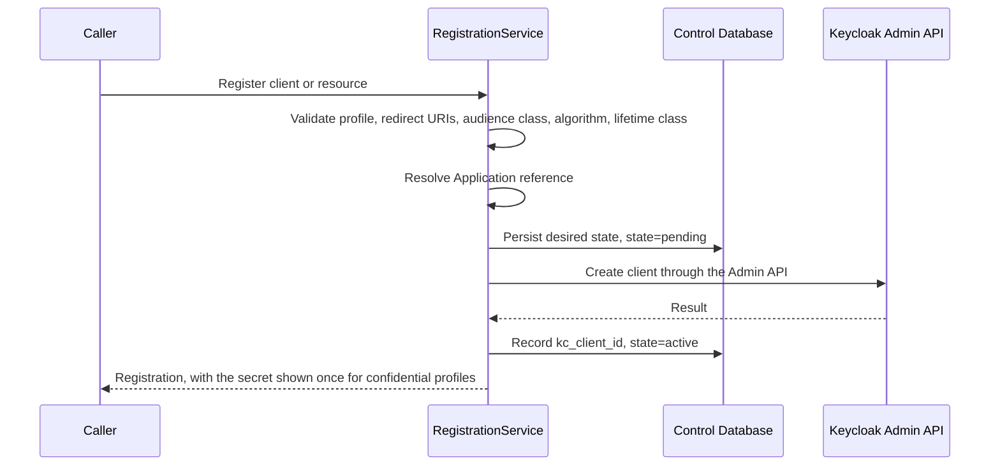

---
doc_meta:
  id: TDD-identity-control-003
  title: Protocol Client and Protected-Resource Registration
  owner: Core Platform Team
  version: 1.1.0
  status: approved
  classification: restricted
  review_cycle_days: 90
  created_date: 2026-08-11
  last_reviewed: 2026-08-14
  parent_sad: SAD-001
---

# Protocol Client and Protected-Resource Registration

## Purpose

Specify how an Application becomes a protocol client or a protected resource in the
identity kernel: what must be true before registration, what the registration fixes,
how client credentials are issued and rotated, and how drift between desired state and
Keycloak is detected.

Registration is where two enterprise rules are enforced or lost. PAD-PLT-001 §7.3
requires every client and protected resource to reference a Software Catalog
Application. STD-IAM-002 §3.3 requires every protected resource to carry exactly one
token-lifetime class, recorded in its registration. Neither has anywhere else to be
enforced.

## Scope

**In scope**

- Desired-state records for clients and protected resources.
- The Application reference, and how registration behaves while Software Catalog is
  unchartered.
- Client profiles and the constraints each carries.
- Redirect URI, audience class, and signing-algorithm validation.
- Client credential issue, rotation, and revocation.
- Drift detection between desired state and Keycloak runtime state.
- Deprovisioning.

**Out of scope**

- Principal creation — owned by `TDD-identity-control-001`.
- Membership context projection and session removal — owned by
  `TDD-identity-control-002`.
- Realm configuration and protocol mappers — owned by `identity-kernel`.
- Workload identity lifecycle — owned by `TDD-identity-control-004`. A workload's
  client registration is created here; its owner, rotation, and orphan handling are
  not.

## Technical Context

Three authorities meet at registration, and only one of them is this service:

| Fact | Authority |
| :-- | :-- |
| The Application exists and who owns it | Software Catalog |
| The protocol registration and its credential trust | Identity & Access, realized here |
| Whether the Application may be sold or used commercially | Subscription & Entitlement |

Software Catalog is not chartered. It has no PAD and no SAD, and EAD-001 §5.4 is
explicit that a target capability is not implementation authorization. Registration
cannot wait for it.

EAD-002 §8 already states the degradation: on Software Catalog unavailability,
*existing systems continue with cached registration metadata*. This design generalises
that to absence. An Application reference is recorded as an authority name and an
opaque identifier, exactly as `organization.external_reference` records a Subscriber
Account. While the authority is `manual`, the reference is entered administratively by
an accountable operator and carries that operator's identity. When Software Catalog is
chartered, the authority name changes and the references are reconciled against it.

What is never permitted is registration with no Application reference at all. The rule
that every client traces to an Application survives the absence of the system that will
eventually hold them.

## Component Design

| Component | Package | Responsibility |
| :-- | :-- | :-- |
| `RegistrationService` | `internal/registration` | Desired state, validation, lifecycle |
| `ApplicationReferenceResolver` | `internal/registration` | Resolves and revalidates the Application reference against its current authority |
| `CredentialIssuer` | `internal/registration` | Issues, rotates, and revokes client secrets through the Admin API |
| `RegistrationReconciler` | `internal/reconcile` | Compares desired state against Keycloak and repairs drift |

### Registration Path



The desired-state record is written before the remote call, exactly as
`TDD-identity-control-001` does for Principals, and for the same reason: a crash
between the call and the commit leaves a `pending` record the reconciler can resolve
rather than an orphan in Keycloak nobody owns.

## Data Model

```sql
CREATE TABLE identity.client_registration (
    registration_id     UUID        PRIMARY KEY,
    kc_client_id        TEXT        UNIQUE,
    realm               TEXT        NOT NULL,
    client_key          TEXT        NOT NULL,
    profile             TEXT        NOT NULL,
    application_authority TEXT      NOT NULL,
    application_ref     TEXT        NOT NULL,
    registered_by       UUID        NOT NULL,
    audience_class      TEXT        NOT NULL,
    signing_algorithm   TEXT        NOT NULL DEFAULT 'PS256',
    algorithm_exception_owner UUID,
    algorithm_exception_reason TEXT,
    algorithm_exception_expires_at TIMESTAMPTZ,
    lifetime_class      TEXT,
    audience            TEXT[],
    redirect_uris       TEXT[],
    state               TEXT        NOT NULL,
    version             BIGINT      NOT NULL DEFAULT 1,
    created_at          TIMESTAMPTZ NOT NULL DEFAULT now(),
    activated_at        TIMESTAMPTZ,
    suspended_at        TIMESTAMPTZ,
    retired_at          TIMESTAMPTZ,
    CONSTRAINT client_profile_check
        CHECK (profile IN ('confidential', 'public', 'workload', 'resource')),
    CONSTRAINT client_audience_class_check
        CHECK (audience_class IN ('internal', 'privileged', 'workload', 'external')),
    CONSTRAINT client_signing_algorithm_check
        CHECK (signing_algorithm IN ('PS256', 'RS256')),
    CONSTRAINT client_algorithm_profile_check
        CHECK (
            (signing_algorithm = 'PS256'
                AND algorithm_exception_owner IS NULL
                AND algorithm_exception_reason IS NULL
                AND algorithm_exception_expires_at IS NULL)
            OR
            (signing_algorithm = 'RS256'
                AND audience_class = 'external'
                AND algorithm_exception_owner IS NOT NULL
                AND algorithm_exception_reason IS NOT NULL
                AND algorithm_exception_expires_at > created_at)
        ),
    CONSTRAINT client_workload_audience_check
        CHECK (profile <> 'workload' OR audience_class = 'workload'),
    CONSTRAINT client_state_check
        CHECK (state IN ('pending', 'active', 'suspended', 'retired')),
    CONSTRAINT client_lifetime_class_required
        CHECK (profile <> 'resource' OR lifetime_class IS NOT NULL),
    CONSTRAINT client_lifetime_class_check
        CHECK (lifetime_class IS NULL OR lifetime_class IN ('L0','L1','L2','L3'))
);

CREATE UNIQUE INDEX client_registration_key
    ON identity.client_registration (realm, client_key)
    WHERE state <> 'retired';
```

`client_lifetime_class_required` is the database expression of STD-IAM-002 §3.3: a
protected resource without an assigned lifetime class cannot be stored, so it cannot be
registered. Leaving that to application validation alone would let a migration or a
repair script create the one resource whose token lifetime nobody chose.

`audience_class` selects exactly one claim surface and therefore exactly one managed
client scope: `scnehaux-internal`, `scnehaux-privileged`, `scnehaux-workload`, or
`scnehaux-external`. `signing_algorithm` is desired state, not an observation copied
from Keycloak. PS256 is the baseline. RS256 is representable only for an external
compatibility exception with a named owner, reason, and expiry; the database rejects
every other combination. This is the persistence boundary for STD-IAM-002 section
3.2.2.

`application_authority` and `application_ref` together are the Application reference.
While Software Catalog is unchartered the authority is `manual` and `registered_by`
carries the accountable operator.

### Credential Records

```sql
CREATE TABLE identity.client_credential (
    credential_id   UUID        PRIMARY KEY,
    registration_id UUID        NOT NULL REFERENCES identity.client_registration(registration_id),
    kc_secret_ref   TEXT        NOT NULL,
    state           TEXT        NOT NULL,
    issued_at       TIMESTAMPTZ NOT NULL DEFAULT now(),
    expires_at      TIMESTAMPTZ NOT NULL,
    retiring_at     TIMESTAMPTZ,
    revoked_at      TIMESTAMPTZ,
    CONSTRAINT credential_state_check
        CHECK (state IN ('active', 'retiring', 'revoked'))
);
```

**No secret value is stored here.** The row records that a credential exists, when it
was issued, and when it expires. The value lives in Keycloak and is shown to the caller
once at issue. A control-plane table holding client secrets would duplicate credential
material the kernel already owns, which ADR-IAM-001 §5.2 prohibits.

## API / Interface

```text
POST   /v1/registrations
GET    /v1/registrations/{registration_id}
POST   /v1/registrations/{registration_id}:suspend
POST   /v1/registrations/{registration_id}:restore
POST   /v1/registrations/{registration_id}:retire
POST   /v1/registrations/{registration_id}/credentials:rotate
POST   /v1/registrations/{registration_id}/credentials/{credential_id}:revoke
GET    /v1/registrations:drift
POST   /v1/registrations:reconcile
```

`POST /v1/registrations` and `:rotate` are the only responses that ever carry a secret
value, and each carries it exactly once. A subsequent `GET` returns the registration
without it. A caller that loses a secret rotates; it does not retrieve.

### Profiles

| Profile | Credential | Redirect URIs | PKCE | Refresh tokens |
| :-- | :-- | :-- | :-- | :-- |
| `confidential` | Required | Exact match, no wildcard | Required | Permitted |
| `public` | Prohibited | Exact match, no wildcard | Required, `S256` | Prohibited |
| `workload` | Required | Not applicable | Not applicable | Prohibited |
| `resource` | Not applicable | Not applicable | Not applicable | Not applicable |

`public` prohibits refresh tokens because STD-IAM-001 §3.2 prohibits embedding a client
secret in a browser or mobile application, and a public client holding a refresh token
is the pattern `TDD-identity-experience-001` exists to replace. A browser-facing
application registers a `confidential` client for its BFF instead.

`workload` prohibits refresh tokens because a workload re-authenticates with its own
credential rather than continuing a session.

Every registration attaches exactly one managed audience scope. Internal, privileged,
and workload registrations issue PS256 only. External registrations also default to
PS256; RS256 is permitted only while the recorded compatibility exception remains
unexpired. No request can select another algorithm, and the reconciler removes any
additional enterprise claim scope or algorithm that appears through console drift.

## Algorithms / Logic

### Validation

```text
register(request):
    reject if the Application reference is absent
    reject if the profile is unknown
    reject if the audience class is unknown
    reject if profile = 'workload' and audience class != 'workload'
    reject if algorithm != 'PS256' and no valid external RS256 exception exists
    reject if the requested algorithm is absent from the audience-class allowlist
    reject if profile = 'public' and a credential is requested
    reject if profile = 'resource' and lifetime_class is absent
    for each redirect URI:
        reject a wildcard, a path traversal, a non-https scheme outside local
        reject a URI whose host is not in the registered host set
    reject an audience naming a resource that is not itself registered
    reject a client_key already active in this realm
```

Redirect URI validation is exact match. STD-IAM-001 §3.2 prohibits open redirect
patterns, and a wildcard in a redirect URI is an open redirect with extra steps: it
delegates to whoever controls any matching host.

An audience naming an unregistered resource is refused because a token issued for an
audience nobody registered has no verifier that would reject it correctly.

### Credential Rotation

```text
rotate(registration):
    issue a new credential through the Admin API
    mark the previous credential 'retiring' with an overlap window
    return the new secret once
    at the end of the overlap:
        revoke the retiring credential
```

Both credentials are valid during the overlap so a running workload can adopt the new
one without a restart window. Rotation that invalidates the old secret immediately
turns every rotation into an outage, which is how rotation stops happening.

The overlap is bounded and the retiring credential is revoked on schedule, not when
someone remembers.

### Drift Reconciliation

```text
for each active registration:
    read the client from Keycloak

    if absent:
        recreate from desired state, record a repair finding

    if present with divergent redirect URIs, audience, audience scope, algorithm, or profile:
        apply desired state, record a repair finding

for each Keycloak client with no registration:
    disable it, record an unmanaged-client finding, raise an alert
```

An unmanaged client is disabled rather than deleted, on the same reasoning as
`TDD-identity-control-001`: a false positive caused by a reconciler defect is
recoverable, and deleting a client that some running system depends on is not.

An unmanaged client is a security finding. Reaching that state requires either a defect
in this path or a direct Admin Console change, and ADR-IAM-001 §5.7 prohibits the
second.

### Retirement

```text
retire(registration):
    reject if any other active registration names this resource in its audience
    revoke every credential
    disable the client in Keycloak
    set state = 'retired', keep the record
```

The audience check prevents retiring a resource that other clients still hold tokens
for. The refusal names the dependent registrations.

The record is kept after retirement. `client_key` is released for reuse only through
the partial unique index, so a retired registration remains auditable while its key
becomes available.

## Configuration

| Variable | Default | Purpose |
| :-- | :-- | :-- |
| `IDENTITY_CREDENTIAL_LIFETIME` | `90d` | Client credential validity |
| `IDENTITY_CREDENTIAL_ROTATION_OVERLAP` | `7d` | Window during which both credentials are valid |
| `IDENTITY_REGISTRATION_RECONCILE_INTERVAL` | `1h` | Drift sweep cadence |
| `IDENTITY_APPLICATION_AUTHORITY` | `manual` | Becomes the Software Catalog authority name once chartered |

## Testing Strategy

### Validation

- A registration without an Application reference is refused.
- A `resource` without a lifetime class is refused by the API and by the database
  constraint, tested separately.
- A wildcard redirect URI is refused.
- A non-https redirect URI outside local development is refused.
- An audience naming an unregistered resource is refused.
- A `public` profile requesting a credential is refused.
- Every registration receives exactly one managed audience scope.
- An internal, privileged, or workload registration requesting RS256 is refused by the
  API and by the database constraint.
- An external RS256 exception without an owner, reason, future expiry, or verifier
  compatibility evidence is refused.
- `none`, symmetric algorithms, and algorithms outside the STD-IAM-002 allowlist are
  refused before any Keycloak call.

### Credentials

- A secret is returned exactly once at issue and once at rotation, and never by `GET`.
- No secret value is written to `identity.client_credential`, to a log, or to an event.
- Both credentials authenticate during the overlap window.
- The retiring credential is revoked at the end of the window without manual action.

### Drift

- A client deleted directly in Keycloak is recreated from desired state.
- A client whose redirect URIs were changed in the Admin Console is repaired.
- A client whose managed audience scope or signing algorithm drifted is restored to
  desired state.
- A Keycloak client with no registration is disabled and alerted, not deleted.
- Reconciliation is idempotent against a consistent state.

### Lifecycle

- Retiring a resource still named in another active registration's audience is refused,
  and the refusal names the dependents.
- A retired registration's `client_key` can be reused; the retired record remains.
- A crash between the Admin API call and the local commit leaves `pending`, and
  recovery adopts the existing client rather than creating a second one.

## Security Notes

Client secrets are held by Keycloak and never by this service. The control-plane record
proves a credential exists and when it expires, which is what rotation and audit need,
and holds nothing an attacker could use.

Exact-match redirect URIs and registered audiences are the two controls that keep the
protocol surface closed. Both are validated at registration because neither is
checkable later without knowing what was intended.

The lifetime class is enforced at the database level because it is the term that bounds
revocation enforcement for every consumer of that resource. A resource registered
without one would have no stated enforcement delay, and STD-IAM-001 §3.4 requires every
revocation class to have one.

While `application_authority` is `manual`, accountability rests on `registered_by`.
That is weaker than a Software Catalog reference and is recorded as such rather than
presented as equivalent.

## Performance Notes

Registration is an administrative operation and appears on no authentication or
token-validation path. The drift sweep enumerates clients through paged Admin API calls
and is rate-limited so reconciliation cannot consume capacity reserved for
authentication.

## Operational Notes

| Signal | Warning | Critical |
| :-- | :-- | :-- |
| Unmanaged Keycloak client detected | — | any occurrence |
| Credential expiring within 14 days | any occurrence | within 3 days |
| Registrations in `pending` past the recovery threshold | any occurrence | — |
| Drift repairs per sweep | above baseline | — |
| Registration with `application_authority = manual` | tracked as debt | — |

Runbooks required before production: unmanaged client triage, credential rotation,
expired credential recovery, and registration drift repair.

## Traceability

| Relationship | Target |
| :-- | :-- |
| Parent system | SAD-001 — Scnehaux Identity Runtime |
| Realizes capability | PAD-PLT-001 — Identity & Access Platform |
| Governed by | ADR-IAM-001 §5.2, §5.7 — supported interfaces only; no unmanaged console change |
| Conforms to | STD-IAM-001 §3.2 — PKCE, exact redirect URIs, no secret in a public client |
| Conforms to | STD-IAM-002 §3.3 — every protected resource carries exactly one lifetime class |
| Enterprise constraint | PAD-PLT-001 §7.3 — every client and protected resource references an Application |
| Enterprise constraint | EAD-002 §8 — registration continues on cached or manually recorded metadata |
| Related design | `TDD-identity-control-001` — the same pending-state recovery pattern |
| Consumed by | `TDD-identity-control-004` — a workload's client registration is created here |

### Open Questions

1. The Application reference authority. `manual` is the interim, and every registration
   carrying it is tracked as debt. When Software Catalog is chartered, the authority
   name changes and existing references are reconciled against it rather than
   re-entered.
