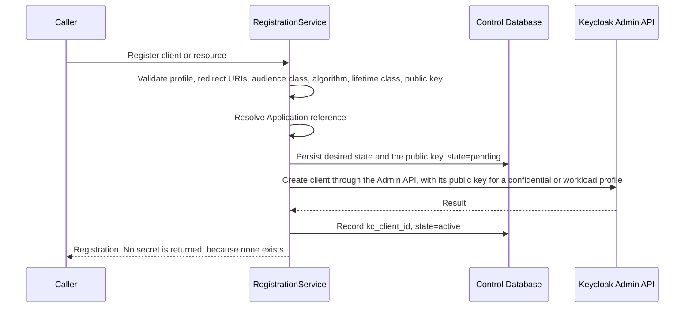

---
doc_meta:
  id: TDD-identity-control-003
  title: Protocol Client and Protected-Resource Registration
  owner: Core Platform Team
  version: 1.11.0
  status: approved
  classification: restricted
  review_cycle_days: 90
  created_date: 2026-08-11
  last_reviewed: 2026-09-30
  parent_sad: SAD-001
---

# Protocol Client and Protected-Resource Registration

## Purpose

Specify how an Application becomes a protocol client or a protected resource in the
identity kernel: what must be true before registration, what the registration fixes,
how a confidential or workload client's public keys are registered, rotated and revoked,
and how drift between desired state and Keycloak is detected.

Registration is where two enterprise rules are enforced or lost. PAD-PLT-001 §7.3
requires every client and protected resource to reference a Software Catalog
Application. STD-IAM-002 §3.3 requires every protected resource to carry exactly one
token-lifetime class, recorded in its registration. Neither has anywhere else to be
enforced.

## Scope

**In scope**

- Desired-state records for clients and protected resources.
- The Application reference, and how registration behaves while Software Catalog is
  unchartered.
- Client profiles and the constraints each carries.
- Redirect URI, audience class, and signing-algorithm validation.
- Client public-key registration, rotation, and revocation (`ADR-IAM-001 §5.12`).
- Drift detection between desired state and Keycloak runtime state.
- Deprovisioning.

**Out of scope**

- Principal creation — owned by `TDD-identity-control-001`.
- Membership context projection and session removal — owned by
  `TDD-identity-control-002`.
- Realm configuration and protocol mappers — owned by `identity-kernel`.
- Workload identity lifecycle — owned by `TDD-identity-control-004`. A workload's
  client registration is created here; its owner, rotation, and orphan handling are
  not.

## Technical Context

Three authorities meet at registration, and only one of them is this service:

| Fact | Authority |
| :-- | :-- |
| The Application exists and who owns it | Software Catalog |
| The protocol registration and its credential trust | Identity & Access, realized here |
| Whether the Application may be sold or used commercially | Subscription & Entitlement |

Software Catalog is not chartered. It has no PAD and no SAD, and EAD-001 §5.4 is
explicit that a target capability is not implementation authorization. Registration
cannot wait for it.

EAD-002 §8 already states the degradation: on Software Catalog unavailability,
*existing systems continue with cached registration metadata*. This design generalises
that to absence. An Application reference is recorded as an authority name and an
opaque identifier, exactly as `organization.external_reference` records a Subscriber
Account. While the authority is `manual`, the reference is entered administratively by
an accountable operator and carries that operator's identity. When Software Catalog is
chartered, the authority name changes and the references are reconciled against it.

What is never permitted is registration with no Application reference at all. The rule
that every client traces to an Application survives the absence of the system that will
eventually hold them.

**Desired state is the registration record in the Control Database.** A reviewed file in
git was proposed for the first drift proof (RESPONSE-4 §4.2), because a pull request
gives review, history and attribution for free. It is not used. Desired state is a
security control: a reconciler applies whatever desired state says, so whoever can write
it can switch a control off, with the reconciler doing the work. The record answers
that concern in its own way. It is written only through this API, by the registration
role, and every write carries an accountable `registered_by` and a new `version`. It is
also validated where a file could not be, against registered audiences and lifetime
classes. And it is what other systems call when they register a client, which a file
read at deploy time could never serve.

## Component Design

| Component | Package | Responsibility |
| :-- | :-- | :-- |
| `RegistrationService` | `internal/registration` | Desired state, validation, lifecycle |
| `ApplicationReferenceResolver` | `internal/registration` | Resolves and revalidates the Application reference against its current authority |
| `ClientKeyRegistrar` | `internal/registration` | Registers, rotates, and revokes a client's public keys on the kernel client through the Admin API. It never receives a private key. Built as the key methods of the registration service (`keys.go`), because each key change runs under the registration's row lock |
| `RegistrationReconciler` | `internal/reconcile` | Compares desired state against Keycloak on a schedule, repairs or blocks drift by field class, and records every run |

### Registration Path


```mermaid
sequenceDiagram
    participant C as Caller
    participant R as RegistrationService
    participant D as Control Database
    participant K as Keycloak Admin API

    C->>R: Register client or resource
    R->>R: Validate profile, redirect URIs, audience class, algorithm, lifetime class, public key
    R->>R: Resolve Application reference
    R->>D: Persist desired state and the public key, state=pending
    R->>K: Create client through the Admin API, with its public key for a confidential or workload profile
    K-->>R: Result
    R->>D: Record kc_client_id, state=active
    R-->>C: Registration. No secret is returned, because none exists
```

The desired-state record is written before the remote call, exactly as
`TDD-identity-control-001` does for Principals, and for the same reason: a crash
between the call and the commit leaves a `pending` record the reconciler can resolve
rather than an orphan in Keycloak nobody owns.

## Data Model

```sql
CREATE TABLE identity.client_registration (
    registration_id     UUID        PRIMARY KEY,
    kc_client_id        TEXT        UNIQUE,
    realm               TEXT        NOT NULL,
    client_key          TEXT        NOT NULL,
    profile             TEXT        NOT NULL,
    application_authority TEXT      NOT NULL,
    application_ref     TEXT        NOT NULL,
    registered_by       UUID        NOT NULL,
    audience_class      TEXT        NOT NULL,
    signing_algorithm   TEXT        NOT NULL DEFAULT 'PS256',
    algorithm_exception_owner UUID,
    algorithm_exception_reason TEXT,
    algorithm_exception_expires_at TIMESTAMPTZ,
    lifetime_class      TEXT,
    audience            TEXT[],
    redirect_uris       TEXT[],
    state               TEXT        NOT NULL,
    version             BIGINT      NOT NULL DEFAULT 1,
    created_at          TIMESTAMPTZ NOT NULL DEFAULT now(),
    activated_at        TIMESTAMPTZ,
    suspended_at        TIMESTAMPTZ,
    retired_at          TIMESTAMPTZ,
    CONSTRAINT client_profile_check
        CHECK (profile IN ('confidential', 'public', 'workload', 'resource')),
    CONSTRAINT client_audience_class_check
        CHECK (audience_class IN ('internal', 'privileged', 'workload', 'external')),
    CONSTRAINT client_signing_algorithm_check
        CHECK (signing_algorithm IN ('PS256', 'RS256')),
    CONSTRAINT client_algorithm_profile_check
        CHECK (
            (signing_algorithm = 'PS256'
                AND algorithm_exception_owner IS NULL
                AND algorithm_exception_reason IS NULL
                AND algorithm_exception_expires_at IS NULL)
            OR
            (signing_algorithm = 'RS256'
                AND audience_class = 'external'
                AND algorithm_exception_owner IS NOT NULL
                AND algorithm_exception_reason IS NOT NULL
                AND algorithm_exception_expires_at > created_at)
        ),
    CONSTRAINT client_workload_audience_check
        CHECK (profile <> 'workload' OR audience_class = 'workload'),
    CONSTRAINT client_state_check
        CHECK (state IN ('pending', 'active', 'suspended', 'retired')),
    CONSTRAINT client_lifetime_class_required
        CHECK (profile <> 'resource' OR lifetime_class IS NOT NULL),
    CONSTRAINT client_lifetime_class_check
        CHECK (lifetime_class IS NULL OR lifetime_class IN ('L0','L1','L2','L3'))
);

CREATE UNIQUE INDEX client_registration_key
    ON identity.client_registration (realm, client_key)
    WHERE state <> 'retired';
```

`client_lifetime_class_required` is the database expression of STD-IAM-002 §3.3: a
protected resource without an assigned lifetime class cannot be stored, so it cannot be
registered. Leaving that to application validation alone would let a migration or a
repair script create the one resource whose token lifetime nobody chose.

`audience_class` selects exactly one claim surface and therefore exactly one managed
client scope, by `identity-kernel`'s names (`realm/client-scopes.json`):

| Audience class | Managed scope |
| :-- | :-- |
| `internal` | `scnehaux-internal` |
| `privileged` | `scnehaux-provider`, the provider-scope form |
| `external` | `scnehaux-external` |
| `workload` | `scnehaux-workload`, not yet declared by the kernel |

The kernel declares no tenant-scope privileged scope and no workload scope. A
registration whose class has no declared scope is refused, never created without its
claim surface. `signing_algorithm` is desired state, not an observation copied
from Keycloak. PS256 is the baseline. RS256 is representable only for an external
compatibility exception with a named owner, reason, and expiry; the database rejects
every other combination. This is the persistence boundary for STD-IAM-002 section
3.2.2.

`application_authority` and `application_ref` together are the Application reference.
While Software Catalog is unchartered the authority is `manual` and `registered_by`
carries the accountable operator.

**A client's access token lifespan is derived, not stored.** It is the access token
lifetime of the shortest lifetime class among the resources in its `audience`, from the
STD-IAM-002 §3.3 table: `L0` 240 s, `L1` and `L3` 540 s, `L2` 900 s. A client whose
audience is empty takes `L0`. STD-IAM-002 forbids configuring a longer lifetime per
client, so a stored number could only ever agree with the classes or break the
standard. The reconciler compares Keycloak's `access.token.lifespan` client attribute
against the derived value.

### Reconciliation Records

```sql
CREATE TABLE identity.reconcile_run (
    run_id       UUID        PRIMARY KEY,
    sweep        TEXT        NOT NULL,
    started_at   TIMESTAMPTZ NOT NULL DEFAULT now(),
    finished_at  TIMESTAMPTZ,
    outcome      TEXT,
    attribution  BOOLEAN,
    findings     INTEGER     NOT NULL DEFAULT 0,
    CONSTRAINT reconcile_run_sweep_check CHECK (sweep IN ('registration')),
    CONSTRAINT reconcile_run_outcome_check
        CHECK (outcome IS NULL OR outcome IN ('converged', 'drift', 'unresolved')),
    CONSTRAINT reconcile_run_finished_check CHECK ((finished_at IS NULL) = (outcome IS NULL))
);

CREATE INDEX reconcile_run_latest ON identity.reconcile_run (sweep, started_at);

CREATE TABLE identity.registration_finding (
    finding_id       UUID        PRIMARY KEY,
    run_id           UUID        NOT NULL REFERENCES identity.reconcile_run(run_id),
    registration_id  UUID        REFERENCES identity.client_registration(registration_id),
    kc_client_id     TEXT        NOT NULL,
    field_class      TEXT,
    finding_class    TEXT        NOT NULL,
    desired          JSONB,
    observed         JSONB,
    actor            TEXT,
    changed_at       TIMESTAMPTZ,
    detected_at      TIMESTAMPTZ NOT NULL DEFAULT now(),
    converged_at     TIMESTAMPTZ,
    resolved_by      UUID,
    resolution_reason TEXT,
    CONSTRAINT registration_finding_field_check
        CHECK (field_class IS NULL OR field_class IN
            ('redirect_uris', 'token_lifespan', 'audience_scope', 'signing_algorithm', 'profile')),
    CONSTRAINT registration_finding_class_check
        CHECK (finding_class IN
            ('repaired', 'blocked', 'sanctioned', 'unattributed', 'missing', 'recreated', 'unmanaged')),
    CONSTRAINT registration_finding_resolution_check
        CHECK ((resolved_by IS NULL) = (resolution_reason IS NULL)
            AND (resolution_reason IS NULL OR btrim(resolution_reason) <> ''))
);

CREATE UNIQUE INDEX registration_finding_open
    ON identity.registration_finding (kc_client_id, field_class) NULLS NOT DISTINCT
    WHERE converged_at IS NULL;

CREATE TABLE identity.drift_exception (
    exception_id     UUID        PRIMARY KEY,
    registration_id  UUID        NOT NULL REFERENCES identity.client_registration(registration_id),
    field_class      TEXT        NOT NULL,
    actor            TEXT        NOT NULL,
    reason           TEXT        NOT NULL,
    granted_by       UUID        NOT NULL,
    granted_at       TIMESTAMPTZ NOT NULL DEFAULT now(),
    expires_at       TIMESTAMPTZ NOT NULL,
    CONSTRAINT drift_exception_field_check
        CHECK (field_class IN
            ('redirect_uris', 'token_lifespan', 'audience_scope', 'signing_algorithm', 'profile')),
    CONSTRAINT drift_exception_named_check CHECK (btrim(actor) <> '' AND btrim(reason) <> ''),
    CONSTRAINT drift_exception_window_check
        CHECK (expires_at > granted_at AND expires_at <= granted_at + interval '24 hours')
);
```

A run that never finished is visible as one: `outcome` is null while it runs, and the
last run's start, finish and outcome are what `GET /v1/registrations:drift` reports
first. `actor` is the Keycloak user an admin event names, and `changed_at` is that
event's time, so `converged_at − changed_at` is the convergence time the drift proof
records as evidence. One divergence has one finding, which `registration_finding_open`
enforces. A later sweep that still sees it
updates that finding's class, `sanctioned` becoming `repaired` when its exception
expires, rather than opening another. A finding is retained after it converges, for the same reason
`TDD-identity-control-002` keeps `extra` findings: the record of a console change is
the evidence it happened. The runtime role therefore deletes none of these four tables' rows,
and cannot update a drift exception either (`grants.sql`).

A drift exception is how an operator makes a console change on purpose: an emergency
fix, in the one place it can be made quickly. It names the registration, the field
class, and the Keycloak user who will make the change, and it lasts at most 24 hours.
A change it covers is left in place and recorded `sanctioned`. When it expires, the
change is drift like any other. Keeping the change means changing desired state
through this API.

### Client Key Records

A confidential or workload client authenticates with `private_key_jwt` (`ADR-IAM-001 §5.12`,
`STD-IAM-001 §3.2`). The client generates its key pair and keeps the private key. This
table records the public keys registered for it:

```sql
CREATE TABLE identity.client_key (
    key_id          UUID        PRIMARY KEY,
    registration_id UUID        NOT NULL REFERENCES identity.client_registration(registration_id),
    kid             TEXT        NOT NULL,
    thumbprint      TEXT        NOT NULL,
    public_jwk      JSONB       NOT NULL,
    state           TEXT        NOT NULL,
    registered_by   UUID        NOT NULL,
    registered_at   TIMESTAMPTZ NOT NULL DEFAULT now(),
    expires_at      TIMESTAMPTZ NOT NULL,
    retiring_at     TIMESTAMPTZ,
    revoked_at      TIMESTAMPTZ,
    revoked_by      UUID,
    revocation_reason TEXT,
    CONSTRAINT client_key_state_check
        CHECK (state IN ('active', 'retiring', 'revoked')),
    CONSTRAINT client_key_public_only
        CHECK (NOT (public_jwk ?| ARRAY['d', 'p', 'q', 'dp', 'dq', 'qi', 'oth', 'k'])),
    CONSTRAINT client_key_dates_check
        CHECK ((state = 'revoked') = (revoked_at IS NOT NULL)
            AND ((state = 'retiring') = (retiring_at IS NOT NULL) OR state = 'revoked')
            AND expires_at > registered_at)
);

CREATE UNIQUE INDEX client_key_kid ON identity.client_key (registration_id, kid);
CREATE UNIQUE INDEX client_key_thumbprint ON identity.client_key (thumbprint);
CREATE UNIQUE INDEX client_key_one_active
    ON identity.client_key (registration_id) WHERE state = 'active';
CREATE UNIQUE INDEX client_key_one_retiring
    ON identity.client_key (registration_id) WHERE state = 'retiring';
```

**No private material is stored here, and the database refuses it.** `public_jwk` is the public
key only. `client_key_public_only` rejects a JWK carrying any private parameter, so a caller that
pastes a private key is refused by the database even if validation missed it. A public key is
public by design (PAD-PLT-001, public verification material), so this table holds nothing that
authenticates as the client.

- `thumbprint` is the RFC 7638 SHA-256 thumbprint. It is unique across every client, so one key pair
  never authenticates two clients, and a leaked key compromises one client only.
- A registration holds at most one `active` and one `retiring` key. That is the overlap the
  kernel was proven to accept.
- The kernel client's JWKS is rebuilt from the `active` and `retiring` rows. Desired state for
  keys is therefore this table, and the reconciler compares the client against it (§Drift
  Reconciliation).
- `client_key_dates_check` keeps the dates honest: a revoked key says when, a retiring key says
  when its overlap ends, and an active key carries neither.
- A thumbprint stays taken after its key is revoked. A key revoked because it leaked can never be
  registered again, to this client or any other.

**A key is never rewritten or deleted.** A new key is a new row. The runtime role holds no
`DELETE` on this table, and `UPDATE` only on the columns a rotation, a revocation or an expiry
changes: `state`, `retiring_at`, `revoked_at`, `revoked_by` and `revocation_reason` (`grants.sql`).
A runtime that could rewrite `public_jwk` could swap a registered key for one whose private half it
holds, and the next rebuild of the kernel's JWKS would install it.

## API / Interface

```text
POST   /v1/registrations
GET    /v1/registrations
GET    /v1/registrations/{registration_id}
POST   /v1/registrations/{registration_id}:suspend
POST   /v1/registrations/{registration_id}:restore
POST   /v1/registrations/{registration_id}:retire
POST   /v1/registrations/{registration_id}/keys
GET    /v1/registrations/{registration_id}/keys
POST   /v1/registrations/{registration_id}/keys/{key_id}:revoke
POST   /v1/registrations/{registration_id}/drift-exceptions
GET    /v1/registrations/{registration_id}/drift-exceptions
GET    /v1/registrations/{registration_id}/findings
GET    /v1/registrations:drift
POST   /v1/registrations:reconcile
```

`GET /v1/registrations` lists the configured realm's registrations, one page at a time, in
creation order: `?after=<registration_id>&limit=<1..100>&state=<state>`. The cursor is
the last `registration_id` of the previous page. That identifier is a UUIDv7, so ordering
on it is creation order, and a keyset on the primary key is what STD-GLB-001 requires in
place of an offset. `limit` defaults to 50. `state` narrows the list to one lifecycle
state, and without it every state is listed, `retired` included, because a retired
registration is still the record of a client that existed. The response is
`{"registrations": [...], "next": "<registration_id>" | null}`. Each item has the same
shape as `GET /v1/registrations/{registration_id}` and carries no secret, since none is
stored. It is what an administrative console lists before it opens one registration and
its findings.

`GET /v1/registrations:drift` returns the last run, the findings that run wrote or
converged, and every finding that has not converged. A repair converges inside the sweep
that made it, so it is never open: the last run's findings, and one registration's
findings (`/findings`, newest first), are where its convergence time is read. `POST /v1/registrations:reconcile` runs a sweep now. With
`X-Administrative-Reason` and the ids of open `blocked`, `unattributed` or `missing` findings, it
also applies desired state to those, which a scheduled sweep never does on its own.
The reason and the caller are recorded on the finding.

`GET /v1/registrations/{registration_id}/drift-exceptions` lists that registration's drift
exceptions, newest first, at most 100: `{"exceptions": [...]}`, each with the field class,
the Keycloak user it names, the reason, the granting Principal, and its window. Expired
exceptions are listed too. An expired exception is the record of why a `sanctioned`
finding was left in place, and the table keeps it for that reason. Whether one is still in
force is `expires_at` against now, which the caller compares. An unknown registration
lists nothing rather than answering 404, as `/findings` does.

**No response ever carries a secret, because none exists.**

- `POST /v1/registrations` for a `confidential` or `workload` profile takes the client's first public
  key as a JWK in `public_key`.
- `POST /v1/registrations/{registration_id}/keys` takes the next key as `{"public_key": <JWK>}`.
  That starts a rotation (§Client Key Rotation). It answers `201` with the keys when the key was
  added, and `200` when that key already is the client's active key, which is how a retry after a
  lost response learns the rotation happened.
- `GET .../keys` lists the keys, newest first, revoked ones included: `{"keys": [...]}`, each with
  its `kid`, thumbprint, public JWK, state and dates. An unknown registration answers `404`.
- `:revoke` removes one key at once. It requires an `X-Administrative-Reason`, recorded on the key
  with the caller, and answers with the keys.

A submitted JWK carries `kty`, `n`, `e` and optionally `kid`, `use` and `alg`, and nothing else. A
key naming no `kid` is registered under its thumbprint, which is what every Scnehaux key tool names
its keys by. The key is recorded as its public members only, re-encoded, so a modulus sent with a
leading zero byte is the same key as one sent without.

A JWK carrying a private parameter is refused, and its content is never logged. A caller that sent
one has exposed that key and must generate another. A caller that loses its private key registers a
new public key and revokes the lost one: there is nothing to retrieve.

### Profiles

| Profile | Client authentication | Redirect URIs | PKCE | Refresh tokens |
| :-- | :-- | :-- | :-- | :-- |
| `confidential` | `private_key_jwt`, a registered public key | Exact match, no wildcard | Required | Permitted |
| `public` | None: no secret and no key | Exact match, no wildcard | Required, `S256` | Prohibited |
| `workload` | `private_key_jwt`, a registered public key | Not applicable | Not applicable | Prohibited |
| `resource` | Not applicable | Not applicable | Not applicable | Not applicable |

No profile authenticates with a client secret. `STD-IAM-001 §3.2` prohibits one for a registered
client, because the kernel cannot rotate a secret with an overlap on supported features
(`ADR-IAM-001 §5.12`).

`public` prohibits refresh tokens because STD-IAM-001 §3.2 prohibits embedding a client
secret in a browser or mobile application, and a public client holding a refresh token
is the pattern `TDD-identity-experience-001` exists to replace. A browser-facing
application registers a `confidential` client for its BFF instead.

`workload` prohibits refresh tokens because a workload re-authenticates with its own
credential rather than continuing a session.

Every registration attaches exactly one managed audience scope. Internal, privileged,
and workload registrations issue PS256 only. External registrations also default to
PS256; RS256 is permitted only while the recorded compatibility exception remains
unexpired. No request can select another algorithm, and the reconciler restores the
managed scope and algorithm when console drift changes them (§Drift Reconciliation).

## Algorithms / Logic

### Validation

```text
register(request):
    reject if the Application reference is absent
    reject if the profile is unknown
    reject if the audience class is unknown
    reject if profile = 'workload' and audience class != 'workload'
    reject if algorithm != 'PS256' and no valid external RS256 exception exists
    reject if the requested algorithm is absent from the audience-class allowlist
    reject if profile = 'public' and a public key is supplied
    reject if profile in ('confidential', 'workload') and no public key is supplied
    reject a key that is not RSA, is shorter than 3072 bits, or names an algorithm other than PS256
    reject a key that carries a private parameter, without logging it
    reject a key whose thumbprint is already registered to any client
    reject if profile = 'resource' and lifetime_class is absent
    for each redirect URI:
        reject a wildcard, a path traversal, a fragment, or credentials
        reject a non-https scheme, except http on a loopback host
        reject a URI whose host is not in the registered host set
    reject an audience naming a resource that is not itself registered
    reject a client_key already active in this realm
    reject a client_key a Keycloak client already holds
    reject an audience class whose managed scope the realm does not declare
```

**Built so far.** All four profiles. A `workload` registers the `workload` audience class, whose
managed scope the kernel does not declare yet, so every workload registration is refused by the
last rule above until it does. The RS256 exception is not offered: every registration is PS256.
The registered host set is not modelled, so that rule is not enforced yet. A `client_key` is 1 to
128 lowercase letters, digits, `.`, `_` or `-`.

**A key an unregistered client holds is refused, not adopted.** Adopting would take over
a client someone else configured and put it under the reconciler. The kernel is checked
before the create, and a conflict from the create itself is treated the same way. The
pending row is retired, which keeps the record and releases the key, and the key's
response is stored, so a retry is refused the same way. A public key the refused
registration recorded is revoked with it: it never reached the kernel, and its thumbprint
stays taken, so that client registers again with a new key pair.

Pending registrations are recovered before each scheduled sweep. One whose create
never landed is created. One whose response was lost is adopted by `client_key`, which
the kernel keeps unique.

Redirect URI validation is exact match. STD-IAM-001 §3.2 prohibits open redirect
patterns, and a wildcard in a redirect URI is an open redirect with extra steps: it
delegates to whoever controls any matching host.

An audience naming an unregistered resource is refused because a token issued for an
audience nobody registered has no verifier that would reject it correctly.

### Client Key Rotation

```text
rotate(registration, new_public_key):
    validate the key as at registration
    reject if the registration already holds a 'retiring' key: one overlap at a time
    add the key to the client's JWKS through the Admin API; record it 'active'
    mark the previous active key 'retiring', retiring_at := now + IDENTITY_CLIENT_KEY_ROTATION_OVERLAP
    return the keys, and nothing secret

at retiring_at, and at a key's expires_at:
    remove the key from the client's JWKS; record it 'revoked'

revoke(registration, key, reason):
    remove the key from the client's JWKS now; record it 'revoked', with the caller and the reason
```

Both keys are valid during the overlap, so a running client can move to the new private key
without a restart window. A rotation that invalidated the old credential immediately would
make every rotation an outage, which is how rotation stops happening. That is why client
secrets are not used (`ADR-IAM-001 §5.12`, Alternative G).

The overlap is bounded, and the retiring key is removed on schedule, not when someone
remembers. Revocation is the other path: it removes one key at once, for a key that has
leaked. Revoking a client's last key is permitted, and it stops the client authenticating
until a new key is registered. For a compromised key that is the containment wanted, and
the reason records why.

**Every key change is one transaction.** It takes the registration's row lock, writes the key rows,
rebuilds the kernel client's JWKS from the `active` and `retiring` rows through the Admin API, and
only then commits. A kernel that refuses or cannot be reached rolls the rows back, so the table never
records a key the kernel was not given. A response lost after the kernel applied the change leaves
the kernel ahead of the table, and the same request sent again converges them, because the JWKS
written is a function of the rows alone. Two changes to one client's keys are serialised by the lock.

**Removal on schedule runs before each sweep.** A retiring key is removed by the first scheduled
pass after its `retiring_at`, and any key by the first pass after its `expires_at`, so each is gone
within one `IDENTITY_REGISTRATION_RECONCILE_INTERVAL` of its time. The removal records no Principal
and names its reason, the overlap or the lifetime ending. A registration whose last key has been
revoked or has expired takes its next key as the active key directly, with nothing to retire.

A client built again, by pending recovery or by an operator recreating a deleted client, holds the
`active` and `retiring` keys, and no other.

**The mechanism is proven against the pinned kernel.** `identity-kernel`'s
`compat/client_keys_test.go` tested it against 26.7.4 (compat run 36606481342):

- a client with two keys in its JWKS authenticates with either;
- a key removed from the JWKS is refused on the next request, with no cache delay;
- an assertion presented twice is refused.

The keys are client attributes (`clientAuthenticatorType: client-jwt`,
`token.endpoint.auth.signing.alg: PS256`, `use.jwks.string: true`, `jwks.string`). The
registration credential already manages client attributes, so no new kernel role is needed.

### Drift Reconciliation

A sweep runs every `IDENTITY_REGISTRATION_RECONCILE_INTERVAL`, and on request.

```text
sweep():
    open a run
    read the realm's client admin events since the previous run's start
        attribution := the read succeeded
    read every client
        if Keycloak is unreachable, or refuses the client read:
            finish the run 'unresolved', change no finding, stop

    for each active registration:
        if its client is absent:
            record 'missing', leave it absent, raise an alert
            continue
        for each field class whose live value differs from desired state:
            event := the latest admin event on this client since the previous run,
                     or else the one already recorded on this divergence's open finding
            if an unexpired exception names this registration, this field class, and event's user:
                record 'sanctioned', leave the value
            else if the field class is redirect_uris:
                disable the client, record 'blocked', raise an alert
            else if attribution is false, or there is no event:
                record 'unattributed', leave the value, raise an alert
            else:
                apply desired state, record 'repaired'
        read the client back; set converged_at on every finding it now satisfies

    for each Keycloak client with no registration:
        disable it, record 'unmanaged', raise an alert

    finish the run 'converged' when nothing differs, 'drift' otherwise
```

Each field class has one policy, and the first two are what the drift proof exercises:

| Field class | Live value | Policy |
| :-- | :-- | :-- |
| `token_lifespan` | `access.token.lifespan` client attribute | repair |
| `redirect_uris` | `redirectUris` | block |
| `audience_scope` | default and optional client scopes | repair |
| `signing_algorithm` | `access.token.signed.response.alg` | repair |
| `profile` | `publicClient`, `serviceAccountsEnabled`, `standardFlowEnabled` | repair |
| `client_keys` | `clientAuthenticatorType`, `use.jwks.string`, `jwks.string` | block |

**A client key is blocked, not restored, for the same reason as a redirect URI.** A key added in
the console lets whoever holds its private key authenticate as the client. So does switching the
client back to a secret. That is a takeover, and repairing it in silence would hide the attempt.
The client is disabled and the changed value kept. Only an operator's reconcile lifts the block,
and it restores the JWKS from the `active` and `retiring` rows.

**A redirect URI is blocked, not restored.** A redirect URI changed in the console is
the shape an attempt to take over a login takes: tokens redirected to a host the
registration never named. Restoring desired state in silence would close the hole and
also hide that anyone tried. So the client is disabled, which stops every new login
through it, and the changed value is kept for whoever investigates. Only an operator
lifts the block, with `POST /v1/registrations:reconcile` naming the finding and a
reason. That restores the desired URIs and re-enables the client. Changing a
registration's redirect URIs through this API is not designed yet, so until it is,
restoring desired state is the only way to lift a block.

**No attribution, no automatic repair.** An automatic repair can undo an operator's
emergency fix minutes after they made it, which is a worse incident than the drift
(RESPONSE-4 §4.4). So a repair happens only when an admin event names who made the
change, and no exception covers it. The attribution stays on the finding, so a change
left in place under an exception is still attributed when the exception expires, long
after its admin event left the sweep's window. A divergence no admin event explains was made by
a path that records none. So was one found while the admin events could not be read.
Both are reported `unattributed` and left for an operator. Blocking needs no
attribution, because disabling a client removes access and never grants it.

**An unreachable Keycloak is `unresolved`, not a failure and not a success.** Nothing
is known about the live state. So no finding is opened, closed or converged, and the
run says so rather than reporting the last known result as current.

**One sweep at a time, across replicas.** Every replica schedules the sweep. A run is
claimed under a transaction-scoped advisory lock: a replica that finds another's run
unfinished and younger than two intervals skips its tick. An older unfinished run
belonged to a replica that stopped. It stays visible as unfinished and no longer
blocks.

**Which admin events a sweep reads.** It reads every client admin event since the
previous run's start, so a change made while no replica was sweeping is still
attributed. The window never reaches past `identity-kernel`'s 7-day retention, and the
interval must be shorter than that retention. An event caused by the registration
credential's own service account is the reconciler's own repair, so it is never taken
as the actor of a change. More than 10,000 client events in one window is read as
attribution unavailable, because attributing from part of the record could name the
wrong actor.

**Built so far.** Two field classes are compared: `token_lifespan` and
`redirect_uris`, the two the drift proof exercises. `audience_scope`,
`signing_algorithm` and `profile` are designed above and not compared yet. Client key
registration is built, so registrations now hold keys, and `client_keys` is the next field
class to compare.

- **An absent client is held, not recreated.** It is recorded as one open `missing`
  finding naming whoever the deletion's admin event names, and every sweep leaves it
  absent. Only an operator's reconcile naming the finding recreates it from desired state,
  which closes the finding as `recreated` with the operator and the reason. Deleting a
  client in the console is how an operator contains a compromised one, and the runtime
  stop path that would make deletion unnecessary, `:suspend` and `:retire`, is not
  built. A sweep that recreated the client would undo that containment within one
  interval. When the lifecycle exists, this can be revisited; until then, holding is the
  conservative reading (RESPONSE-27, D5).
- **No client is treated as unmanaged yet.** This service's own clients are confidential
  clients that development scripts create, each with its own key. They can now be registered
  through this API with those keys, and until they are, disabling every unregistered client would
  disable this service. When the
  branch is built, it must also exempt the clients Keycloak itself creates in every
  realm (`account`, `account-console`, `admin-cli`, `broker`, `realm-management`,
  `security-admin-console`). Disabling `realm-management` or `admin-cli` would lock
  administration out of the realm, a worse incident than any drift.

An unmanaged client is disabled rather than deleted, on the same reasoning as
`TDD-identity-control-001`: a false positive caused by a reconciler defect is
recoverable, and deleting a client that some running system depends on is not.

An unmanaged client is a security finding. Reaching that state requires either a defect
in this path or a direct Admin Console change, and ADR-IAM-001 §5.7 prohibits the
second.

### Retirement

```text
retire(registration):
    reject if any other active registration names this resource in its audience
    remove every registered key from the client's JWKS; record each 'revoked'
    disable the client in Keycloak
    set state = 'retired', keep the record
```

The audience check prevents retiring a resource that other clients still hold tokens
for. The refusal names the dependent registrations.

The record is kept after retirement. `client_key` is released for reuse only through
the partial unique index, so a retired registration remains auditable while its key
becomes available.

## Configuration

| Variable | Default | Purpose |
| :-- | :-- | :-- |
| `IDENTITY_CLIENT_KEY_LIFETIME` | `2160h` (90 days) | How long a registered client key is valid before it is removed. A Go duration, which has no day unit |
| `IDENTITY_CLIENT_KEY_ROTATION_OVERLAP` | `168h` (7 days) | Window during which the new and the retiring key are both accepted. Shorter than the lifetime, or startup is refused |
| `IDENTITY_REGISTRATION_RECONCILE_INTERVAL` | `1h` | Drift sweep cadence. Admin-event retention in `identity-kernel` (7 days) must exceed it, or a change would lose its attribution before a sweep reads it |
| `IDENTITY_APPLICATION_AUTHORITY` | `manual` | Becomes the Software Catalog authority name once chartered |
| `IDENTITY_REGISTRATION_KEYCLOAK_CLIENT_ID` | none, required | The registration path's own Admin API client, `identity-control-registration` |
| `IDENTITY_REGISTRATION_KEYCLOAK_CLIENT_KEY_FILE` | none, required | Its PEM private key, from the secret manager as a file; never the Principal path's |

## Testing Strategy

### Validation

- A registration without an Application reference is refused.
- A `resource` without a lifetime class is refused by the API and by the database
  constraint, tested separately.
- A wildcard redirect URI is refused.
- A non-https redirect URI outside local development is refused.
- An audience naming an unregistered resource is refused.
- A `public` profile supplying a public key is refused. A `confidential` or `workload`
  profile without one is refused.
- Every registration receives exactly one managed audience scope.
- An internal, privileged, or workload registration requesting RS256 is refused by the
  API and by the database constraint.
- An external RS256 exception without an owner, reason, future expiry, or verifier
  compatibility evidence is refused.
- `none`, symmetric algorithms, and algorithms outside the STD-IAM-002 allowlist are
  refused before any Keycloak call.

### Listing

- The list pages by `registration_id` in creation order. The last page's `next` is
  null, and an empty page is an empty list.
- A listed registration has the same shape as a read of that registration.
- `state` narrows the list. A limit outside 1 to 100, or an unknown state, is refused.
- The list is scoped to the configured realm.

### Client Keys

- No response, log, or event ever carries a secret or a private key.
- A JWK carrying a private parameter is refused by validation, and by the
  `client_key_public_only` constraint, tested separately. Nothing of it is logged.
- A key that is not RSA, is shorter than 3072 bits, or is not PS256 is refused.
- A key already registered to any client is refused.
- During the overlap, assertions signed with either key authenticate against a live kernel.
- At the end of the overlap the retiring key is removed without manual action, and an
  assertion signed with it is refused.
- A revoked key is refused on the next request. A revocation without a reason is refused.
- A second rotation while a key is still retiring is refused. A retry of a rotation already made
  changes nothing and answers the keys.
- A key change the kernel refuses leaves the key rows as they were.
- A revoked key cannot be registered again, to its client or any other.
- A client built again by recovery or by an operator holds exactly its active and retiring keys.
- The registration credential cannot create, modify, or disable a user, and the Principal path's
  credential cannot create or modify a client. Both are asserted against a live kernel.

### Drift

- A client deleted directly in Keycloak is recorded `missing` and left absent by every
  sweep. An operator's reconcile naming the finding recreates it, and the finding closes
  as `recreated`.
- A client whose redirect URIs were changed in the Admin Console is disabled and
  recorded `blocked`, with the changed value kept. A reconcile naming the finding
  restores desired state and re-enables it.
- A client whose JWKS or client authenticator was changed in the Admin Console is
  disabled and recorded `blocked`. A reconcile naming the finding restores the registered
  keys.
- A client whose access token lifespan was changed in the Admin Console is restored,
  recorded `repaired` with the admin who changed it, and its convergence time is
  recorded.
- The same change covered by an unexpired exception naming that admin is recorded
  `sanctioned` and left. After the exception expires, the next sweep repairs it.
- A divergence found while admin events cannot be read is recorded `unattributed` and
  not repaired.
- A sweep against an unreachable Keycloak finishes `unresolved` and changes no
  finding.
- The last run's start, finish and outcome are readable through the API.
- A client whose managed audience scope or signing algorithm drifted is restored to
  desired state.
- A Keycloak client with no registration is disabled and alerted, not deleted.
- Reconciliation is idempotent against a consistent state.

### Lifecycle

- Retiring a resource still named in another active registration's audience is refused,
  and the refusal names the dependents.
- A retired registration's `client_key` can be reused; the retired record remains.
- A crash between the Admin API call and the local commit leaves `pending`, and
  recovery adopts the existing client rather than creating a second one.

## Security Notes

**The registration path has its own Admin API credential.** It is a separate Keycloak client,
`identity-control-registration`, whose service account holds the realm-management roles
`manage-clients`, `view-clients`, and `view-events`, the last so the reconciler can read
the admin events that attribute a change. It holds nothing else: no user management, no
realm administration, no credential read.

On the development server this client is created once, by a script that creates this
one client and refuses to run when it exists, and whoever operates the server runs it.
The scripts that created the kernel's clients there are not rerun for it. The Principal path keeps its own credential, with user roles
only (`TDD-identity-control-001`), and so does the projector (`TDD-identity-control-002`).
All three designs therefore stay true: none of those credentials holds client management.

The split limits what one leaked key can do. A credential that could both create users and
register clients would let whoever holds it mint a Principal, and register a client that redirects
its tokens to them, in one step. Split, each key opens one of those capabilities only. The cost is
a second key to rotate, and a registration component that cannot reach the Principal path's
credential even by mistake, because it is configured with a different one.

**A registered client has no secret, and no private key reaches this service.** The client
generates its key pair and keeps the private key (`ADR-IAM-001 §5.12`). This service
records and registers the public key only, and the database refuses private material.
Neither a Control Database breach nor a kernel breach yields anything that authenticates as a
registered client. With client secrets, the kernel's database and backups would have held one
per client, readable by its administrators.

This service's own clients, `identity-control` and `identity-control-registration`, follow the
same rule. The registration path cannot register them before it exists, so a bootstrap script
creates them. Each has its own key, made with identity-kernel's `client-key` tool on the host the
service runs on. No client secret exists in any shared environment, development included
(`STD-IAM-001 §3.2`).

Exact-match redirect URIs and registered audiences are the two controls that keep the
protocol surface closed. Both are validated at registration because neither is
checkable later without knowing what was intended.

The lifetime class is enforced at the database level because it is the term that bounds
revocation enforcement for every consumer of that resource. A resource registered
without one would have no stated enforcement delay, and STD-IAM-001 §3.4 requires every
revocation class to have one.

While `application_authority` is `manual`, accountability rests on `registered_by`.
That is weaker than a Software Catalog reference and is recorded as such rather than
presented as equivalent.

## Performance Notes

Registration is an administrative operation and appears on no authentication or
token-validation path. The drift sweep enumerates clients through paged Admin API calls
and is rate-limited so reconciliation cannot consume capacity reserved for
authentication.

## Operational Notes

| Signal | Warning | Critical |
| :-- | :-- | :-- |
| Unmanaged Keycloak client detected | — | any occurrence |
| Client key expiring within 14 days with no successor registered | any occurrence | within 3 days |
| Client blocked for a key or authenticator change | — | any occurrence |
| Registrations in `pending` past the recovery threshold | any occurrence | — |
| Drift repairs per sweep | above baseline | — |
| Client blocked for a redirect URI change | — | any occurrence |
| Unattributed divergence | any occurrence | — |
| Last registration sweep finished | older than 2 intervals | older than 4 intervals, or `unresolved` twice in a row |
| Registration with `application_authority = manual` | tracked as debt | — |

Runbooks required before production: unmanaged client triage, client key rotation,
compromised client key, expired client key recovery, and registration drift repair.

## Traceability

| Relationship | Target |
| :-- | :-- |
| Parent system | SAD-001 — Scnehaux Identity Runtime |
| Realizes capability | PAD-PLT-001 — Identity & Access Platform |
| Governed by | ADR-IAM-001 §5.2, §5.7 — supported interfaces only; no unmanaged console change |
| Governed by | ADR-IAM-001 §5.12 — confidential and workload clients authenticate with registered keys |
| Conforms to | STD-IAM-001 §3.2 — PKCE, exact redirect URIs, no secret in a public client, `private_key_jwt` for confidential and workload clients |
| Evidence | `identity-kernel` `compat/client_keys_test.go` — key overlap, immediate removal, replay refusal |
| Conforms to | STD-IAM-002 §3.3 — every protected resource carries exactly one lifetime class |
| Enterprise constraint | PAD-PLT-001 §7.3 — every client and protected resource references an Application |
| Enterprise constraint | EAD-002 §8 — registration continues on cached or manually recorded metadata |
| Related design | `TDD-identity-control-001` — the same pending-state recovery pattern |
| Consumed by | `TDD-identity-control-004` — a workload's client registration is created here |

### Open Questions

1. The Application reference authority. `manual` is the interim, and every registration
   carrying it is tracked as debt. When Software Catalog is chartered, the authority
   name changes and existing references are reconciled against it rather than
   re-entered.
