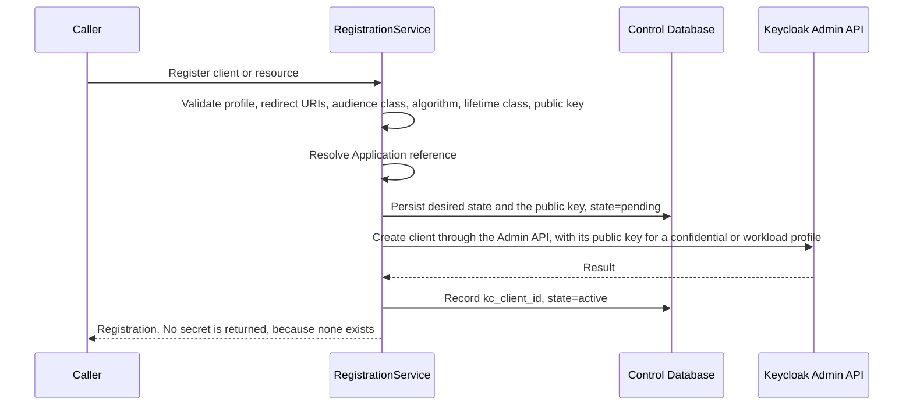

---
doc_meta:
  id: TDD-identity-control-003
  title: Protocol Client and Protected-Resource Registration
  owner: Core Platform Team
  version: 1.29.0
  status: approved
  classification: restricted
  review_cycle_days: 90
  created_date: 2026-08-11
  last_reviewed: 2026-10-05
  parent_sad: SAD-001
---

# Protocol Client and Protected-Resource Registration

## Purpose

Specify how an Application becomes a protocol client or a protected resource in the
identity kernel: what must be true before registration, what the registration fixes,
how a confidential or workload client's public keys are registered, rotated and revoked,
and how drift between desired state and Keycloak is detected.

Registration is where two enterprise rules are enforced or lost. PAD-PLT-001 §7.3
requires every client and protected resource to reference a Software Catalog
Application. STD-IAM-002 §3.3 requires every protected resource to carry exactly one
token-lifetime class, recorded in its registration. Neither has anywhere else to be
enforced.

## Scope

**In scope**

- Desired-state records for clients and protected resources.
- The Application reference, and how registration behaves while Software Catalog is
  unchartered.
- Client profiles and the constraints each carries.
- Redirect URI, audience class, and signing-algorithm validation.
- Client public-key registration, rotation, and revocation (`ADR-IAM-001 §5.12`).
- Drift detection between desired state and Keycloak runtime state.
- Suspension, restoration, and retirement (`ADR-IAM-001 §5.13`).

**Out of scope**

- Principal creation — owned by `TDD-identity-control-001`.
- Membership context projection and session removal — owned by
  `TDD-identity-control-002`.
- Realm configuration and protocol mappers — owned by `identity-kernel`.
- Workload identity lifecycle — owned by `TDD-identity-control-004`. A workload's
  client registration is created here; its owner, rotation, and orphan handling are
  not.

## Technical Context

Three authorities meet at registration, and only one of them is this service:

| Fact | Authority |
| :-- | :-- |
| The Application exists and who owns it | Software Catalog |
| The protocol registration and its credential trust | Identity & Access, realized here |
| Whether the Application may be sold or used commercially | Subscription & Entitlement |

Software Catalog is not chartered. It has no PAD and no SAD, and EAD-001 §5.4 is
explicit that a target capability is not implementation authorization. Registration
cannot wait for it.

EAD-002 §8 already states the degradation: on Software Catalog unavailability,
*existing systems continue with cached registration metadata*. This design generalises
that to absence. An Application reference is recorded as an authority name and an
opaque identifier, exactly as `organization.external_reference` records a Subscriber
Account. While the authority is `manual`, the reference is entered administratively by
an accountable operator and carries that operator's identity. When Software Catalog is
chartered, the authority name changes and the references are reconciled against it.

What is never permitted is registration with no Application reference at all. The rule
that every client traces to an Application survives the absence of the system that will
eventually hold them.

**Desired state is the registration record in the Control Database.** A reviewed file in
git was proposed for the first drift proof (RESPONSE-4 §4.2), because a pull request
gives review, history and attribution for free. It is not used. Desired state is a
security control: a reconciler applies whatever desired state says, so whoever can write
it can switch a control off, with the reconciler doing the work. The record answers
that concern in its own way. It is written only through this API, by the registration
role, and every write carries an accountable `registered_by` and a new `version`. It is
also validated where a file could not be, against registered audiences and lifetime
classes. And it is what other systems call when they register a client, which a file
read at deploy time could never serve.

## Component Design

| Component | Package | Responsibility |
| :-- | :-- | :-- |
| `RegistrationService` | `internal/registration` | Desired state, validation, lifecycle |
| `ApplicationReferenceResolver` | `internal/registration` | Resolves and revalidates the Application reference against its current authority |
| `ClientKeyRegistrar` | `internal/registration` | Registers, rotates, and revokes a client's public keys on the kernel client through the Admin API. It never receives a private key. Built as the key methods of the registration service (`keys.go`), because each key change runs under the registration's row lock |
| `RegistrationReconciler` | `internal/reconcile` | Compares desired state against Keycloak on a schedule, repairs or blocks drift by field class, and records every run |

### Registration Path


```mermaid
sequenceDiagram
    participant C as Caller
    participant R as RegistrationService
    participant D as Control Database
    participant K as Keycloak Admin API

    C->>R: Register client or resource
    R->>R: Validate profile, redirect URIs, audience class, algorithm, lifetime class, public key
    R->>R: Resolve Application reference
    R->>D: Persist desired state and the public key, state=pending
    R->>K: Create client through the Admin API, with its public key for a confidential or workload profile
    K-->>R: Result
    R->>D: Record kc_client_id, state=active
    R-->>C: Registration. No secret is returned, because none exists
```

The desired-state record is written before the remote call, exactly as
`TDD-identity-control-001` does for Principals, and for the same reason: a crash
between the call and the commit leaves a `pending` record the reconciler can resolve
rather than an orphan in Keycloak nobody owns.

## Data Model

```sql
CREATE TABLE identity.client_registration (
    registration_id     UUID        PRIMARY KEY,
    kc_client_id        TEXT        UNIQUE,
    realm               TEXT        NOT NULL,
    client_key          TEXT        NOT NULL,
    profile             TEXT        NOT NULL,
    application_authority TEXT      NOT NULL,
    application_ref     TEXT        NOT NULL,
    registered_by       UUID        NOT NULL,
    audience_class      TEXT        NOT NULL,
    privileged_form     TEXT,
    signing_algorithm   TEXT        NOT NULL DEFAULT 'PS256',
    algorithm_exception_owner UUID,
    algorithm_exception_reason TEXT,
    algorithm_exception_expires_at TIMESTAMPTZ,
    lifetime_class      TEXT,
    audience            TEXT[],
    redirect_uris       TEXT[],
    state               TEXT        NOT NULL,
    version             BIGINT      NOT NULL DEFAULT 1,
    created_at          TIMESTAMPTZ NOT NULL DEFAULT now(),
    activated_at        TIMESTAMPTZ,
    suspended_at        TIMESTAMPTZ,
    retired_at          TIMESTAMPTZ,
    CONSTRAINT client_profile_check
        CHECK (profile IN ('confidential', 'public', 'workload', 'resource')),
    CONSTRAINT client_audience_class_check
        CHECK (audience_class IN ('internal', 'privileged', 'workload', 'external')),
    CONSTRAINT client_privileged_form_check
        CHECK ((audience_class = 'privileged') = (privileged_form IS NOT NULL)
           AND (privileged_form IS NULL OR privileged_form IN ('provider-scope', 'tenant-scoped'))),
    CONSTRAINT client_signing_algorithm_check
        CHECK (signing_algorithm IN ('PS256', 'RS256')),
    CONSTRAINT client_algorithm_profile_check
        CHECK (
            (signing_algorithm = 'PS256'
                AND algorithm_exception_owner IS NULL
                AND algorithm_exception_reason IS NULL
                AND algorithm_exception_expires_at IS NULL)
            OR
            (signing_algorithm = 'RS256'
                AND audience_class = 'external'
                AND algorithm_exception_owner IS NOT NULL
                AND algorithm_exception_reason IS NOT NULL
                AND algorithm_exception_expires_at > created_at)
        ),
    CONSTRAINT client_workload_audience_check
        CHECK (profile <> 'workload' OR audience_class = 'workload'),
    CONSTRAINT client_state_check
        CHECK (state IN ('pending', 'active', 'suspended', 'retired')),
    CONSTRAINT client_lifetime_class_required
        CHECK (profile <> 'resource' OR lifetime_class IS NOT NULL),
    CONSTRAINT client_lifetime_class_check
        CHECK (lifetime_class IS NULL OR lifetime_class IN ('L0','L1','L2','L3'))
);

CREATE UNIQUE INDEX client_registration_key
    ON identity.client_registration (realm, client_key)
    WHERE state <> 'retired';
```

`client_lifetime_class_required` is the database expression of STD-IAM-002 §3.3: a
protected resource without an assigned lifetime class cannot be stored, so it cannot be
registered. Leaving that to application validation alone would let a migration or a
repair script create the one resource whose token lifetime nobody chose.

`audience_class` selects exactly one claim surface and therefore exactly one managed
client scope, by `identity-kernel`'s names (`realm/client-scopes.json`):

| Audience class | Managed scope |
| :-- | :-- |
| `internal` | `scnehaux-internal` |
| `privileged`, `privileged_form` `provider-scope` | `scnehaux-provider` |
| `privileged`, `privileged_form` `tenant-scoped` (1.29.0) | `scnehaux-privileged` |
| `external` | `scnehaux-external` |
| `workload` | `scnehaux-workload` |

**`privileged_form` (1.29.0)** says which of STD-IAM-002 §3.1.1's forms a `privileged` client's
tokens take, because each form is a different claim surface:

- **`provider-scope`** carries no `tenant_id`. It is also the claim surface of the `resource-scoped`
  form, which carries the same four claims and differs only in the record the resource reads.
- **`tenant-scoped`** is a privileged operation inside one Tenant, such as administering it at
  Organization Control (`ADR-ORG-003 §5.3`). It takes `scnehaux-privileged`, which identity-kernel
  declares from 1.14.0 of its TDD-001, and the `organization` scope as optional, so a sign-in asks
  for its Tenant with `organization:<tenant_id>`.

A client holds exactly one audience profile scope (STD-IAM-002 §3.2.1), so the form is fixed for the
registration's life, like its class. A console that is both a provider's and a Tenant
administrator's is two registrations.

A `privileged` resource, such as `organization-control-api`, takes a form as well, because the
column is set exactly when the class is `privileged`; the form selects only the scope it holds, and a
resource is issued no token. The resource accepts whichever form its callers' tokens take, and decides
what each may do from its own records.

The column is set exactly when the class is `privileged`. A request that names no form for a
`privileged` registration is `provider-scope`, which is what every `privileged` registration was
before 1.29.0, and the migration records that for them. A form named for any other class is refused.

A registration whose class and form have no declared scope is refused, never created without its
claim surface. `signing_algorithm` is desired state, not an observation copied
from Keycloak. PS256 is the baseline. RS256 is representable only for an external
compatibility exception with a named owner, reason, and expiry; the database rejects
every other combination. This is the persistence boundary for STD-IAM-002 section
3.2.2.

`application_authority` and `application_ref` together are the Application reference.
While Software Catalog is unchartered the authority is `manual` and `registered_by`
carries the accountable operator.

**A client's access token lifespan is derived, not stored.** It is the access token
lifetime of the shortest lifetime class among the resources in its `audience`, from the
STD-IAM-002 §3.3 table: `L0` 240 s, `L1` and `L3` 540 s, `L2` 900 s. A client whose
audience is empty takes `L0`. STD-IAM-002 forbids configuring a longer lifetime per
client, so a stored number could only ever agree with the classes or break the
standard. The reconciler compares Keycloak's `access.token.lifespan` client attribute
against the derived value.

### Reconciliation Records

```sql
CREATE TABLE identity.reconcile_run (
    run_id       UUID        PRIMARY KEY,
    sweep        TEXT        NOT NULL,
    started_at   TIMESTAMPTZ NOT NULL DEFAULT now(),
    finished_at  TIMESTAMPTZ,
    outcome      TEXT,
    attribution  BOOLEAN,
    findings     INTEGER     NOT NULL DEFAULT 0,
    CONSTRAINT reconcile_run_sweep_check CHECK (sweep IN ('registration')),
    CONSTRAINT reconcile_run_outcome_check
        CHECK (outcome IS NULL OR outcome IN ('converged', 'drift', 'unresolved')),
    CONSTRAINT reconcile_run_finished_check CHECK ((finished_at IS NULL) = (outcome IS NULL))
);

CREATE INDEX reconcile_run_latest ON identity.reconcile_run (sweep, started_at);

CREATE TABLE identity.registration_finding (
    finding_id       UUID        PRIMARY KEY,
    run_id           UUID        NOT NULL REFERENCES identity.reconcile_run(run_id),
    registration_id  UUID        REFERENCES identity.client_registration(registration_id),
    kc_client_id     TEXT        NOT NULL,
    field_class      TEXT,
    finding_class    TEXT        NOT NULL,
    desired          JSONB,
    observed         JSONB,
    actor            TEXT,
    changed_at       TIMESTAMPTZ,
    detected_at      TIMESTAMPTZ NOT NULL DEFAULT now(),
    converged_at     TIMESTAMPTZ,
    resolved_by      UUID,
    resolution_reason TEXT,
    CONSTRAINT registration_finding_field_check
        CHECK (field_class IS NULL OR field_class IN
            ('redirect_uris', 'token_lifespan', 'audience_scope', 'signing_algorithm', 'profile', 'client_keys')),
    CONSTRAINT registration_finding_class_check
        CHECK (finding_class IN
            ('repaired', 'blocked', 'sanctioned', 'unattributed', 'missing', 'recreated', 'unmanaged')),
    CONSTRAINT registration_finding_resolution_check
        CHECK ((resolved_by IS NULL) = (resolution_reason IS NULL)
            AND (resolution_reason IS NULL OR btrim(resolution_reason) <> ''))
);

CREATE UNIQUE INDEX registration_finding_open
    ON identity.registration_finding (kc_client_id, field_class) NULLS NOT DISTINCT
    WHERE converged_at IS NULL;

CREATE TABLE identity.drift_exception (
    exception_id     UUID        PRIMARY KEY,
    registration_id  UUID        NOT NULL REFERENCES identity.client_registration(registration_id),
    field_class      TEXT        NOT NULL,
    actor            TEXT        NOT NULL,
    reason           TEXT        NOT NULL,
    granted_by       UUID        NOT NULL,
    granted_at       TIMESTAMPTZ NOT NULL DEFAULT now(),
    expires_at       TIMESTAMPTZ NOT NULL,
    CONSTRAINT drift_exception_field_check
        CHECK (field_class IN
            ('redirect_uris', 'token_lifespan', 'audience_scope', 'signing_algorithm', 'profile')),
    CONSTRAINT drift_exception_named_check CHECK (btrim(actor) <> '' AND btrim(reason) <> ''),
    CONSTRAINT drift_exception_window_check
        CHECK (expires_at > granted_at AND expires_at <= granted_at + interval '24 hours')
);
```

A run that never finished is visible as one: `outcome` is null while it runs, and the
last run's start, finish and outcome are what `GET /v1/registrations:drift` reports
first. `actor` is the Keycloak user an admin event names, and `changed_at` is that
event's time, so `converged_at − changed_at` is the convergence time the drift proof
records as evidence. One divergence has one finding, which `registration_finding_open`
enforces. A later sweep that still sees it
updates that finding's class, `sanctioned` becoming `repaired` when its exception
expires, rather than opening another. A finding is retained after it converges, for the same reason
`TDD-identity-control-002` keeps `extra` findings: the record of a console change is
the evidence it happened. The runtime role therefore deletes none of these four tables' rows,
and cannot update a drift exception either (`grants.sql`).

A drift exception is how an operator makes a console change on purpose: an emergency
fix, in the one place it can be made quickly. It names the registration, the field
class, and the Keycloak user who will make the change, and it lasts at most 24 hours.
A change it covers is left in place and recorded `sanctioned`. When it expires, the
change is drift like any other. Keeping the change means changing desired state
through this API.

### Adoption Records

```sql
CREATE TABLE identity.registration_adoption (
    adoption_id      UUID        PRIMARY KEY,
    registration_id  UUID        NOT NULL UNIQUE REFERENCES identity.client_registration(registration_id),
    kc_client_id     TEXT        NOT NULL,
    adopted_by       UUID        NOT NULL,
    reason           TEXT        NOT NULL,
    observed         JSONB       NOT NULL,
    converged        TEXT[]      NOT NULL DEFAULT '{}',
    adopted_at       TIMESTAMPTZ NOT NULL DEFAULT now(),
    CONSTRAINT registration_adoption_reason_check CHECK (btrim(reason) <> '')
);
```

One row per adopted client: who adopted it, when, why, what the client held when it was adopted
(`observed`: its authenticator, key ids, redirect URIs, lifespan, default scopes and whether it
was enabled), and which repairable differences the adoption converged. The runtime role inserts
and reads it, and can neither update nor delete it (`grants.sql`), so the record of how a client
came under management outlives whoever adopted it (`ADR-IAM-001 §5.12` rule 5).

### Lifecycle Records

```sql
CREATE TABLE identity.registration_state_change (
    change_id        UUID        PRIMARY KEY,
    registration_id  UUID        NOT NULL REFERENCES identity.client_registration(registration_id),
    from_state       TEXT        NOT NULL,
    to_state         TEXT        NOT NULL,
    changed_by       UUID        NOT NULL,
    reason           TEXT        NOT NULL,
    changed_at       TIMESTAMPTZ NOT NULL DEFAULT now(),
    CONSTRAINT registration_state_change_reason_check CHECK (btrim(reason) <> ''),
    CONSTRAINT registration_state_change_transition_check CHECK (
        (from_state = 'active' AND to_state IN ('suspended', 'retired'))
        OR (from_state = 'suspended' AND to_state IN ('active', 'retired')))
);
```

One row per suspension, restoration, and retirement: who moved the registration, from which state
to which, when, and why (`ADR-IAM-001 §5.13`, `STD-IAM-001 §3.8`). A repeated request that finds
the registration already in the state it asks for records nothing, because nothing moved. The
runtime role inserts and reads it, and can neither update nor delete it (`grants.sql`).
`client_registration.suspended_at` is the latest suspension, kept after a restore; the state says
whether it is in force.

### Client Key Records

A confidential or workload client authenticates with `private_key_jwt` (`ADR-IAM-001 §5.12`,
`STD-IAM-001 §3.2`). The client generates its key pair and keeps the private key. This
table records the public keys registered for it:

```sql
CREATE TABLE identity.client_key (
    key_id          UUID        PRIMARY KEY,
    registration_id UUID        NOT NULL REFERENCES identity.client_registration(registration_id),
    kid             TEXT        NOT NULL,
    thumbprint      TEXT        NOT NULL,
    public_jwk      JSONB       NOT NULL,
    state           TEXT        NOT NULL,
    registered_by   UUID        NOT NULL,
    registered_at   TIMESTAMPTZ NOT NULL DEFAULT now(),
    expires_at      TIMESTAMPTZ NOT NULL,
    retiring_at     TIMESTAMPTZ,
    revoked_at      TIMESTAMPTZ,
    revoked_by      UUID,
    revocation_reason TEXT,
    CONSTRAINT client_key_state_check
        CHECK (state IN ('active', 'retiring', 'revoked')),
    CONSTRAINT client_key_public_only
        CHECK (NOT (public_jwk ?| ARRAY['d', 'p', 'q', 'dp', 'dq', 'qi', 'oth', 'k'])),
    CONSTRAINT client_key_dates_check
        CHECK ((state = 'revoked') = (revoked_at IS NOT NULL)
            AND ((state = 'retiring') = (retiring_at IS NOT NULL) OR state = 'revoked')
            AND expires_at > registered_at)
);

CREATE UNIQUE INDEX client_key_kid ON identity.client_key (registration_id, kid);
CREATE UNIQUE INDEX client_key_thumbprint ON identity.client_key (thumbprint);
CREATE UNIQUE INDEX client_key_one_active
    ON identity.client_key (registration_id) WHERE state = 'active';
CREATE UNIQUE INDEX client_key_one_retiring
    ON identity.client_key (registration_id) WHERE state = 'retiring';
```

**No private material is stored here, and the database refuses it.** `public_jwk` is the public
key only. `client_key_public_only` rejects a JWK carrying any private parameter, so a caller that
pastes a private key is refused by the database even if validation missed it. A public key is
public by design (PAD-PLT-001, public verification material), so this table holds nothing that
authenticates as the client.

- `thumbprint` is the RFC 7638 SHA-256 thumbprint. It is unique across every client, so one key pair
  never authenticates two clients, and a leaked key compromises one client only.
- A registration holds at most one `active` and one `retiring` key. That is the overlap the
  kernel was proven to accept.
- The kernel client's JWKS is rebuilt from the `active` and `retiring` rows. Desired state for
  keys is therefore this table, and the reconciler compares the client against it (§Drift
  Reconciliation).
- `client_key_dates_check` keeps the dates honest: a revoked key says when, a retiring key says
  when its overlap ends, and an active key carries neither.
- A thumbprint stays taken after its key is revoked. A key revoked because it leaked can never be
  registered again, to this client or any other.

**A key is never rewritten or deleted.** A new key is a new row. The runtime role holds no
`DELETE` on this table, and `UPDATE` only on the columns a rotation, a revocation or an expiry
changes: `state`, `retiring_at`, `revoked_at`, `revoked_by` and `revocation_reason` (`grants.sql`).
A runtime that could rewrite `public_jwk` could swap a registered key for one whose private half it
holds, and the next rebuild of the kernel's JWKS would install it.

## API / Interface

**`X-Administrative-Reason` is visible US-ASCII.** Every route that records a reason takes it from
this header, and a value holding any octet outside visible US-ASCII, space and horizontal tab is
refused with `400 validation-failed` before the handler runs (STD-GLB-001 §Request Header Values,
RFC 9110 §5.5). Such octets carry no encoding the service could rely on. Stored as text, they once
reached PostgreSQL as invalid UTF-8, and the request failed as an unexplained `503`. A failure that
is not the kernel's answers `500`, never the kernel's `503`.

```text
POST   /v1/registrations
POST   /v1/registrations:adopt
GET    /v1/registrations
GET    /v1/registrations/{registration_id}
POST   /v1/registrations/{registration_id}:suspend
POST   /v1/registrations/{registration_id}:restore
POST   /v1/registrations/{registration_id}:retire
POST   /v1/registrations/{registration_id}/keys
GET    /v1/registrations/{registration_id}/keys
POST   /v1/registrations/{registration_id}/keys/{key_id}:revoke
POST   /v1/registrations/{registration_id}/drift-exceptions
GET    /v1/registrations/{registration_id}/drift-exceptions
GET    /v1/registrations/{registration_id}/findings
GET    /v1/registrations:drift
GET    /v1/registrations:expiring-keys
GET    /v1/registrations:mine
GET    /v1/registrations:standing
POST   /v1/registrations:reconcile
POST   /v1/registrations/{registration_id}/owners
GET    /v1/registrations/{registration_id}/owners
POST   /v1/registrations/{registration_id}/owners/{principal_id}:revoke
POST   /v1/registrations/{registration_id}/changes
GET    /v1/registrations/{registration_id}/changes
GET    /v1/registrations:changes
POST   /v1/registrations/{registration_id}/changes/{change_id}:approve
POST   /v1/registrations/{registration_id}/changes/{change_id}:reject
POST   /v1/registrations/{registration_id}/changes/{change_id}:withdraw
GET    /v1/application-developers
POST   /v1/application-developers
POST   /v1/application-developers/{principal_id}:revoke
POST   /v1/registration-requests
GET    /v1/registration-requests
GET    /v1/registration-requests:mine
POST   /v1/registration-requests/{request_id}:approve
POST   /v1/registration-requests/{request_id}:reject
POST   /v1/registration-requests/{request_id}:withdraw
```

`GET /v1/registrations` lists the configured realm's registrations, one page at a time, in
creation order: `?after=<registration_id>&limit=<1..100>&state=<state>`. The cursor is
the last `registration_id` of the previous page. That identifier is a UUIDv7, so ordering
on it is creation order, and a keyset on the primary key is what STD-GLB-001 requires in
place of an offset. `limit` defaults to 50. `state` narrows the list to one lifecycle
state, and without it every state is listed, `retired` included, because a retired
registration is still the record of a client that existed. The response is
`{"registrations": [...], "next": "<registration_id>" | null}`. Each item has the same
shape as `GET /v1/registrations/{registration_id}` and carries no secret, since none is
stored. It is what an administrative console lists before it opens one registration and
its findings.

`GET /v1/registrations:drift` returns the last run, the findings that run wrote or
converged, and every finding that has not converged. A repair converges inside the sweep
that made it, so it is never open: the last run's findings, and one registration's
findings (`/findings`, newest first), are where its convergence time is read. `POST /v1/registrations:reconcile` runs a sweep now. With
`X-Administrative-Reason` and the ids of open `blocked`, `unattributed` or `missing` findings, it
also applies desired state to those, which a scheduled sweep never does on its own.
The reason and the caller are recorded on the finding.

`GET /v1/registrations/{registration_id}/drift-exceptions` lists that registration's drift
exceptions, newest first, at most 100: `{"exceptions": [...]}`, each with the field class,
the Keycloak user it names, the reason, the granting Principal, and its window. Expired
exceptions are listed too. An expired exception is the record of why a `sanctioned`
finding was left in place, and the table keeps it for that reason. Whether one is still in
force is `expires_at` against now, which the caller compares. An unknown registration
lists nothing rather than answering 404, as `/findings` does.

`:suspend`, `:restore` and `:retire` take no body and require an `X-Administrative-Reason`, recorded
with the caller (§Lifecycle Records). Each answers `200` with the registration. Each is idempotent on
the state it moves to: a repeat records nothing and applies that state to the kernel again, which is
how a caller retries after a kernel failure. They answer:

- `404` for an unknown registration;
- `409` for a transition §Suspension, Restoration, and Retirement refuses, naming the rule: a
  `pending` registration, a retirement of a client that is not suspended, a suspension of a resource,
  a workload's client, or a resource another registration names in its audience, with those
  registrations named;
- `503` when the kernel did not confirm the change. A suspension is recorded already, and the sweep
  or a retry finishes it; a restore or a retirement is not recorded, and a retry repeats it.

**No response ever carries a secret, because none exists.**

- `POST /v1/registrations` for a `confidential` or `workload` profile takes the client's first public
  key as a JWK in `public_key`.
- `POST /v1/registrations/{registration_id}/keys` takes the next key as `{"public_key": <JWK>}`.
  That starts a rotation (§Client Key Rotation). It answers `201` with the keys when the key was
  added, and `200` when that key already is the client's active key, which is how a retry after a
  lost response learns the rotation happened.
- `GET .../keys` lists the keys, newest first, revoked ones included: `{"keys": [...]}`, each with
  its `kid`, thumbprint, public JWK, state and dates. An unknown registration answers `404`.
- `:revoke` removes one key at once. It requires an `X-Administrative-Reason`, recorded on the key
  with the caller, and answers with the keys.

A submitted JWK carries `kty`, `n`, `e` and optionally `kid`, `use` and `alg`, and nothing else. A
key naming no `kid` is registered under its thumbprint, which is what every Scnehaux key tool names
its keys by. The key is recorded as its public members only, re-encoded, so a modulus sent with a
leading zero byte is the same key as one sent without.

A JWK carrying a private parameter is refused, and its content is never logged. A caller that sent
one has exposed that key and must generate another. A caller that loses its private key registers a
new public key and revokes the lost one: there is nothing to retrieve.

### Profiles

| Profile | Client authentication | Redirect URIs | PKCE | Refresh tokens |
| :-- | :-- | :-- | :-- | :-- |
| `confidential` | `private_key_jwt`, a registered public key | Exact match, no wildcard | Required | Permitted |
| `public` | None: no secret and no key | Exact match, no wildcard | Required, `S256` | Prohibited |
| `workload` | `private_key_jwt`, a registered public key | Not applicable | Not applicable | Prohibited |
| `resource` | Not applicable | Not applicable | Not applicable | Not applicable |

No profile authenticates with a client secret. `STD-IAM-001 §3.2` prohibits one for a registered
client, because the kernel cannot rotate a secret with an overlap on supported features
(`ADR-IAM-001 §5.12`).

`public` prohibits refresh tokens because STD-IAM-001 §3.2 prohibits embedding a client
secret in a browser or mobile application, and a public client holding a refresh token
is the pattern `TDD-identity-experience-001` exists to replace. A browser-facing
application registers a `confidential` client for its BFF instead.

`workload` prohibits refresh tokens because a workload re-authenticates with its own
credential rather than continuing a session.

**Every client but a resource is registered as an RFC 9068 issuer's client, and holds a closed set
of scopes** (STD-IAM-002 §3.2, §3.2.1):

| Setting | Public, confidential | Workload |
| :-- | :-- | :-- |
| `access.token.header.type.rfc9068` attribute | `true`, so its access tokens carry `typ` `at+jwt` | `true` |
| `client_id` mapper | a hardcoded claim naming its `client_key`, in access tokens | the same |
| Default client scopes | exactly `basic`, `acr`, and its managed audience scope | exactly `basic`, `service_account`, and its managed audience scope |
| Optional client scopes | `scnehaux-profile` for a confidential client; `organization` for an `internal` client (1.28.0) and a `tenant-scoped` `privileged` one (1.29.0) | `organization` (1.28.0) |

**`organization` (1.28.0).** It is the kernel's scope through which a client asks for one Tenant with
`organization:<tenant_id>`. It is the only path by which `tenant_id` reaches a token (`ADR-IAM-006
§5.2`, §5.3).
- **Who holds it.** A client of an audience class that may carry `tenant_id` (STD-IAM-002 §3.2) holds
  it as an optional scope: `internal`; `privileged` in the `tenant-scoped` form (1.29.0); and
  `workload`, which is tenant-scoped once its service-account user is a member.
- **Who never does.** `privileged` in the `provider-scope` form carries no Tenant, and `external`
  carries no enterprise claim. Neither ever holds it.
- **Existing clients.** A client registered before 1.28.0 lacks it. The reconciler reads that as a
  scope difference, and repairs it toward the registered profile like any other.

The kernel writes the at+jwt header only for a client that carries the attribute, and `client_id`
only into a service-account token, so both are set per client (identity-kernel compat run
36775603547). The scope sets are closed because a scope the client holds is a claim surface: the
kernel's built-in `profile`, `email`, `roles` and `web-origins` put personal data and roles into an
access token, and `acr` puts `acr=1` into a client credentials token. A workload holds
`service_account`: the kernel attaches it again on every update of a client with service accounts
(identity-control#30 found a detachment undone by the next key rotation), and `identity-kernel`
declares it with its `client_id` mapper alone, so it writes no network address. A scope outside the set is detached; a missing one is attached. A scope
the realm does not declare is skipped, except the managed audience scope, whose absence refuses the
registration. The sets are applied wherever the managed scope is attached: creation, pending
recovery, recreation, and adoption.

A `workload` registration is made by the workload path (`TDD-identity-control-004`), which reserves
it in the same transaction as the workload and realizes it through this path. An operator's
reconcile that would recreate a deleted client refuses a workload's: a new client has a new
service-account user, which does not carry the workload's identity. Internal, privileged,
and workload registrations issue PS256 only. External registrations also default to
PS256; RS256 is permitted only while the recorded compatibility exception remains
unexpired. No request can select another algorithm, and the reconciler restores the
managed scope and algorithm when console drift changes them (§Drift Reconciliation).

## Algorithms / Logic

### Validation

```text
register(request):
    reject if the Application reference is absent
    reject if the profile is unknown
    reject if the audience class is unknown
    reject a privileged_form named for a class other than 'privileged'
    reject a privileged_form other than 'provider-scope' or 'tenant-scoped'
    (a 'privileged' request naming no form is 'provider-scope')
    reject if profile = 'workload' and audience class != 'workload'
    reject if algorithm != 'PS256' and no valid external RS256 exception exists
    reject if the requested algorithm is absent from the audience-class allowlist
    reject if profile = 'public' and a public key is supplied
    reject if profile in ('confidential', 'workload') and no public key is supplied
    reject a key that is not RSA, is shorter than 3072 bits, or names an algorithm other than PS256
    reject a key that carries a private parameter, without logging it
    reject a key whose thumbprint is already registered to any client
    reject if profile = 'resource' and lifetime_class is absent
    for each redirect URI:
        reject a wildcard, a path traversal, a fragment, or credentials
        reject a non-https scheme, except http on a loopback host
        reject a URI whose host is not in the registered host set
    reject an audience naming a resource that is not itself registered
    reject a client_key already active in this realm
    reject a client_key a Keycloak client already holds
    reject an audience class and form whose managed scope the realm does not declare
```

**Built so far.** All four profiles. A `workload` registers the `workload` audience class, whose
managed scope `identity-kernel` declares from identity-kernel#23. The RS256 exception is not offered: every registration is PS256.
The registered host set is not modelled, so that rule is not enforced yet. A `client_key` is 1 to
128 lowercase letters, digits, `.`, `_` or `-`.

**A key an unregistered client holds is refused, not adopted.** Adopting would take over
a client someone else configured and put it under the reconciler. The kernel is checked
before the create, and a conflict from the create itself is treated the same way. The
pending row is retired, which keeps the record and releases the key, and the key's
response is stored, so a retry is refused the same way. A public key the refused
registration recorded is revoked with it: it never reached the kernel, and its thumbprint
stays taken, so that client registers again with a new key pair.

Pending registrations are recovered before each scheduled sweep. One whose create
never landed is created. One whose response was lost is adopted by `client_key`, which
the kernel keeps unique.

Redirect URI validation is exact match. STD-IAM-001 §3.2 prohibits open redirect
patterns, and a wildcard in a redirect URI is an open redirect with extra steps: it
delegates to whoever controls any matching host.

An audience naming an unregistered resource is refused because a token issued for an
audience nobody registered has no verifier that would reject it correctly.

### Adoption

A client created before this service existed, by a bootstrap script, is refused by
`POST /v1/registrations` (the rule above). It comes under registration by
`POST /v1/registrations:adopt`, held to the five rules of `ADR-IAM-001 §5.12`:

```text
adopt(request):
    validate the declaration as a registration, with one or two public keys, and a reason
    reject a profile other than 'confidential'
    unless dry_run: an Idempotency-Key that completed an adoption returns its stored answer
    reject a client_key a registration already holds
    read the one Keycloak client with that client_key; none is not found
    compare it with the declaration, per field class:
        token_lifespan   repairable
        audience_scope   repairable   exactly the default and optional scopes of §Profiles
        token_format     repairable   the at+jwt attribute and the client_id mapper
        enabled          repairable   the client is enabled
        redirect_uris    blocking
        client_keys      blocking     client-jwt, the held JWKS, exactly the declared keys
    if dry_run: return the plan, change nothing
    reject if a blocking class differs, or a repairable one differs and the request does not name it
    reject a declared key already registered to any client
    converge the named repairable differences on the kernel
    record the registration active, its keys, and the adoption, in one transaction
    return the registration and the plan it was adopted under
```

The request is the registration document with `public_keys` in place of `public_key`, a list of one
or two JWKs, because a client may be adopted in the middle of a rotation, and with `dry_run` and
`converge`, the repairable field classes the caller accepts converging. It carries an
`X-Administrative-Reason`, and an `Idempotency-Key` unless it is a dry run. The answer is the plan:
each field class with its policy, the declared and observed value, and whether it differs; and, when
it was adopted, the registration. The first declared key is recorded `active` and a second
`retiring`, with the rotation overlap starting at the adoption.

- **Only `confidential` is adopted.** A workload's client carries its Principal on its
  service-account user and is created through the workload path (`TDD-identity-control-004`); a
  `public` client and a resource hold no key to prove anything with (`ADR-IAM-001 §5.12` rule 4).
- **A replay answers before the checks.** Once adopted, the client_key is registered, so the
  checks would refuse the retry of the request that registered it. The retry with the same
  `Idempotency-Key` returns the first answer instead; a key not yet completed is claimed only to
  look, and rolled back.
- **The plan changes nothing.** It is what an operator reads before adopting, and what the
  refusal of an adoption returns, so a refused adoption says which class stopped it.
- **Convergence happens before the record.** A converged difference left behind by a failed commit
  is a change to a client that is still unmanaged, and the adoption retried finds nothing left to
  converge. A record written before a failed convergence would describe a registration whose
  client does not match it.
- **A client the unmanaged branch disabled is adopted disabled** unless `enabled` is named: whether
  it runs again is the operator's decision, not a side effect of adopting it.

### Client Key Rotation

```text
rotate(registration, new_public_key):
    validate the key as at registration
    reject if the registration already holds a 'retiring' key: one overlap at a time
    add the key to the client's JWKS through the Admin API; record it 'active'
    mark the previous active key 'retiring', retiring_at := now + IDENTITY_CLIENT_KEY_ROTATION_OVERLAP
    return the keys, and nothing secret

at retiring_at, and at a key's expires_at:
    remove the key from the client's JWKS; record it 'revoked'

revoke(registration, key, reason):
    remove the key from the client's JWKS now; record it 'revoked', with the caller and the reason
```

Both keys are valid during the overlap, so a running client can move to the new private key
without a restart window. A rotation that invalidated the old credential immediately would
make every rotation an outage, which is how rotation stops happening. That is why client
secrets are not used (`ADR-IAM-001 §5.12`, Alternative G).

The overlap is bounded, and the retiring key is removed on schedule, not when someone
remembers. Revocation is the other path: it removes one key at once, for a key that has
leaked. Revoking a client's last key is permitted, and it stops the client authenticating
until a new key is registered. For a compromised key that is the containment wanted, and
the reason records why.

**Every key change is one transaction.** It takes the registration's row lock, writes the key rows,
rebuilds the kernel client's JWKS from the `active` and `retiring` rows through the Admin API, and
only then commits. A kernel that refuses or cannot be reached rolls the rows back, so the table never
records a key the kernel was not given. A response lost after the kernel applied the change leaves
the kernel ahead of the table, and the same request sent again converges them, because the JWKS
written is a function of the rows alone. Two changes to one client's keys are serialised by the lock.

**Removal on schedule runs before each sweep.** A retiring key is removed by the first scheduled
pass after its `retiring_at`, and any key by the first pass after its `expires_at`, so each is gone
within one `IDENTITY_REGISTRATION_RECONCILE_INTERVAL` of its time. The removal records no Principal
and names its reason, the overlap or the lifetime ending. A registration whose last key has been
revoked or has expired takes its next key as the active key directly, with nothing to retire.

A client built again, by pending recovery or by an operator recreating a deleted client, holds the
`active` and `retiring` keys, and no other.

### Key Expiry Warnings

A key that reaches its `expires_at` is removed on schedule, and a client whose only key went with it
stops authenticating. The BFF is such a client. The warning comes before that, at the thresholds
§Operational Notes sets: a warning when a key expires within 14 days with no successor registered,
critical within 3 days.

```text
expiring(now):
    for each active registration of a keyed profile:
        key := its active key, or, with none, its retiring key
        ends := key.expires_at for the active key, key.retiring_at for a retiring one
        no key:                    no_key     -- it cannot authenticate now
        ends before now + 3 days:  critical
        ends before now + 14 days: warning
```

**The active key counts.** A rotation makes the new key active and the old one retiring, and a
registration holds at most one of each, so "no successor registered" is exactly "the active key is
expiring": once a successor exists, it is the active key. A retiring key beside an active one ends
with its overlap, on purpose, and warns nobody. A retiring key alone, after the active key was
revoked mid-rotation, is the client's last accepted key, and its overlap end is what counts.

**Two outputs, no new state.** The rule is evaluated where it is read:

- `GET /v1/registrations:expiring-keys` answers `{"warning_days": 14, "critical_days": 3,
  "registrations": [...]}`. Each entry names the registration, its `client_key` and profile, the
  severity, and, when one exists, the active key's `key_id`, `kid` and `expires_at`. Most urgent
  first: `no_key`, then `critical`, then `warning`, each by `expires_at`. It carries no key
  material, only the identifiers already in a registration's own key list.
- The scheduled pass logs each entry before the sweep, at `WARN` for `warning` and `ERROR` for
  `critical` and `no_key`, naming the `client_key` and the `kid`, so a log alert fires without a
  metrics pipeline. Exporting it as a metric arrives with this service's OpenTelemetry export, which
  it does not have yet.

The thresholds are constants, as §Operational Notes states them. A `workload`'s key is included: its
owner rotates it like any other.

**The mechanism is proven against the pinned kernel.** `identity-kernel`'s
`compat/client_keys_test.go` tested it against 26.7.4 (compat run 36606481342):

- a client with two keys in its JWKS authenticates with either;
- a key removed from the JWKS is refused on the next request, with no cache delay;
- an assertion presented twice is refused.

The keys are client attributes (`clientAuthenticatorType: client-jwt`,
`token.endpoint.auth.signing.alg: PS256`, `use.jwks.string: true`, `jwks.string`). The
registration credential already manages client attributes, so no new kernel role is needed.

### Drift Reconciliation

A sweep runs every `IDENTITY_REGISTRATION_RECONCILE_INTERVAL`, and on request.

```text
sweep():
    open a run
    read the realm's client admin events since the previous run's start
        attribution := the read succeeded
    read every client
        if Keycloak is unreachable, or refuses the client read:
            finish the run 'unresolved', change no finding, stop

    for each suspended registration:
        if its client is absent:
            record 'missing', leave it absent, raise an alert
        else if the client is enabled, or its notBefore is before the suspension's:
            disable it and set the notBefore, record 'repaired'
    for each active registration:
        if its client is absent:
            record 'missing', leave it absent, raise an alert
            continue
        for each field class whose live value differs from desired state:
            event := the latest admin event on this client since the previous run,
                     or else the one already recorded on this divergence's open finding
            if an unexpired exception names this registration, this field class, and event's user:
                record 'sanctioned', leave the value
            else if the field class is redirect_uris:
                disable the client, record 'blocked', raise an alert
            else if attribution is false, or there is no event:
                record 'unattributed', leave the value, raise an alert
            else:
                apply desired state, record 'repaired'
        read the client back; set converged_at on every finding it now satisfies

    for each Keycloak client with no registration, except the exempt ones:
        record 'unmanaged', raise an alert
        disable it, when IDENTITY_UNMANAGED_CLIENTS is 'disable'
    converge an open 'unmanaged' finding whose client is now registered or gone
    converge every open finding of a retired registration

    finish the run 'converged' when nothing differs, 'drift' otherwise
```

Each field class has one policy, and the first two are what the drift proof exercises:

| Field class | Live value | Policy |
| :-- | :-- | :-- |
| `token_lifespan` | `access.token.lifespan` client attribute | repair |
| `redirect_uris` | `redirectUris` | block |
| `audience_scope` | default and optional client scopes, as the closed sets of §Profiles | repair |
| `token_format` | `access.token.header.type.rfc9068`, the `client_id` mapper | repair |
| `signing_algorithm` | `access.token.signed.response.alg` | repair |
| `profile` | `publicClient`, `serviceAccountsEnabled`, `standardFlowEnabled` | repair |
| `client_keys` | `clientAuthenticatorType`, `use.jwks.string`, `jwks.string` | block |
| `suspension` | `enabled`, `notBefore`, of a suspended registration's client | repair, always |

**A suspension is repaired without attribution.** Disabling a suspended client and setting its
not-before removes access and never grants it, the reason blocking needs no attribution. So a
suspended client re-enabled in the console is disabled again by the next sweep, whoever did it, and
no drift exception covers it: the supported way to enable it is `:restore`. A suspended
registration is compared for `suspension` only. Its other classes are written again by the restore.
An operator's reconcile and a recreation refuse a suspended registration, because both would enable
its client, and `:restore` is the path that does.

**A client key is blocked, not restored, for the same reason as a redirect URI.** A key added in
the console lets whoever holds its private key authenticate as the client. So does switching the
client back to a secret. That is a takeover, and repairing it in silence would hide the attempt.
The client is disabled and the changed value kept. Only an operator's reconcile lifts the block,
and it restores the JWKS from the `active` and `retiring` rows.

**A redirect URI is blocked, not restored.** A redirect URI changed in the console is
the shape an attempt to take over a login takes: tokens redirected to a host the
registration never named. Restoring desired state in silence would close the hole and
also hide that anyone tried. So the client is disabled, which stops every new login
through it, and the changed value is kept for whoever investigates. Only an operator
lifts the block, with `POST /v1/registrations:reconcile` naming the finding and a
reason. That restores the desired URIs and re-enables the client. A registration's
redirect URIs change through this API by a change, approved where approval is required
(§Registration Changes), which writes the kernel itself, so a sweep finds nothing to block.

**No attribution, no automatic repair.** An automatic repair can undo an operator's
emergency fix minutes after they made it, which is a worse incident than the drift
(RESPONSE-4 §4.4). So a repair happens only when an admin event names who made the
change, and no exception covers it. The attribution stays on the finding, so a change
left in place under an exception is still attributed when the exception expires, long
after its admin event left the sweep's window. A divergence no admin event explains was made by
a path that records none. So was one found while the admin events could not be read.
Both are reported `unattributed` and left for an operator. Blocking needs no
attribution, because disabling a client removes access and never grants it.

**An unreachable Keycloak is `unresolved`, not a failure and not a success.** Nothing
is known about the live state. So no finding is opened, closed or converged, and the
run says so rather than reporting the last known result as current.

**One sweep at a time, across replicas.** Every replica schedules the sweep. A run is
claimed under a transaction-scoped advisory lock: a replica that finds another's run
unfinished and younger than two intervals skips its tick. An older unfinished run
belonged to a replica that stopped. It stays visible as unfinished and no longer
blocks.

**Which admin events a sweep reads.** It reads every client admin event since the
previous run's start, so a change made while no replica was sweeping is still
attributed. The window never reaches past `identity-kernel`'s 7-day retention, and the
interval must be shorter than that retention. An event caused by the registration
credential's own service account is the reconciler's own repair, so it is never taken
as the actor of a change. More than 10,000 client events in one window is read as
attribution unavailable, because attributing from part of the record could name the
wrong actor.

**A client-key divergence is confirmed before it is blocked.** This service's own rotation and
revocation write the kernel's JWKS inside the transaction that holds the registration's row lock,
before that transaction commits its rows. A sweep that read the rows before the commit and the
client after the kernel write would see a difference nobody made. So a `client_keys` divergence is
read again: the registration's keys under a share lock on its row, which waits for a key change in
flight and sees what it committed, and then the client. Only a divergence that survives is blocked.

**No drift exception covers `client_keys`.** A key a console change would add is a credential for
whoever holds its private key, and the path to add one on purpose is `POST .../keys`, which records
who registered it. A drift exception's field classes are therefore unchanged.

**Built so far.** Three field classes are compared: `token_lifespan`, `redirect_uris`, the two the
drift proof exercises first, and `client_keys`, for a confidential or workload client: its
authenticator, whether it takes its keys from the JWKS held on it, and the keys in it, compared by
`kid` and key material together. `suspension` is compared for every suspended registration.
`audience_scope` and `token_format` are compared for every client but a resource: the first as two
closed sets, the second as the attribute and the mapper's value. A client registered before they
were compared, and an adopted one, is found differing at the first sweep; with no admin event to
attribute the difference to, the finding is `unattributed` and an operator applies the registered
state once. `signing_algorithm` and `profile` are designed above and not compared yet.

- **An absent client is held, not recreated.** It is recorded as one open `missing`
  finding naming whoever the deletion's admin event names, and every sweep leaves it
  absent. Only an operator's reconcile naming the finding recreates it from desired state,
  which closes the finding as `recreated` with the operator and the reason. Deleting a
  client in the console was how an operator contained a compromised one before `:suspend`
  existed, and a sweep that recreated the client would undo that containment within one
  interval. With the lifecycle built (`ADR-IAM-001 §5.13`), the hold stays: a recreation
  nobody named is an automatic change no admin event attributes, and the supported stops
  are now `:suspend` and `:retire` (RESPONSE-27, D5).
- **A client no registration describes is found on every sweep.** Its finding is `unmanaged`, with
  no registration and no field class, attributed to whoever its latest admin event names. Two
  groups are exempt, by `clientId`:
  - the clients Keycloak creates in every realm: `account`, `account-console`, `admin-cli`,
    `broker`, `realm-management` and `security-admin-console`. Disabling `realm-management` or
    `admin-cli` would lock administration out of the realm, a worse incident than any drift;
  - this service's own Admin API clients, named by `IDENTITY_KEYCLOAK_CLIENT_ID` and
    `IDENTITY_REGISTRATION_KEYCLOAK_CLIENT_ID` (`ADR-IAM-001 §5.12`). A controller's credentials
    are bootstrapped outside what it controls.

  The finding converges when a later sweep finds the client registered, by adoption or otherwise,
  or deleted.
- **Disabling is a setting, for the rollout.** `IDENTITY_UNMANAGED_CLIENTS` is `report` or
  `disable`. In `report` the finding is recorded and alerted and the client is left alone; in
  `disable` it is also disabled, once. An estate whose bootstrap clients are not adopted yet would
  lose them to its first sweep in `disable`, and the first sweep runs at startup, so an estate
  moves to `disable` after adopting them, and production runs `disable`. It is the observe-first
  rollout Crossplane's `Observe` management policy gives an import.

An unmanaged client is disabled rather than deleted, on the same reasoning as
`TDD-identity-control-001`: a false positive caused by a reconciler defect is
recoverable, and deleting a client that some running system depends on is not.

An unmanaged client is a security finding. Reaching that state requires either a defect
in this path or a direct Admin Console change, and ADR-IAM-001 §5.7 prohibits the
second.

### Suspension, Restoration, and Retirement

`ADR-IAM-001 §5.13` stops a registration in two steps: a suspension that can be undone, and a
retirement only after one.

```text
suspend(registration, reason, caller):
    refuse a workload's client: it is stopped through its workload
    refuse a resource: it holds no credential; it is retired instead
    in one transaction, holding the registration's row lock:
        refuse unless it is 'active', or already 'suspended'
        'active': set 'suspended' and suspended_at = now; record the change
    converge(registration)

restore(registration, reason, caller):
    refuse a workload's client, and a resource, which is never suspended
    in one transaction, holding the row lock:
        already 'active': return it, changing nothing
        refuse unless it is 'suspended'
        set 'active'; record the change
        write its desired redirect URIs, keys and lifespan to the client, and enable it
        an absent client is refused: a suspended registration whose client is gone is retired
        resolve its open findings of a field class, with the caller and the reason

converge(registration):
    in one transaction, holding the row lock, read the committed state:
        'suspended': disable the client, and set its notBefore to suspended_at plus one second
        any other state: change nothing
    a client that is absent stays absent: the sweep holds it 'missing'

retire(registration, reason, caller):
    refuse a workload's client
    in one transaction, holding the row lock:
        already 'retired': return it
        a resource: refuse unless 'active', and refuse while an active or suspended
                    registration names it in its audience; the refusal names them
        any other profile: refuse unless 'suspended'
        remove its keys from the client, then delete the client; an absent client is deleted already
        set 'retired' and retired_at = now; record every key 'revoked'; record the change
```

- **A suspension is recorded before the kernel changes.** The record is desired state. `converge`
  reads what was committed and makes the kernel match it under the row lock, so two operators
  racing end on the last state committed, and a kernel call that fails leaves a suspended
  registration the sweep converges (§Drift Reconciliation, the `suspension` class).
- **A restore changes the kernel inside the transaction that records it.** Nothing converges an
  active registration's client to enabled: the sweep never enables a client, because enabling grants
  access. So a restore recorded first and then failed would leave an active registration whose
  client stays disabled. Inside one transaction, a kernel call that fails rolls the restore back and
  leaves the client suspended, and a commit lost after the call leaves an enabled client the sweep
  disables again. Either failure errs toward the suspension. A restore of an active registration
  changes nothing, so it can never lift a block the reconciler set on an active client.
- **A restore resolves what it settled.** It wrote every compared field class from desired state and
  enabled the client, which is what an operator's reconcile does, so the registration's open findings
  of a field class are recorded resolved, by the caller and with the reason. A `blocked` finding left
  open would otherwise never converge.
- **A retired registration's open findings converge at the next sweep.** Its client is deleted, and
  nothing compares it again.
- **The not-before ends the refresh tokens.** A disabled client's refresh tokens are accepted again
  once it is enabled; its not-before keeps every token issued before it refused (`identity-kernel`
  compat run 36765561606). The kernel compares issued-at in seconds, and a token issued in the same
  second as the not-before is not before it, so the not-before is the second after the
  suspension. A sign-in in that second, after a restore, has its refresh refused once and signs in
  again.
- **A restore writes desired state before it enables.** The sweep compares a suspended registration
  for its suspension only, so a redirect URI or a key changed in the console while it was
  suspended would come back to life with it. The restore writes the registered values first, the
  way an operator's reconcile lifts a block.
- **A retirement changes the kernel first.** A deleted client cannot be converged back, so the
  retirement deletes it before it records, holding the row lock throughout, as a key change does. A
  commit that fails after the deletion leaves a suspended registration whose client is gone, and
  the retirement retried finds the client absent and records it. The keys are removed before the
  deletion, so a deletion that fails leaves a disabled client that cannot authenticate either.
- **A resource's dependents include suspended registrations,** because a restore would bring them
  back holding an audience that no longer exists.
- **The record is kept.** The registration, its keys, its findings and its lifecycle records stay.
  The partial unique index releases the `client_key`, and every key's thumbprint stays taken, so a
  client registered again under the name registers a new key pair.
- **A pending registration is not stopped.** Recovery resolves it (§Registration Path).
- **A workload's client is refused.** Deleting a client deletes its service-account user, which
  carries the workload's identity (`identity-kernel` compat run 36765561606). The workload lifecycle
  stops the client and its Principal together (`TDD-identity-control-004`).

### Registration Ownership

`ADR-IAM-003` gives a registration owners, so an application team can act on its own client. This
is its first slice: owners, the token that carries one, and the routes an owner may call. Changes,
approved by another provider in production, are §Registration Changes. Who may create a
registration without being a provider is §Application Developers.

```sql
CREATE TABLE identity.registration_owner (
    ownership_id    UUID        PRIMARY KEY,
    registration_id UUID        NOT NULL REFERENCES identity.client_registration(registration_id),
    principal_id    UUID        NOT NULL,
    granted_by      UUID        NOT NULL,
    grant_reason    TEXT        NOT NULL CHECK (btrim(grant_reason) <> ''),
    granted_at      TIMESTAMPTZ NOT NULL DEFAULT now(),
    revoked_at      TIMESTAMPTZ,
    revoked_by      UUID,
    revoke_reason   TEXT,
    CONSTRAINT registration_owner_revocation_check
        CHECK ((revoked_at IS NULL) = (revoked_by IS NULL)
           AND (revoked_at IS NULL) = (revoke_reason IS NULL))
);
CREATE UNIQUE INDEX registration_owner_active
    ON identity.registration_owner (registration_id, principal_id) WHERE revoked_at IS NULL;
```

The runtime role holds no `DELETE` on the table and `UPDATE` only on the three revocation columns, so
who was made an owner, by whom and why is never rewritten, and a revoked ownership stays as the
record.

**An owner is an active human Principal, checked when it is read.** Granting refuses a Principal
whose mapping is not an active `human` one. Every ownership read joins the owner's mapping and
counts it only while the mapping is active, so a Principal retired or quarantined confers nothing
from the next request, without a sweep having to revoke anything.

**Granting and revoking are a provider's**, each with `X-Administrative-Reason`. A revocation in
production is refused when it would leave the registration fewer than two active owners
(`ADR-IAM-003 §5.1`); whether the deployment is production is
`IDENTITY_ENVIRONMENT`. A retired registration takes no new owner.

**The caller.** A caller is a provider when this service's records say so for this request
(`TDD-identity-control-006` §The Provider Decision). Any other caller is an owner
(`TDD-identity-control-001` §Caller Token): a person, with `acr` and `auth_time`. Authentication
establishes which, and then:

| Route | Provider | Owner |
| :-- | :-- | :-- |
| `GET /v1/registrations:mine` | its own owned registrations | its own owned registrations |
| `GET /v1/registrations:standing` | its own standing | its own standing |
| `GET /v1/registrations/{id}`, `/keys`, `/findings`, `/owners` | any | owned only |
| `POST /v1/registrations/{id}/keys` (rotate), `/keys/{key_id}:revoke` | any | owned only |
| `POST /v1/registrations/{id}:suspend`, `:restore` | any | owned only |
| `POST /v1/registrations/{id}/changes`, `GET .../changes` | any | owned only |
| `POST .../changes/{change_id}:withdraw` | its own proposal | its own proposal, on a registration it owns |
| `POST .../changes/{change_id}:approve`, `:reject`, `GET /v1/registrations:changes` | yes, not its own proposal | 403 |
| `POST /v1/registrations` | any | an application developer, in non-production, within §Application Developers |
| `POST /v1/registration-requests`, `GET /v1/registration-requests:mine`, `:withdraw` | its own | an application developer, its own |
| `GET /v1/registration-requests`, `:approve`, `:reject` | yes, not its own request | 403 |
| `POST /v1/registrations/{id}:retire`, owners, application developers, adoption, reconcile, every Principal and workload route | yes | 403 |

An owner route reads the ownership of the registration in its path and answers 404 for one the
caller does not own, so an owner cannot learn which other registrations exist. Every other route
refuses an owner before reading a record, in one place, so a route added later is a provider's
unless it is listed here. An owner's action is recorded under the owner's `principal_id`, as a
provider's is.

### Registration Changes

`ADR-IAM-003 §5.2` lets an owner propose a change to a registration's trust configuration and
apply it to a non-production registration, and has a provider other than the proposer approve
it in production. A change has a `kind`:

- **`redirect_uris`**, the field that decides where an authorization code is delivered and the one
  an attacker with a developer account would change (`TDD-identity-experience-004` §Security
  Notes).
- **`audience`**, the resources that accept the client's tokens. It is how a caller configured
  before a resource was registered moves to it: `identity-control-api` replacing this service's
  Admin API client in `aud` (STD-IAM-002 §3.1).

A resource's lifetime class is not changed yet: it changes the derived lifespan of every client
whose audience names it, so it needs its own design.

**Why an audience is a governed change.** Keycloak's guidance is to "limit the audience on the token
to make sure that access tokens contain just limited amount of audiences" [R3], and an
audience-restricted token "cannot then be taken by that resource and presented elsewhere" [R4]. The
audience is therefore a trust decision of the resource's, as a redirect URI is of the client's, and
it takes the same route: an owner proposes, and in production another provider approves (NIST
AC-5, `ADR-IAM-003 §5.2`).

```sql
CREATE TABLE identity.registration_change (
    change_id              UUID        PRIMARY KEY,
    registration_id        UUID        NOT NULL REFERENCES identity.client_registration(registration_id),
    base_version           BIGINT      NOT NULL,
    kind                   TEXT        NOT NULL DEFAULT 'redirect_uris'
        CHECK (kind IN ('redirect_uris', 'audience')),
    previous_redirect_uris TEXT[],
    redirect_uris          TEXT[]      CHECK (cardinality(redirect_uris) > 0),
    previous_audience      TEXT[],
    audience               TEXT[],
    approval_required      BOOLEAN     NOT NULL,
    proposed_by            UUID        NOT NULL,
    proposal_reason        TEXT        NOT NULL CHECK (btrim(proposal_reason) <> ''),
    proposed_at            TIMESTAMPTZ NOT NULL DEFAULT now(),
    state                  TEXT        NOT NULL DEFAULT 'proposed'
        CHECK (state IN ('proposed', 'applied', 'rejected', 'withdrawn', 'superseded')),
    decided_by             UUID,
    decision_reason        TEXT,
    decided_at             TIMESTAMPTZ,
    CONSTRAINT registration_change_decision_check
        CHECK ((state = 'proposed') = (decided_at IS NULL)
           AND (decided_at IS NULL) = (decided_by IS NULL)
           AND (decided_at IS NULL) = (decision_reason IS NULL)),
    CONSTRAINT registration_change_separation_check
        CHECK (NOT approval_required OR state <> 'applied' OR decided_by <> proposed_by),
    CONSTRAINT registration_change_kind_check
        CHECK ((kind = 'redirect_uris') = (redirect_uris IS NOT NULL AND previous_redirect_uris IS NOT NULL)
           AND (kind = 'audience') = (audience IS NOT NULL AND previous_audience IS NOT NULL))
);
CREATE UNIQUE INDEX registration_change_open
    ON identity.registration_change (registration_id) WHERE state = 'proposed';
```

`registration_change_separation_check` is AC-5 in the database: a change that required approval
cannot be recorded as applied by its proposer, whatever the code above it does. Whether approval
was required is fixed when the change is proposed, from `IDENTITY_ENVIRONMENT`, so the record
states the rule it was held to. The runtime role holds no `DELETE` on the table and `UPDATE` only
on `state` and the three decision columns, so a proposal's content and its proposer are never
rewritten.

```text
propose(registration, redirect_uris, expected_version, reason, caller):
    refuse unless the registration is active and its profile is public or confidential
    refuse unless expected_version is the registration's version         409 version conflict
    validate each redirect URI as registration does; at least one; no repeats
    refuse a set equal to the registered one
    an open proposal by the same caller with the same set is answered    200, the same change
    refuse while another change to this registration is open            409, naming it
    record previous_redirect_uris, the registered set, for the preview
    non-production: apply now, recorded applied by the caller            201
    production: record it proposed; nothing else changes                 201

approve(change, caller, reason):                      provider only
    refuse unless the change is proposed                                 409
    refuse when the caller proposed it                                   403, AC-5
    when the registration's version moved since base_version:
        record the change superseded, by the caller, and refuse          409
    apply                                                                200

reject(change, caller, reason):                       provider only, not its proposer
withdraw(change, caller, reason):                     its proposer only

apply(change), under the registration's row lock:
    write redirect_uris and version + 1
    patch the kernel client's redirect URIs; on failure roll back        503, retry
    record the change applied, with the caller and the reason
```

An audience change differs in what it validates and what it writes:

```text
propose(registration, audience, expected_version, reason, caller):
    refuse unless the registration is active and its profile is public, confidential or workload
    each entry a client_key, no repeats, not the registration's own
    refuse an entry that is not an active registered resource             400
    a caller that is not a provider: refuse an added resource it does not own   403
    refuse a set equal to the registered one; the order is not significant
    then as above: pinned to expected_version, one open change, applied now or proposed

apply(audience change), under the registration's row lock:
    write audience, sorted, and version + 1
    make the kernel client's audience mappers exactly the set: one oidc-audience-mapper per
        resource, and every other audience mapper removed, including one made by hand
    patch the access token lifespan derived from the new audience (STD-IAM-002 §3.3)
    on any kernel failure roll back                                         503, retry
```

- **Removing is never restricted, adding is.** A narrower audience only takes access away. An
  added resource is one whose owners did not agree to this client, so an owner adds only resources
  it owns, as an application developer registers (§Application Developers), and a provider adds
  any, approved in production by another provider.
- **The mapper set is closed.** An audience mapper the registration does not declare is a path for
  a token to reach a resource nobody recorded, so the apply removes it. That is how a caller's
  hand-made audience mapper (`deploy/dev/create-kernel-clients.sh`) is replaced.
- **Not compared by the sweep yet.** The drift sweep does not read audience mappers, so a console
  edit between changes is not found. Comparing them is the next step and needs no new state.

| Ref | Source |
| :-- | :-- |
| R3 | Keycloak, *Server Administration Guide*, §Audience support, <https://github.com/keycloak/keycloak/blob/main/docs/documentation/server_admin/topics/clients/oidc/con-audience.adoc>, accessed 2026-10-02: "Limit the audience on the token to make sure that access tokens contain just limited amount of audiences"; the audience mapper's *Included Client Audience* adds "the client ID of the specified service client as an audience". |
| R4 | IETF RFC 8707, *Resource Indicators for OAuth 2.0*, §3, <https://www.rfc-editor.org/rfc/rfc8707>: "An audience-restricted access token that is legitimately presented to a resource cannot then be taken by that resource and presented elsewhere for illegitimate access to other resources." |

**The kernel is written inside the transaction, as a restore writes it.** A kernel that refuses or
does not answer rolls the change back, and the proposal stays open for a retry. A kernel that
accepted the change when the commit then fails leaves the client with URIs desired state does not
hold. The next sweep blocks it, disables the client, and keeps the new value on the finding for
inspection. That fails closed, on a path that needs the database to fail between two statements,
and the operator reconciles and approves again.

**A proposal is pinned to the version it was made against.** The approver sees what the proposer
saw: `previous_redirect_uris` and `redirect_uris`, the whole set before and after. A registration
that moved since, by a rotation or another change, changes the preview, so the proposal is
recorded `superseded` and is proposed again. A key rotation does not move `version`, because it
changes no field of the registration row, so rotating does not invalidate a waiting proposal.

**One open change per registration.** Two proposals waiting on the same registration would each
be approved against a version the other moves, so the second is refused until the first is
decided. A retry of the same proposal by the same caller is answered with it, so a proposal whose
answer was lost is not refused as a conflict with itself.

`GET /v1/registrations/{id}/changes` lists one registration's changes, newest first, at most 100:
`{"changes": [...]}`. `GET /v1/registrations:changes` lists every open proposal in the realm,
oldest first: the approval queue. Each change carries its registration's `client_key`, so the
queue reads without a second request. Every command takes `X-Administrative-Reason`.

### Registration Requests

`ADR-IAM-003 §5.3` creates a production registration only by approval: an application developer
proposes it, naming at least two owners, and a provider other than the proposer approves it. A
request is that proposal, held until it is decided.

```sql
CREATE TABLE identity.registration_request (
    request_id      UUID        PRIMARY KEY,
    realm           TEXT        NOT NULL,
    client_key      TEXT        NOT NULL,
    request         JSONB       NOT NULL,
    owners          UUID[]      NOT NULL CHECK (cardinality(owners) >= 2),
    proposed_by     UUID        NOT NULL,
    proposal_reason TEXT        NOT NULL CHECK (btrim(proposal_reason) <> ''),
    proposed_at     TIMESTAMPTZ NOT NULL DEFAULT now(),
    state           TEXT        NOT NULL DEFAULT 'proposed'
        CHECK (state IN ('proposed', 'approved', 'rejected', 'withdrawn')),
    decided_by      UUID,
    decision_reason TEXT,
    decided_at      TIMESTAMPTZ,
    registration_id UUID REFERENCES identity.client_registration(registration_id),
    CONSTRAINT registration_request_decision_check
        CHECK ((state = 'proposed') = (decided_at IS NULL)
           AND (decided_at IS NULL) = (decided_by IS NULL)
           AND (decided_at IS NULL) = (decision_reason IS NULL)),
    CONSTRAINT registration_request_registration_check
        CHECK ((state = 'approved') = (registration_id IS NOT NULL)),
    CONSTRAINT registration_request_separation_check
        CHECK (state <> 'approved' OR decided_by <> proposed_by)
);
CREATE UNIQUE INDEX registration_request_open
    ON identity.registration_request (realm, client_key) WHERE state = 'proposed';
```

`request` is the registration document as `POST /v1/registrations` takes it, and a confidential
client's public key with it. A private key is refused when proposed, as at registration, so none is
stored. The runtime role holds `UPDATE` only on `state`, the decision columns and
`registration_id`, and no `DELETE`.

```text
propose(document, owners, reason), in production only:
    validate the document as registration does
    hold it to §Application Developers' bounds when the proposer is a developer, production aside
    refuse fewer than two distinct owners, or an owner who is not an active person   400
    refuse a client_key an active registration holds                                 409
    the same proposal retried by its proposer is answered with it                    200
    refuse while another request for the same client_key is open                     409

approve(request, caller, reason):                provider only, not the proposer   403
    register the document as the proposer's, under the request as its Idempotency-Key,
    and in the transaction that reserves it:
        grant each named owner, refusing one no longer an active person
        record the request approved, naming the registration
    a retry of the same approval by the same provider is answered with it
reject(request, caller, reason):                 provider only, not the proposer
withdraw(request, caller, reason):               the proposer only
```

**The approval and the registration commit together.** The request is recorded approved, and its
owners granted, in the same transaction that reserves the registration. A kernel that does not then
confirm the client leaves the registration `pending`, which recovery completes (§Validation).
A client_key a Keycloak client already holds retires it, as registration does, and the request
stays the record of what was approved.

**Outside production there is nothing to request**: an application developer registers directly,
and the API says so.

**A provider registers directly, and each production one is reported** (`ADR-IAM-003 §5.3`,
§5.7). Registration, the workload path and adoption create a provider's production registration
without a request, as Entra's Application Administrator "can create and manage all aspects of …
application registrations" [R1]. Each one logs at WARN, after it commits: *a provider registered a
production client directly, without a second person's approval*, with its `path`
(`registration`, `workload` or `adoption`), `client_key`, `registration_id` and `registered_by`.
A registration an approved request created is not reported: a second provider decided it.

The tradeoff, stated rather than hidden: one provider, or one compromised provider account,
registers a production client alone, and Entra itself notes that an application administrator
"can add credentials to an application and use those credentials to impersonate the
application's identity" [R1]. The report makes each one visible to a review and an alert; it
prevents nothing. Requiring a request of providers too was rejected (`ADR-IAM-003` Alternative E).
It would put a second person in front of every workload, adoption and incident replacement. It
would also constrain only registration, while the established control constrains everything a
provider does: approval when administrative authority is activated, by "at least two approvers"
[R2]. That is the backlog item `ADR-IAM-003 §5.7` names.

| Ref | Source |
| :-- | :-- |
| R1 | Microsoft, *Delegate application management administrator permissions*, <https://learn.microsoft.com/en-us/entra/identity/role-based-access-control/delegate-app-roles>, accessed 2026-10-02 |
| R2 | Microsoft, *Configure Microsoft Entra role settings in PIM*, <https://learn.microsoft.com/en-us/entra/id-governance/privileged-identity-management/pim-how-to-change-default-settings>, accessed 2026-10-02 |

`GET /v1/registration-requests` is the approval queue, oldest first. `:mine` lists the caller's own
requests, newest first, at most 100.

### Application Developers

`ADR-IAM-003 §5.3` lets a provider grant a person **application developer** standing, as Entra's
Application Developer role grants creating registrations once self-service is restricted. Such a
person creates non-production registrations and becomes their first owner. This slice is that
standing and that creation. A production registration is created by approval (§Registration Requests).

```sql
CREATE TABLE identity.application_developer (
    grant_id      UUID        PRIMARY KEY,
    principal_id  UUID        NOT NULL,
    granted_by    UUID        NOT NULL,
    grant_reason  TEXT        NOT NULL CHECK (btrim(grant_reason) <> ''),
    granted_at    TIMESTAMPTZ NOT NULL DEFAULT now(),
    revoked_at    TIMESTAMPTZ,
    revoked_by    UUID,
    revoke_reason TEXT,
    CONSTRAINT application_developer_revocation_check
        CHECK ((revoked_at IS NULL) = (revoked_by IS NULL)
           AND (revoked_at IS NULL) = (revoke_reason IS NULL))
);
CREATE UNIQUE INDEX application_developer_active
    ON identity.application_developer (principal_id) WHERE revoked_at IS NULL;
```

The standing is held as an ownership is: granted and revoked by a provider with
`X-Administrative-Reason`, insert-only but for its revocation columns, held only by an active human
Principal, and counted only while the Principal's mapping is active, so a person who leaves stops
creating registrations at the next request.

```text
register(request) by a caller that is not a provider:
    refuse unless the caller holds active application developer standing        403, before reading
    refuse in production: a production registration is requested, then approved    403
    refuse the workload profile: a workload is created through /v1/workloads       403
    refuse the privileged and workload audience classes                            403
    refuse an audience naming a resource the caller does not own                   403
    validate and create as a provider's registration is created
    in the same transaction as the reservation, record the caller as its first owner
```

**`privileged` stays a provider's.** That class carries the provider-scope claim surface
(§Profiles), so a client registered in it is issued tokens the Identity Control API serves as a
provider's. Letting an application developer create one would let them make themselves a
provider. The `tenant-scoped` form stays a provider's too: its tokens are the ones Organization
Control serves as a Tenant administrator's (`ADR-ORG-003 §5.3`).

**An audience names only the caller's own resources.** A client's audience decides which resource
accepts its tokens, and the resource's owners did not agree to a client they do not know. A
provider registers a client for another team's resource until that resource's owners can approve
one, which is the same approval a production change takes.

`GET /v1/registrations:standing` answers any authenticated caller with its own standing:
`{"provider": bool, "application_developer": bool, "environment": "production" | "non-production"}`.
A console reads it to offer registration only where the API would accept one, so it never shows a
control the API refuses. It names no other Principal, and the environment is the deployment's
setting, which every refusal in production already states.

The standing is checked twice: before the request is read, where every provider route is refused,
and again inside the transaction that records the registration, so a standing revoked between the
two creates nothing.

## Configuration

| Variable | Default | Purpose |
| :-- | :-- | :-- |
| `IDENTITY_CLIENT_KEY_LIFETIME` | `2160h` (90 days) | How long a registered client key is valid before it is removed. A Go duration, which has no day unit |
| `IDENTITY_CLIENT_KEY_ROTATION_OVERLAP` | `168h` (7 days) | Window during which the new and the retiring key are both accepted. Shorter than the lifetime, or startup is refused |
| `IDENTITY_REGISTRATION_RECONCILE_INTERVAL` | `1h` | Drift sweep cadence. Admin-event retention in `identity-kernel` (7 days) must exceed it, or a change would lose its attribution before a sweep reads it |
| `IDENTITY_UNMANAGED_CLIENTS` | `report` | `report` records and alerts a Keycloak client no registration describes; `disable` also disables it. Production runs `disable`, once its bootstrap clients are adopted |
| `IDENTITY_ENVIRONMENT` | `production` | `production` or `non-production`. In production, a registration keeps at least two owners (`ADR-IAM-003 §5.1`), and a redirect URI change waits for a provider other than its proposer (§Registration Changes). Production by default, so a deployment that forgets to set it gets the stricter rule |
| `IDENTITY_APPLICATION_AUTHORITY` | `manual` | Becomes the Software Catalog authority name once chartered |
| `IDENTITY_REGISTRATION_KEYCLOAK_CLIENT_ID` | none, required | The registration path's own Admin API client, `identity-control-registration` |
| `IDENTITY_REGISTRATION_KEYCLOAK_CLIENT_KEY_FILE` | none, required | Its PEM private key, from the secret manager as a file; never the Principal path's |

## Testing Strategy

### Validation

- A registration without an Application reference is refused.
- A `resource` without a lifetime class is refused by the API and by the database
  constraint, tested separately.
- A wildcard redirect URI is refused.
- A non-https redirect URI outside local development is refused.
- An audience naming an unregistered resource is refused.
- A `public` profile supplying a public key is refused. A `confidential` or `workload`
  profile without one is refused.
- Every registration receives exactly one managed audience scope.
- A `privileged` registration naming no form is `provider-scope` and holds `scnehaux-provider`; one
  naming `tenant-scoped` holds `scnehaux-privileged`, with `organization` optional (1.29.0). A form
  named for another class, or an unknown form, is refused by the API and by the database constraint,
  and a `privileged` row without a form is refused by the constraint.
- A registered client holds exactly its default and optional scope sets of §Profiles after
  creation, recovery, and recreation alike: a built-in `profile`, `email`, `roles` or `web-origins`
  scope is detached, a workload holds `service_account` and not `acr`, and only a confidential
  client holds `scnehaux-profile`, as an optional scope.
- A registered client other than a resource carries the at+jwt attribute and a `client_id` mapper
  naming its `client_key`; a resource carries neither.
- An internal, privileged, or workload registration requesting RS256 is refused by the
  API and by the database constraint.
- An external RS256 exception without an owner, reason, future expiry, or verifier
  compatibility evidence is refused.
- `none`, symmetric algorithms, and algorithms outside the STD-IAM-002 allowlist are
  refused before any Keycloak call.

### Listing

- The list pages by `registration_id` in creation order. The last page's `next` is
  null, and an empty page is an empty list.
- A listed registration has the same shape as a read of that registration.
- `state` narrows the list. A limit outside 1 to 100, or an unknown state, is refused.
- The list is scoped to the configured realm.

### Client Keys

- No response, log, or event ever carries a secret or a private key.
- A JWK carrying a private parameter is refused by validation, and by the
  `client_key_public_only` constraint, tested separately. Nothing of it is logged.
- A key that is not RSA, is shorter than 3072 bits, or is not PS256 is refused.
- A key already registered to any client is refused.
- During the overlap, assertions signed with either key authenticate against a live kernel.
- At the end of the overlap the retiring key is removed without manual action, and an
  assertion signed with it is refused.
- A revoked key is refused on the next request. A revocation without a reason is refused.
- A second rotation while a key is still retiring is refused. A retry of a rotation already made
  changes nothing and answers the keys.
- A key change the kernel refuses leaves the key rows as they were.
- A revoked key cannot be registered again, to its client or any other.
- An active key expiring within 14 days is reported `warning`, within 3 days `critical`, and an
  active keyed registration holding no active or retiring key `no_key`. A retiring key beside an
  active one, a key of a suspended or retired registration, and a `public` or `resource`
  registration are not reported; a retiring key alone is reported by its overlap end.
- After a rotation, the registration is no longer reported, because its active key is new.
- A client built again by recovery or by an operator holds exactly its active and retiring keys.
- The registration credential cannot create, modify, or disable a user, and the Principal path's
  credential cannot create or modify a client. Both are asserted against a live kernel.

### Drift

- A client deleted directly in Keycloak is recorded `missing` and left absent by every
  sweep. An operator's reconcile naming the finding recreates it, and the finding closes
  as `recreated`.
- A client whose redirect URIs were changed in the Admin Console is disabled and
  recorded `blocked`, with the changed value kept. A reconcile naming the finding
  restores desired state and re-enables it.
- A client whose JWKS or client authenticator was changed in the Admin Console is
  disabled and recorded `blocked`. A reconcile naming the finding restores the registered
  keys.
- A client whose access token lifespan was changed in the Admin Console is restored,
  recorded `repaired` with the admin who changed it, and its convergence time is
  recorded.
- The same change covered by an unexpired exception naming that admin is recorded
  `sanctioned` and left. After the exception expires, the next sweep repairs it.
- A divergence found while admin events cannot be read is recorded `unattributed` and
  not repaired.
- A sweep against an unreachable Keycloak finishes `unresolved` and changes no
  finding.
- The last run's start, finish and outcome are readable through the API.
- A client whose managed audience scope or signing algorithm drifted is restored to
  desired state.
- A Keycloak client with no registration is disabled and alerted, not deleted.
- Reconciliation is idempotent against a consistent state.

- A client whose default or optional scopes differ from the sets, or that lacks the at+jwt attribute
  or its `client_id` mapper, is found differing in `audience_scope` or `token_format`; attributed,
  it is repaired to the sets; unattributed, an operator's reconcile applies them.

### Adoption

- A dry run returns the plan per field class and changes neither the kernel nor the Control
  Database.
- A client whose redirect URIs or keys differ from the declaration is refused, and so is one that
  authenticates with a secret or a JWKS URL, and the refusal carries the plan.
- A repairable difference is refused unless named, and converged when named.
- A client that does not exist, a client_key already registered, a profile other than
  `confidential`, and a declared key already registered are refused.
- An adopted client is an active registration with its keys, compared by the next sweep, which
  converges its open `unmanaged` finding.
- The adoption record is written with the adopting Principal, the reason and the observed state,
  and the runtime role can neither update nor delete it.

### Unmanaged Clients

- A Keycloak client no registration describes is recorded `unmanaged`, left enabled in `report`,
  and disabled in `disable`.
- The kernel's built-in clients and this service's own Admin API clients are never recorded.
- The finding converges once the client is registered or deleted.

### Ownership

- A provider grants an owner with a reason; a workload, an inactive Principal, or a retired
  registration is refused, and a second active ownership of the same Principal is refused.
- An owner reads, rotates and revokes keys of, and suspends and restores, a registration it owns;
  another registration answers 404, and a provider-only route answers 403 without reading a record.
- An owner whose Principal is retired or quarantined confers nothing at the next request.
- In production, revoking an ownership that would leave fewer than two is refused.
- A caller's token that names a workload, lacks `acr` or `auth_time`, or carries `tenant_id` or
  `provider_scope` is refused, except Organization Control's workload on the delivery intake
  (`TDD-identity-control-006`).

### Changes

- A change to redirect URIs that fail registration's rules, that repeat one, or that equal the
  registered set is refused; so is one against a registration that is not active, or a profile with
  no redirect URIs.
- A stale `expected_version` is refused as a version conflict.
- In non-production, a change is applied at once: desired state, `version` and the kernel client
  move together, and the change is recorded applied by its proposer.
- In production, a change waits. Its proposer's approval is refused, by the service and by the
  database, and another provider's approval applies it.
- A proposal whose registration moved since is recorded superseded when approved, and nothing is
  applied.
- A second open proposal on the same registration is refused; the same proposal retried returns it.
- A kernel failure while applying leaves desired state, the version and the proposal unchanged.
- An audience change naming an unregistered resource, the registration itself, or a repeated entry
  is refused, as is one equal to the registered set in any order, and one on a resource.
- An owner's audience change adding a resource it does not own is refused; one removing a resource
  is not. A provider's adds any registered resource.
- An applied audience change leaves the kernel client with exactly one audience mapper per declared
  resource, a hand-made one removed, and the lifespan the new audience derives.
- An owner proposes and withdraws on a registration it owns; it cannot approve or reject, or read
  the queue. A withdrawal by anyone but the proposer is refused.

### Application Developers

- A provider grants and revokes the standing with a reason; a workload, an inactive Principal, or
  a second active grant is refused.
- An application developer creates a public, confidential or resource registration in
  non-production and becomes its first owner.
- Production, the workload profile, the `privileged` and `workload` classes, and an audience naming
  a resource the developer does not own are each refused, and nothing is recorded.
- A caller without the standing, or whose Principal is no longer active, is refused before the body
  is read.

### Registration Requests

- A request outside production, with fewer than two owners, an owner who is not an active person,
  or a document registration refuses, is refused, and nothing is recorded.
- A developer's request is held to its bounds; the same request retried returns it; a second open
  request for the same client_key is refused.
- The proposer's approval is refused, by the service and by the database. Another provider's
  approval creates the registration, grants its owners and records the request approved, together.
- An owner who stopped being an active person refuses the approval, and nothing is created.
- Only the proposer withdraws; a provider rejects with a reason.
- A provider's direct production registration logs the report, with its path, client and
  registrant; one outside production, and one an approved request created, do not.

### Lifecycle

- A suspension disables the client and sets its not-before to the second after it, records the
  change with the caller and the reason, and answers the registration `suspended`; a repeat records
  nothing and applies it again.
- A restore writes the registered redirect URIs, keys and lifespan, enables the client, and records
  the change; a restore the kernel refuses leaves the registration suspended; a restore of an active
  registration changes nothing, a blocked client included.
- A suspended client re-enabled in the console is disabled again by the next sweep and recorded
  `repaired`, attributed or not; an operator's reconcile and a recreation refuse it.
- A retirement of a client that is not suspended is refused; a suspended one is retired: its keys
  removed, the client deleted, every key `revoked`, the change recorded, and the `client_key`
  registrable again while the retired record remains.
- A retirement retried after the client is already deleted records the retirement.
- A resource is refused suspension, and refused retirement while an active or suspended
  registration names it in its audience, with the dependents named; with none, it is retired.
- A workload's client is refused every lifecycle action.
- A crash between the Admin API call and the local commit of a creation leaves `pending`, and
  recovery adopts the existing client rather than creating a second one.
- The runtime role cannot update or delete a lifecycle record.

## Security Notes

**The registration path has its own Admin API credential.** It is a separate Keycloak client,
`identity-control-registration`, whose service account holds the realm-management roles
`manage-clients`, `view-clients`, and `view-events`, the last so the reconciler can read
the admin events that attribute a change. It holds nothing else: no user management, no
realm administration, no credential read.

On the development server this client is created once, by a script that creates this
one client and refuses to run when it exists, and whoever operates the server runs it.
The scripts that created the kernel's clients there are not rerun for it. The Principal path keeps its own credential, with user roles
only (`TDD-identity-control-001`), and so does the projector (`TDD-identity-control-002`).
All three designs therefore stay true: none of those credentials holds client management.

The split limits what one leaked key can do. A credential that could both create users and
register clients would let whoever holds it mint a Principal, and register a client that redirects
its tokens to them, in one step. Split, each key opens one of those capabilities only. The cost is
a second key to rotate, and a registration component that cannot reach the Principal path's
credential even by mistake, because it is configured with a different one.

**A registered client has no secret, and no private key reaches this service.** The client
generates its key pair and keeps the private key (`ADR-IAM-001 §5.12`). This service
records and registers the public key only, and the database refuses private material.
Neither a Control Database breach nor a kernel breach yields anything that authenticates as a
registered client. With client secrets, the kernel's database and backups would have held one
per client, readable by its administrators.

This service's own clients, `identity-control` and `identity-control-registration`, follow the
same rule. The registration path cannot register them before it exists, so a bootstrap script
creates them. Each has its own key, made with identity-kernel's `client-key` tool on the host the
service runs on. No client secret exists in any shared environment, development included
(`STD-IAM-001 §3.2`).

Exact-match redirect URIs and registered audiences are the two controls that keep the
protocol surface closed. Both are validated at registration because neither is
checkable later without knowing what was intended.

The lifetime class is enforced at the database level because it is the term that bounds
revocation enforcement for every consumer of that resource. A resource registered
without one would have no stated enforcement delay, and STD-IAM-001 §3.4 requires every
revocation class to have one.

While `application_authority` is `manual`, accountability rests on `registered_by`.
That is weaker than a Software Catalog reference and is recorded as such rather than
presented as equivalent.

## Performance Notes

Registration is an administrative operation and appears on no authentication or
token-validation path. The drift sweep enumerates clients through paged Admin API calls
and is rate-limited so reconciliation cannot consume capacity reserved for
authentication.

## Operational Notes

| Signal | Warning | Critical |
| :-- | :-- | :-- |
| Unmanaged Keycloak client detected | — | any occurrence |
| Client key expiring within 14 days with no successor registered | any occurrence | within 3 days |
| Client blocked for a key or authenticator change | — | any occurrence |
| Registrations in `pending` past the recovery threshold | any occurrence | — |
| Drift repairs per sweep | above baseline | — |
| Client blocked for a redirect URI change | — | any occurrence |
| Suspended client found enabled | — | any occurrence |
| Registration suspended | any occurrence | — |
| Unattributed divergence | any occurrence | — |
| Last registration sweep finished | older than 2 intervals | older than 4 intervals, or `unresolved` twice in a row |
| Registration with `application_authority = manual` | tracked as debt | — |
| Registration change awaiting approval | older than 3 days | older than 7 days |
| Production registration a provider created directly | any occurrence, reviewed | — |

Runbooks required before production: unmanaged client triage, client key rotation,
compromised client key, expired client key recovery, and registration drift repair.

## Traceability

| Relationship | Target |
| :-- | :-- |
| Parent system | SAD-001 — Scnehaux Identity Runtime |
| Realizes capability | PAD-PLT-001 — Identity & Access Platform |
| Governed by | ADR-IAM-001 §5.2, §5.7 — supported interfaces only; no unmanaged console change |
| Governed by | ADR-IAM-001 §5.12 — confidential and workload clients authenticate with registered keys |
| Governed by | ADR-IAM-001 §5.12 — a bootstrap client comes under registration by explicit adoption; the service's own Admin API clients are exempt from the unmanaged rule |
| Governed by | ADR-IAM-001 §5.13 — a registration stops by a suspension that ends its sessions, and is removed only by a retirement after one |
| Conforms to | STD-IAM-001 §3.4 — a stop ends the sessions issued before it; a permanent removal follows a reversible stop |
| Evidence | `identity-kernel` `compat/client_lifecycle_test.go`, run 36765561606 — a disabled client's refresh resumes on re-enable, a not-before ends it, a deleted client's service-account user goes with it |
| Evidence | Terraform `import` blocks, CloudFormation resource import, Crossplane `external-name` and its `Observe` management policy: explicit per-resource adoption, planned first |
| Conforms to | STD-IAM-001 §3.2 — PKCE, exact redirect URIs, no secret in a public client, `private_key_jwt` for confidential and workload clients |
| Evidence | `identity-kernel` `compat/client_keys_test.go` — key overlap, immediate removal, replay refusal |
| Conforms to | STD-IAM-002 §3.3 — every protected resource carries exactly one lifetime class |
| Governed by | ADR-IAM-003 §5.1, §5.2, §5.4 — registration owners; a production change approved by a provider other than its proposer; authority separated by route |
| Enterprise constraint | PAD-PLT-001 §7.3 — every client and protected resource references an Application |
| Enterprise constraint | EAD-002 §8 — registration continues on cached or manually recorded metadata |
| Related design | `TDD-identity-control-001` — the same pending-state recovery pattern |
| Consumed by | `TDD-identity-control-004` — a workload's client registration is created here |

### Open Questions

1. The Application reference authority. `manual` is the interim, and every registration
   carrying it is tracked as debt. When Software Catalog is chartered, the authority
   name changes and existing references are reconciled against it rather than
   re-entered.
