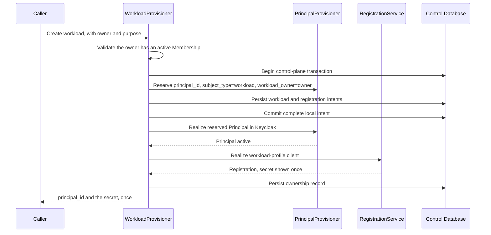

---
doc_meta:
  id: TDD-identity-control-004
  title: Workload and Bounded Agent Identity
  owner: Core Platform Team
  version: 1.1.0
  status: approved
  classification: restricted
  review_cycle_days: 90
  created_date: 2026-08-11
  last_reviewed: 2026-08-14
  parent_sad: SAD-001
---

# Workload and Bounded Agent Identity

## Purpose

Specify the identity lifecycle for services, jobs, connectors, and governed agents: how
a workload Principal is created, who is accountable for it, what happens when that
person leaves, and how an agent acting on behalf of a human is bounded and remains
distinguishable from that human.

STD-IAM-001 §3.7 states the rules and nothing realizes them:

> Service, workload, automation, and AI-agent identities MUST use non-human credential
> profiles with explicit owner, audience, rotation, and lifecycle.
>
> Shared human credentials or long-lived static secrets are prohibited when a managed
> workload-identity mechanism is available.
>
> Workload identity MUST be distinguishable from human Principal context in audit and
> authorization flows.

## Scope

**In scope**

- Workload Principal creation and its relationship to the human Principal model.
- The accountable owner, and what happens when that owner's access ends.
- Workload Membership and how revocation reaches a workload.
- Bounded agent identity: delegation, its limits, and its audit trail.
- Distinguishability in tokens, audit, and authorization.

**Out of scope**

- The workload's protocol client registration and its credential rotation — owned by
  `TDD-identity-control-003`.
- Membership authority and the revocation transaction — owned by
  `TDD-organization-control-002`.
- Principal identifier minting — owned by `TDD-identity-control-001`, and used
  unchanged here.
- Runtime deployment and where a workload executes.

## Technical Context

**A workload is a Principal.** PAD-PLT-001 defines a Principal as a stable human,
service, workload, or governed-agent security subject, and `membership.membership`
already carries `subject_type IN ('human','workload')` against a `principal_id`. A
workload therefore takes the same identifier, the same minting path, and the same
Membership model as a human.

What differs is everything about its lifecycle:

| | Human Principal | Workload Principal |
| :-- | :-- | :-- |
| Authenticates by | Interactive ceremony, MFA, session | Client credential, no session |
| Accountable to | Themselves | A named human owner |
| Ends when | They leave the organization | It is retired, or its owner leaves and nobody claims it |
| Refresh tokens | Permitted | Prohibited — it re-authenticates instead |
| Step-up | Possible | Meaningless; there is nobody to prompt |

The lifecycle difference is the whole problem. **Workloads outlive the people who
create them.** A connector built by an engineer who left two years ago keeps running,
keeps holding credentials, and keeps having nobody who can say whether it should. That
is the failure this design exists to prevent, and it is a lifecycle failure rather than
a cryptographic one.

## Component Design

| Component | Package | Responsibility |
| :-- | :-- | :-- |
| `WorkloadProvisioner` | `internal/workload` | Creates the workload Principal and its registration |
| `OwnershipRegistry` | `internal/workload` | Owner of record, reassignment, orphan detection |
| `AgentDelegationService` | `internal/workload` | Bounded delegation for governed agents |
| `WorkloadReconciler` | `internal/reconcile` | Orphan sweep, unused-workload detection |

### Creation



The workload Principal is minted through the same path as a human. The request passes
`subject_type=workload` and the active human `workload_owner` into
`PrincipalProvisioner`; those values are immutable claim-source attributes on the
initial Keycloak create call. There is no second creation path, identifier space, or
reconciler.

The Principal mapping, workload ownership row, and client-registration intent are
reserved in one Control Database transaction before either remote call. Recovery can
therefore finish a partially realized workload, but can never discover a workload
Principal for which no accountable owner was durably recorded.

## Data Model

```sql
CREATE TABLE identity.workload (
    principal_id      UUID        PRIMARY KEY,
    registration_id   UUID        NOT NULL REFERENCES identity.client_registration(registration_id),
    display_name      TEXT        NOT NULL,
    purpose           TEXT        NOT NULL,
    workload_type     TEXT        NOT NULL,
    owner_principal_id UUID       NOT NULL,
    owner_recorded_at TIMESTAMPTZ NOT NULL DEFAULT now(),
    state             TEXT        NOT NULL,
    orphaned_at       TIMESTAMPTZ,
    last_seen_at      TIMESTAMPTZ,
    created_at        TIMESTAMPTZ NOT NULL DEFAULT now(),
    CONSTRAINT workload_type_check
        CHECK (workload_type IN ('service', 'job', 'connector', 'agent')),
    CONSTRAINT workload_state_check
        CHECK (state IN ('active', 'orphaned', 'suspended', 'retired'))
);

CREATE INDEX workload_by_owner ON identity.workload (owner_principal_id) WHERE state <> 'retired';
CREATE INDEX workload_orphaned ON identity.workload (orphaned_at) WHERE state = 'orphaned';
```

`purpose` is free text and is required. A workload whose purpose nobody wrote down is a
workload nobody can decide to retire, and the review that should retire it will defer
instead.

`last_seen_at` is updated from authentication events. It is what makes an unused
workload visible, and an unused workload holding a live credential is the cheapest
credential an attacker can find.

### Agent Delegation

```sql
CREATE TABLE identity.agent_delegation (
    delegation_id       UUID        PRIMARY KEY,
    agent_principal_id  UUID        NOT NULL REFERENCES identity.workload(principal_id),
    on_behalf_of        UUID        NOT NULL,
    tenant_id           UUID        NOT NULL,
    scope               TEXT[]      NOT NULL,
    granted_at          TIMESTAMPTZ NOT NULL DEFAULT now(),
    expires_at          TIMESTAMPTZ NOT NULL,
    revoked_at          TIMESTAMPTZ,
    correlation_id      UUID        NOT NULL
);
```

Delegation is always time-bounded: `expires_at` is not nullable. An agent acting on
behalf of a human without an expiry is an agent that outlives the intent that created
it.

## API / Interface

```text
POST   /v1/workloads
GET    /v1/workloads/{principal_id}
POST   /v1/workloads/{principal_id}:reassign
POST   /v1/workloads/{principal_id}:suspend
POST   /v1/workloads/{principal_id}:restore
POST   /v1/workloads/{principal_id}:retire
GET    /v1/workloads:orphaned
GET    /v1/workloads:unused

POST   /v1/agents/{principal_id}/delegations
POST   /v1/agents/{principal_id}/delegations/{delegation_id}:revoke
```

### Token Shape

```json
{
  "iss": "https://identity.scnehaux.com/realms/scnehaux",
  "sub": "<protocol subject>",
  "principal_id": "019236a1-...",
  "subject_type": "workload",
  "workload_owner": "019235f1-...",
  "tenant_id": "019235f2-...",
  "membership_version": 7,
  "aud": ["hcm-api"],
  "exp": 1786000540
}
```

`subject_type` is what makes a workload distinguishable in audit and authorization, as
STD-IAM-001 §3.7 requires. A product enforcing a rule that applies only to humans reads
that claim rather than inferring from a naming convention.

`workload_owner` carries accountability into the token. An audit record of a workload
action names both the workload and the human answerable for it, without a lookup.

For an agent acting under delegation, the token additionally carries:

```json
{
  "subject_type": "workload",
  "workload_type": "agent",
  "act": { "principal_id": "019235f1-...", "delegation_id": "019236b2-..." }
}
```

`act` names the human the agent is acting for. The agent is the subject, and the human
is the actor behind it — never the reverse. Issuing a token whose `principal_id` is the
human's would make the agent invisible in every downstream audit record.

## Algorithms / Logic

### Orphan Handling

This is the design decision that matters, and both extremes are wrong.

Killing a workload the moment its owner's access ends turns a resignation into a
production outage, and the operators who learn that lesson start using shared service
accounts nobody owns. Never acting leaves credentials owned by nobody, which is the
state the control exists to prevent.

```text
on membership.security.revoked or principal retirement for a human:
    for each active workload owned by that Principal:
        set state = 'orphaned', orphaned_at = now()
        notify the owner's administrative chain and the workload's Tenant admins
        the workload keeps operating

daily sweep over orphaned workloads:
    age < 7 days     → reminder
    age >= 7 days    → escalate to the Tenant administrator
    age >= 30 days   → suspend the workload, notify, keep the record

on reassign:
    validate the new owner has an active Membership in the workload's Tenant
    set owner, clear orphaned_at, state = 'active'
    emit a privileged-administration event
```

The workload keeps running while orphaned. That is deliberate: the grace period buys
the reassignment that ought to happen, and the escalation makes ignoring it
progressively harder. Suspension at thirty days is the backstop, and it is reversible.

### Revocation Reaching a Workload

A workload holds no session and no refresh token, so two of the four human revocation
mechanisms do not apply. Two do:

| Mechanism | Effect |
| :-- | :-- |
| Context projection removed | The next client-credentials exchange cannot assert the revoked context |
| Consumer read model updated | An already-issued access token naming the revoked context is rejected |

Enforcement is therefore bounded by the propagation time plus the remaining access
token lifetime of class `L3`, which STD-IAM-002 §3.3 sets at nine minutes for the
`workload` audience. A workload cannot extend that by refreshing, because refresh tokens
are prohibited for the `workload` profile in `TDD-identity-control-003`.

Two earlier revisions got this wrong in opposite directions, and the reason is worth
recording: the class letters were reassigned while two rewrites of STD-IAM-002 ran in
parallel. One revision named `L3` believing it was external; a later one "corrected" it to
`L1` against the other rewrite, where `L3` was indeed external. In the standard as merged,
`L2` is the external and partner class and `L3` is the workload class, both at the lifetimes
above. `TDD-identity-experience-004` has carried the merged table correctly throughout.

**A lifetime class MUST be cited together with its audience, never by letter alone.** Citing
`L3` by itself resolved to a real class saying something else, so neither the linter nor a
reviewer had anything to catch: a reference that resolves to the wrong text fails silently,
while a dangling one at least fails.

Suspending a workload additionally revokes its client credential, which stops the next
exchange outright.

### Unused Workload Detection

```text
weekly sweep:
    for each active workload where last_seen_at is older than the unused threshold:
        record an unused finding
        notify the owner
```

An unused finding is not automatic retirement. A quarterly job legitimately sits idle
for eighty-nine days. The finding puts the decision in front of the owner, who is the
only party who can make it.

### Agent Delegation

```text
grant(agent, on_behalf_of, tenant, scope, duration):
    reject if duration exceeds the ceiling
    reject if the human has no active Membership in the tenant
    reject if the scope exceeds what the human holds
    reject if the scope exceeds what the agent is permitted to hold
    persist the delegation with a correlation identifier
    emit a privileged-administration event
```

The scope is the intersection of what the human holds and what the agent may hold,
never the union and never just the human's. An agent that can do everything its
principal can do is not bounded, and PAD-PLT-001 requires bounded agent identity rather
than impersonation.

A delegation is revoked when the human's Membership is revoked, on the same priority
event that revokes the human.

## Configuration

| Variable | Default | Purpose |
| :-- | :-- | :-- |
| `IDENTITY_WORKLOAD_ORPHAN_ESCALATE_AFTER` | `7d` | First escalation |
| `IDENTITY_WORKLOAD_ORPHAN_SUSPEND_AFTER` | `30d` | Automatic suspension |
| `IDENTITY_WORKLOAD_UNUSED_THRESHOLD` | `90d` | Unused finding threshold |
| `IDENTITY_AGENT_DELEGATION_MAX_DURATION` | `24h` | Ceiling on one delegation |
| `IDENTITY_WORKLOAD_SWEEP_INTERVAL` | `24h` | Orphan and unused sweep cadence |

## Testing Strategy

### Identity Model

- A workload carries a `principal_id` minted through the same path as a human.
- Its token carries `subject_type = workload` and `workload_owner`.
- A crash after Principal realization but before client realization recovers from the
  same ownership and registration intents without creating a second Principal.
- No Keycloak workload user exists before its local ownership intent commits.
- A workload Membership is created, verified, and revoked through the same path as a
  human Membership, distinguished only by `subject_type`.
- The `workload` client profile is refused a refresh token.

### Ownership

- Creating a workload without an owner holding an active Membership is refused.
- Revoking the owner's Membership marks every workload they own `orphaned`, and none of
  them stops working.
- Escalation fires at the configured ages.
- Suspension at thirty days is applied, is reversible, and keeps the record.
- Reassignment to a principal without an active Membership in the workload's Tenant is
  refused.

### Revocation

- After context projection removal, a client-credentials exchange cannot assert the
  revoked context.
- Measured enforcement stays within propagation plus the class `L3` lifetime.
- Suspending a workload revokes its credential and the next exchange fails.

### Agents

- A delegation exceeding the duration ceiling is refused.
- A delegation whose scope exceeds the human's scope is refused.
- A delegation whose scope exceeds the agent's permitted scope is refused.
- The agent's token names the agent as subject and the human in `act`, never the
  reverse.
- Revoking the human's Membership revokes every delegation granted on their behalf.

### Negative

- No workload shares a credential with a human Principal.
- An unused finding does not retire a workload automatically.
- A workload cannot be created with an empty `purpose`.

## Security Notes

The accountability chain is the control. A credential whose owner cannot be named is a
credential nobody will ever decide to revoke, and the reason long-lived service
accounts accumulate is not that anyone chose them but that nobody owned the decision to
remove them.

Carrying `workload_owner` in the token puts that chain in every audit record without a
lookup, so an investigation reading logs sees who is answerable without joining against
a registry that may itself be stale.

The orphan grace period accepts a bounded window in which a workload runs under an
owner who has left. That window is chosen against the alternative: an immediate kill
teaches operators to avoid owned workloads entirely, and shared unowned accounts are
strictly worse than a thirty-day orphan.

Agent delegation is intersection, not inheritance. An agent that holds exactly what its
principal holds is impersonation with extra logging, and the `act` claim exists so that
downstream systems can apply a different rule to an agent than to the human.

## Performance Notes

Workload creation is administrative. Client-credentials exchange happens in the kernel
and does not reach this service.

The orphan and unused sweeps are indexed queries over a population that is small
relative to human Principals, and run daily and weekly rather than continuously.

`last_seen_at` is updated from authentication events already consumed for other
purposes, so it adds a write per workload per authentication rather than a new stream.

## Operational Notes

| Signal | Warning | Critical |
| :-- | :-- | :-- |
| Orphaned workloads | any occurrence | older than the escalation threshold |
| Workloads suspended for orphan age | any occurrence | — |
| Unused workloads past threshold | any occurrence | — |
| Agent delegation refused for scope excess | any occurrence | sustained from one agent |
| Workload without a recorded purpose | — | any occurrence |

Runbooks required before production: orphaned workload reassignment, workload
credential compromise, agent delegation review, and unused workload retirement.

## Traceability

| Relationship | Target |
| :-- | :-- |
| Parent system | SAD-001 — Scnehaux Identity Runtime |
| Realizes capability | PAD-PLT-001 — machine, service, workload, and bounded agent identity |
| Governed by | ADR-IAM-001 — the kernel owns credential storage and protocol grants |
| Conforms to | STD-IAM-001 §3.7 — explicit owner, audience, rotation, lifecycle; distinguishable in audit; no shared human credentials |
| Conforms to | STD-IAM-002 §3.1, §3.2 — the `workload` audience class carries `principal_id`, `subject_type`, and `workload_owner` |
| Enterprise constraint | EAD-006 — agents receive bounded delegated authority, not unrestricted user power |
| Depends on | `TDD-identity-control-001` — the workload Principal is minted through the same path |
| Depends on | `TDD-identity-control-003` — the workload's client registration and credential rotation |
| Depends on | `TDD-organization-control-002` — workload Membership and its revocation |
